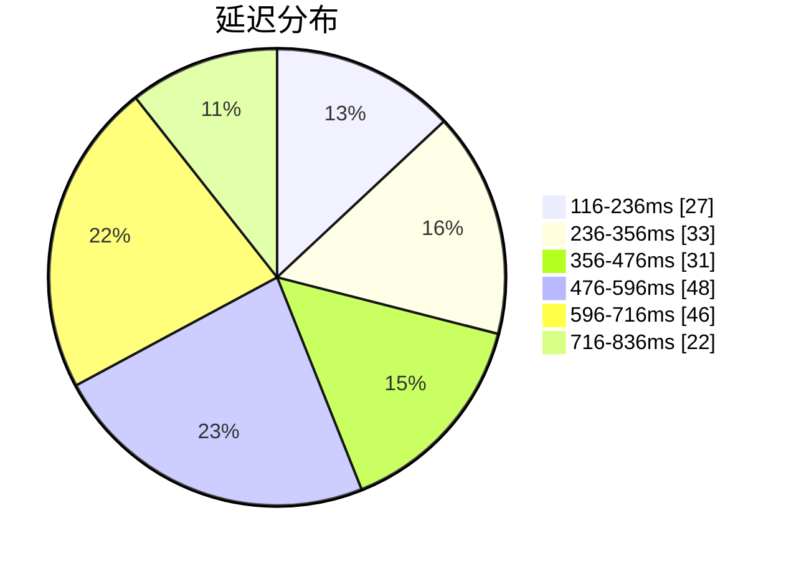
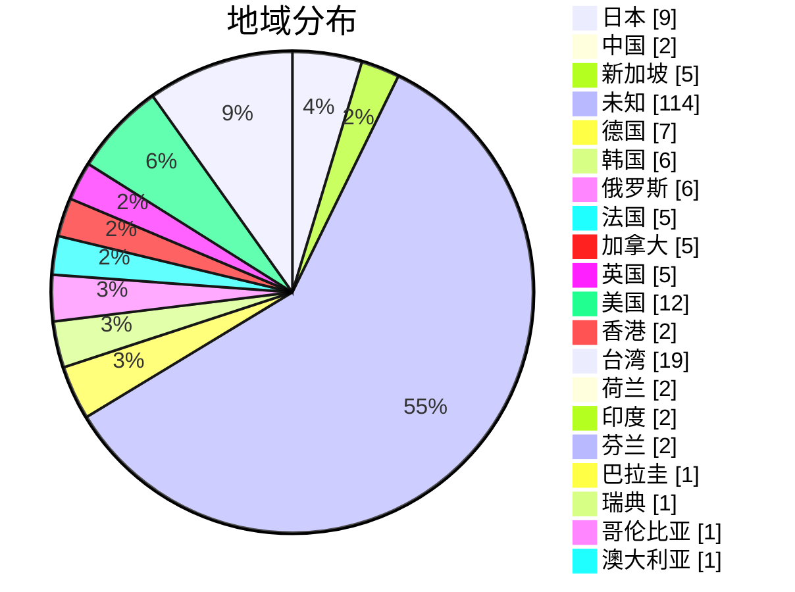
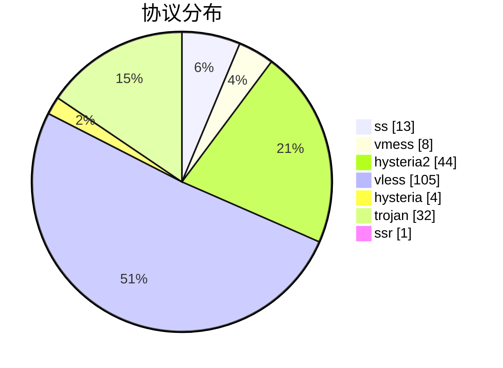

```mermaid
pie showData
title 延迟分布
"116-236ms" : 27
"236-356ms" : 33
"356-476ms" : 31
"476-596ms" : 48
"596-716ms" : 46
"716-836ms" : 22
```

```mermaid
pie showData
title 地域分布
"日本" : 9
"中国" : 2
"新加坡" : 5
"未知" : 114
"德国" : 7
"韩国" : 6
"俄罗斯" : 6
"法国" : 5
"加拿大" : 5
"英国" : 5
"美国" : 12
"香港" : 2
"台湾" : 19
"荷兰" : 2
"印度" : 2
"芬兰" : 2
"巴拉圭" : 1
"瑞典" : 1
"哥伦比亚" : 1
"澳大利亚" : 1
```

```mermaid
pie showData
title 协议分布
"ss" : 13
"vmess" : 8
"hysteria2" : 44
"vless" : 105
"hysteria" : 4
"trojan" : 32
"ssr" : 1
```