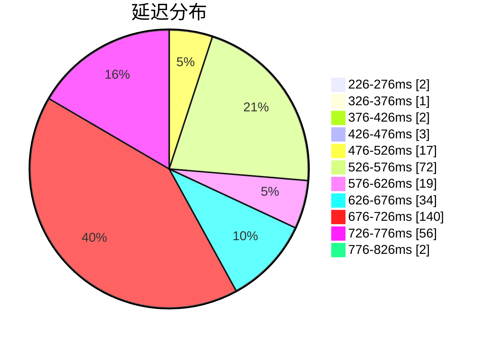
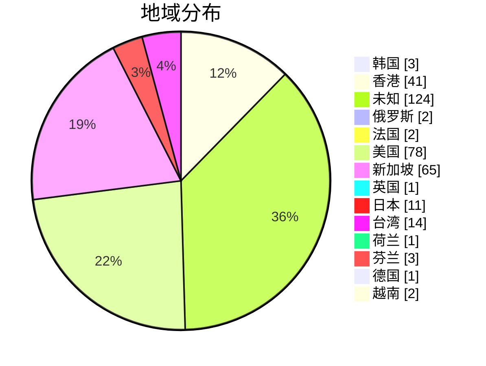
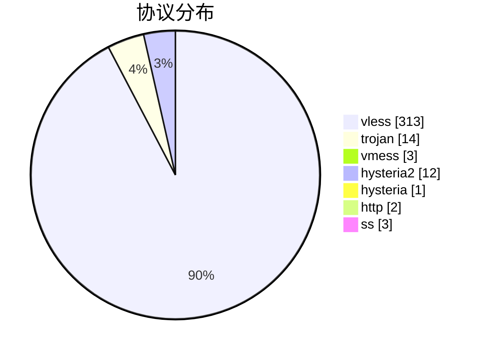

```mermaid
pie showData
title 延迟分布
"226-276ms" : 2
"326-376ms" : 1
"376-426ms" : 2
"426-476ms" : 3
"476-526ms" : 17
"526-576ms" : 72
"576-626ms" : 19
"626-676ms" : 34
"676-726ms" : 140
"726-776ms" : 56
"776-826ms" : 2
```

```mermaid
pie showData
title 地域分布
"韩国" : 3
"香港" : 41
"未知" : 124
"俄罗斯" : 2
"法国" : 2
"美国" : 78
"新加坡" : 65
"英国" : 1
"日本" : 11
"台湾" : 14
"荷兰" : 1
"芬兰" : 3
"德国" : 1
"越南" : 2
```

```mermaid
pie showData
title 协议分布
"vless" : 313
"trojan" : 14
"vmess" : 3
"hysteria2" : 12
"hysteria" : 1
"http" : 2
"ss" : 3
```