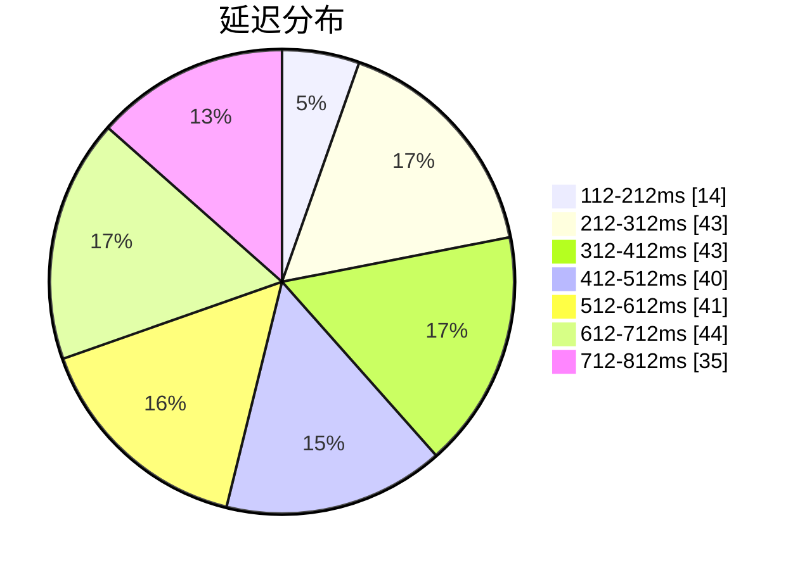
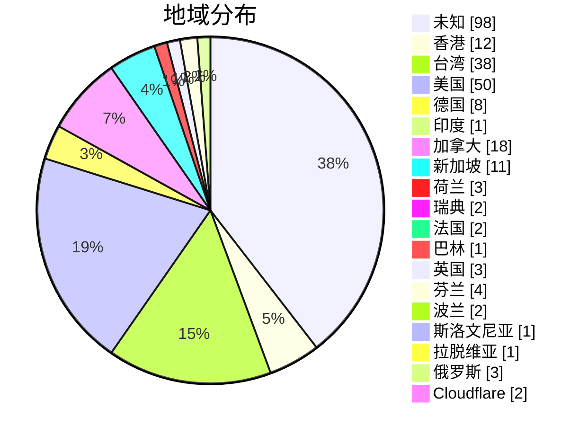
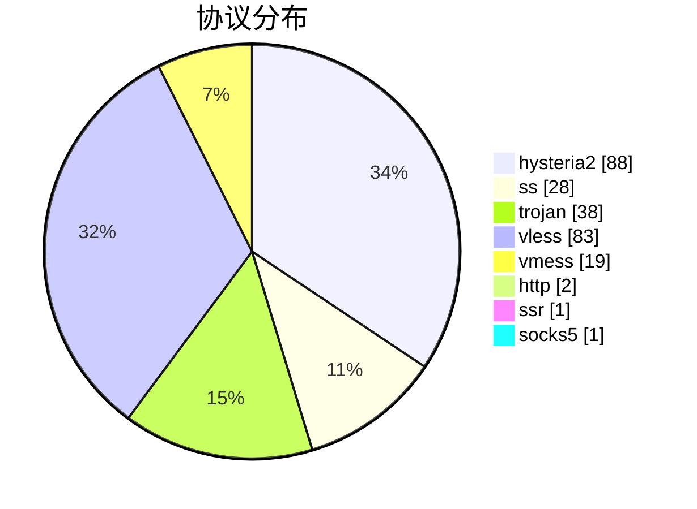

```mermaid
pie showData
title 延迟分布
"112-212ms" : 14
"212-312ms" : 43
"312-412ms" : 43
"412-512ms" : 40
"512-612ms" : 41
"612-712ms" : 44
"712-812ms" : 35
```

```mermaid
pie showData
title 地域分布
"未知" : 98
"香港" : 12
"台湾" : 38
"美国" : 50
"德国" : 8
"印度" : 1
"加拿大" : 18
"新加坡" : 11
"荷兰" : 3
"瑞典" : 2
"法国" : 2
"巴林" : 1
"英国" : 3
"芬兰" : 4
"波兰" : 2
"斯洛文尼亚" : 1
"拉脱维亚" : 1
"俄罗斯" : 3
"Cloudflare" : 2
```

```mermaid
pie showData
title 协议分布
"hysteria2" : 88
"ss" : 28
"trojan" : 38
"vless" : 83
"vmess" : 19
"http" : 2
"ssr" : 1
"socks5" : 1
```