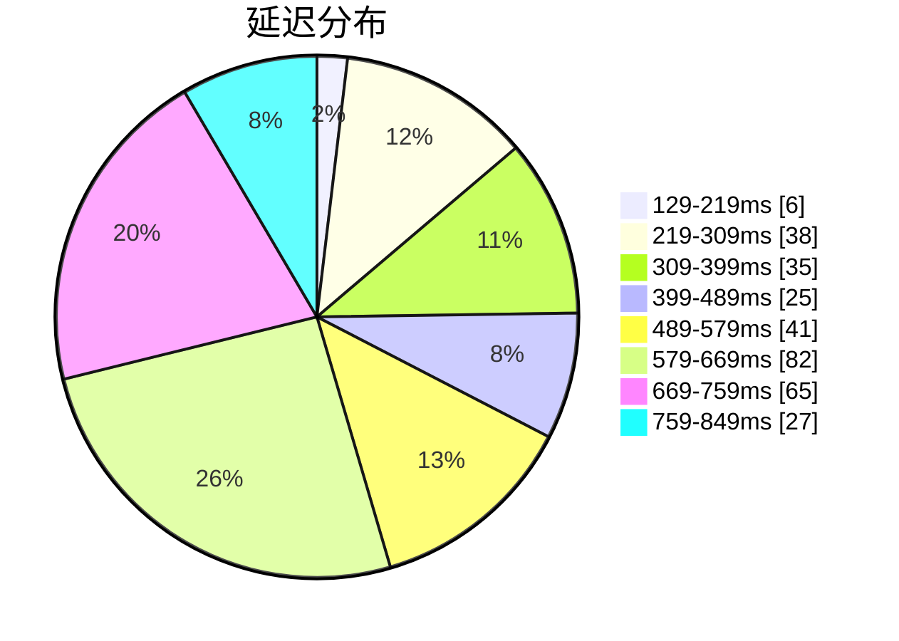
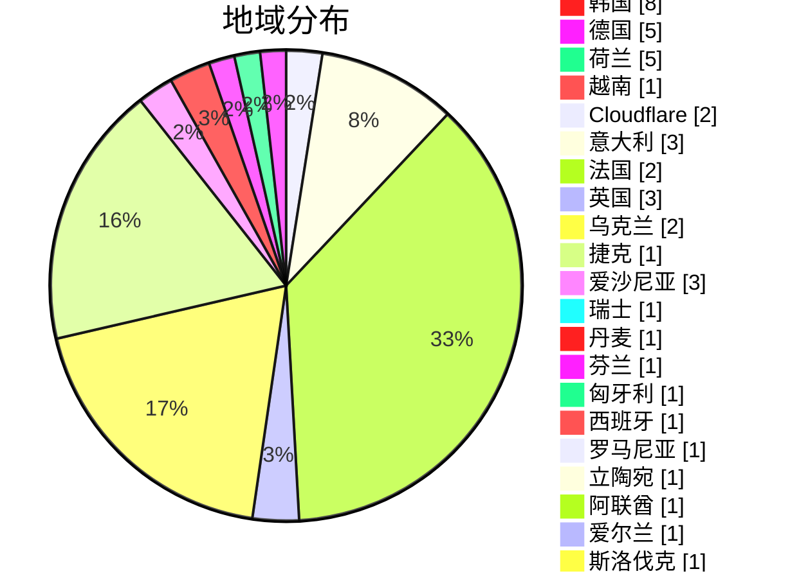
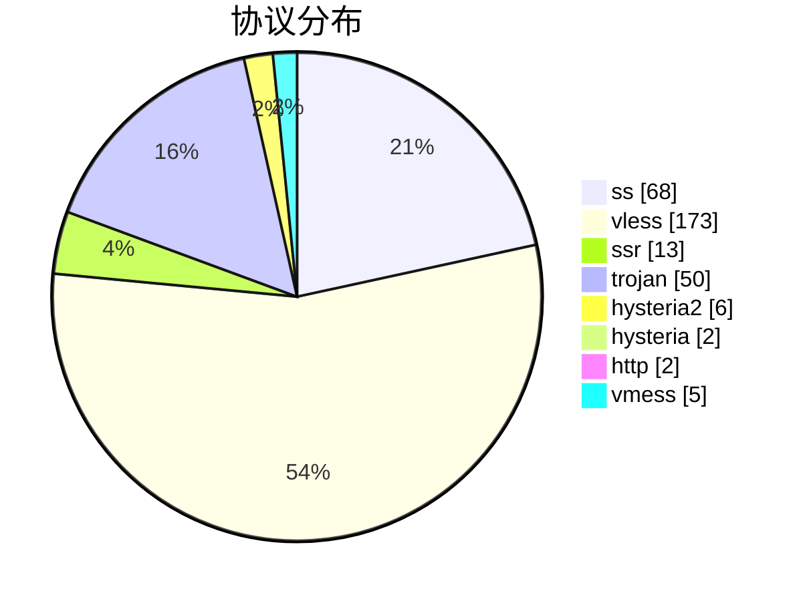

```mermaid
pie showData
title 延迟分布
"129-219ms" : 6
"219-309ms" : 38
"309-399ms" : 35
"399-489ms" : 25
"489-579ms" : 41
"579-669ms" : 82
"669-759ms" : 65
"759-849ms" : 27
```

```mermaid
pie showData
title 地域分布
"日本" : 7
"美国" : 27
"未知" : 105
"新加坡" : 9
"台湾" : 54
"波兰" : 51
"香港" : 7
"俄罗斯" : 2
"韩国" : 8
"德国" : 5
"荷兰" : 5
"越南" : 1
"Cloudflare" : 2
"意大利" : 3
"法国" : 2
"英国" : 3
"乌克兰" : 2
"捷克" : 1
"爱沙尼亚" : 3
"瑞士" : 1
"丹麦" : 1
"芬兰" : 1
"匈牙利" : 1
"西班牙" : 1
"罗马尼亚" : 1
"立陶宛" : 1
"阿联酋" : 1
"爱尔兰" : 1
"斯洛伐克" : 1
"保加利亚" : 1
"冰岛" : 1
"塞浦路斯" : 1
"希腊" : 1
"孟加拉国" : 5
"瑞典" : 1
"挪威" : 1
"印度" : 1
```

```mermaid
pie showData
title 协议分布
"ss" : 68
"vless" : 173
"ssr" : 13
"trojan" : 50
"hysteria2" : 6
"hysteria" : 2
"http" : 2
"vmess" : 5
```