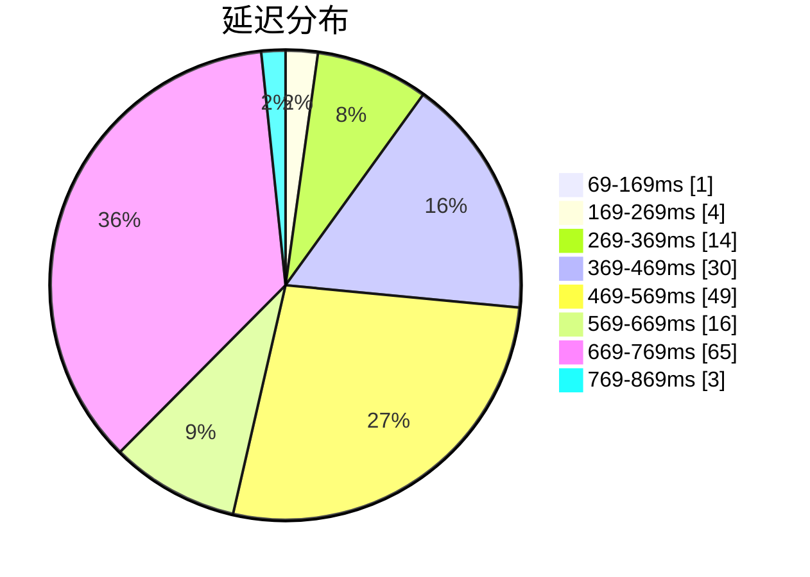
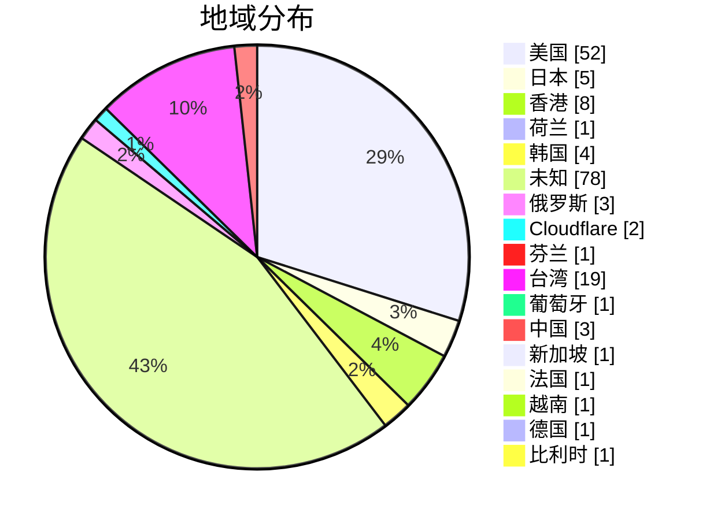
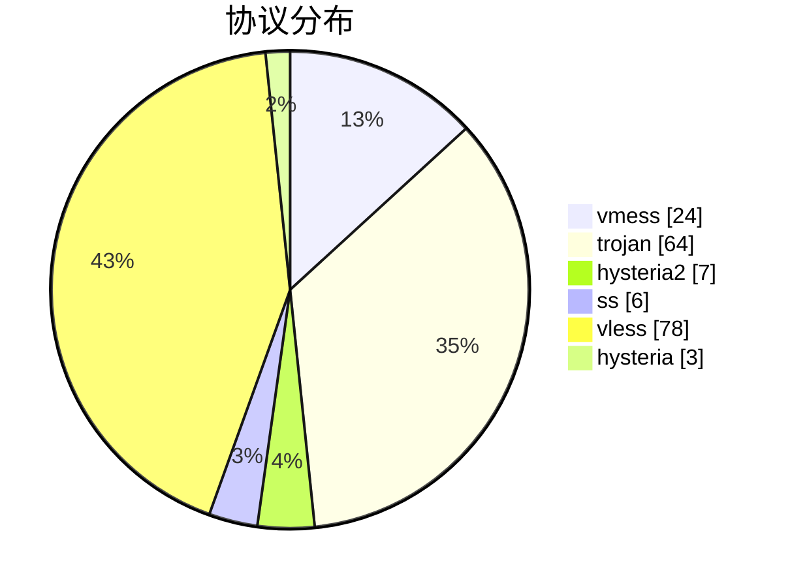

```mermaid
pie showData
title 延迟分布
"69-169ms" : 1
"169-269ms" : 4
"269-369ms" : 14
"369-469ms" : 30
"469-569ms" : 49
"569-669ms" : 16
"669-769ms" : 65
"769-869ms" : 3
```

```mermaid
pie showData
title 地域分布
"美国" : 52
"日本" : 5
"香港" : 8
"荷兰" : 1
"韩国" : 4
"未知" : 78
"俄罗斯" : 3
"Cloudflare" : 2
"芬兰" : 1
"台湾" : 19
"葡萄牙" : 1
"中国" : 3
"新加坡" : 1
"法国" : 1
"越南" : 1
"德国" : 1
"比利时" : 1
```

```mermaid
pie showData
title 协议分布
"vmess" : 24
"trojan" : 64
"hysteria2" : 7
"ss" : 6
"vless" : 78
"hysteria" : 3
```