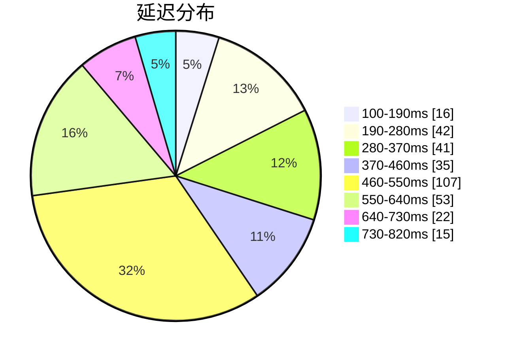
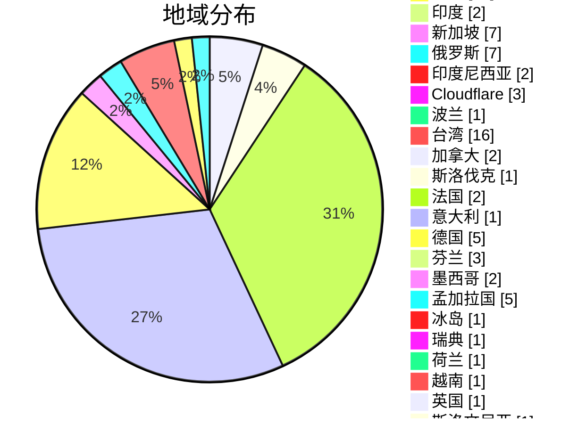
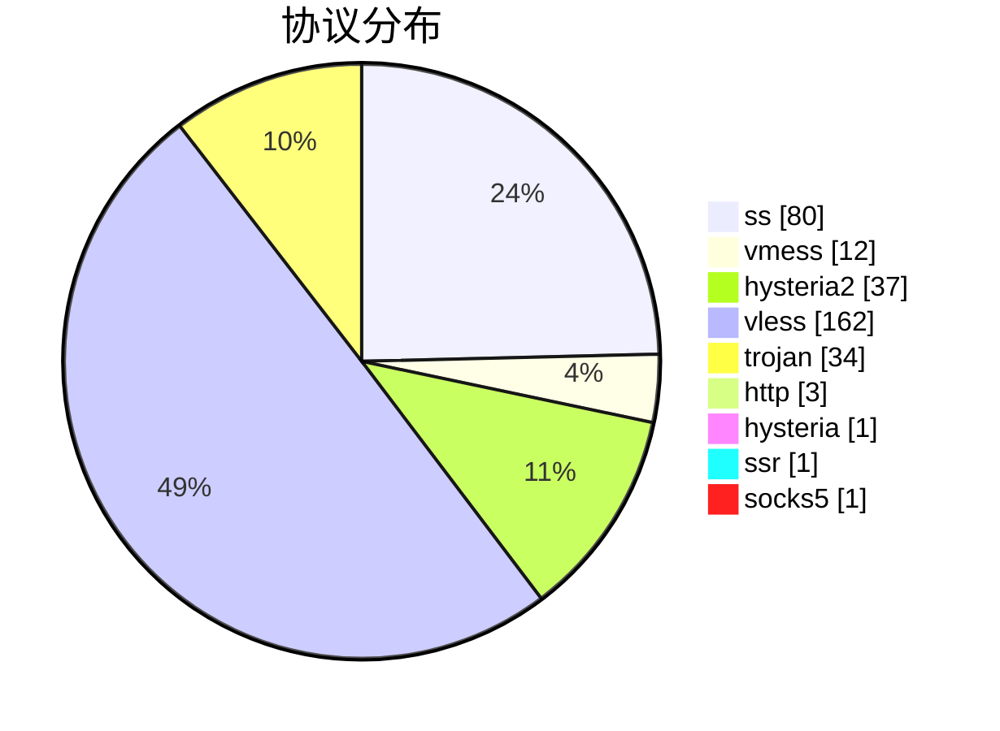

```mermaid
pie showData
title 延迟分布
"100-190ms" : 16
"190-280ms" : 42
"280-370ms" : 41
"370-460ms" : 35
"460-550ms" : 107
"550-640ms" : 53
"640-730ms" : 22
"730-820ms" : 15
```

```mermaid
pie showData
title 地域分布
"香港" : 15
"日本" : 13
"未知" : 102
"美国" : 91
"韩国" : 41
"印度" : 2
"新加坡" : 7
"俄罗斯" : 7
"印度尼西亚" : 2
"Cloudflare" : 3
"波兰" : 1
"台湾" : 16
"加拿大" : 2
"斯洛伐克" : 1
"法国" : 2
"意大利" : 1
"德国" : 5
"芬兰" : 3
"墨西哥" : 2
"孟加拉国" : 5
"冰岛" : 1
"瑞典" : 1
"荷兰" : 1
"越南" : 1
"英国" : 1
"斯洛文尼亚" : 1
"中国" : 1
"葡萄牙" : 1
"拉脱维亚" : 1
"澳大利亚" : 1
```

```mermaid
pie showData
title 协议分布
"ss" : 80
"vmess" : 12
"hysteria2" : 37
"vless" : 162
"trojan" : 34
"http" : 3
"hysteria" : 1
"ssr" : 1
"socks5" : 1
```