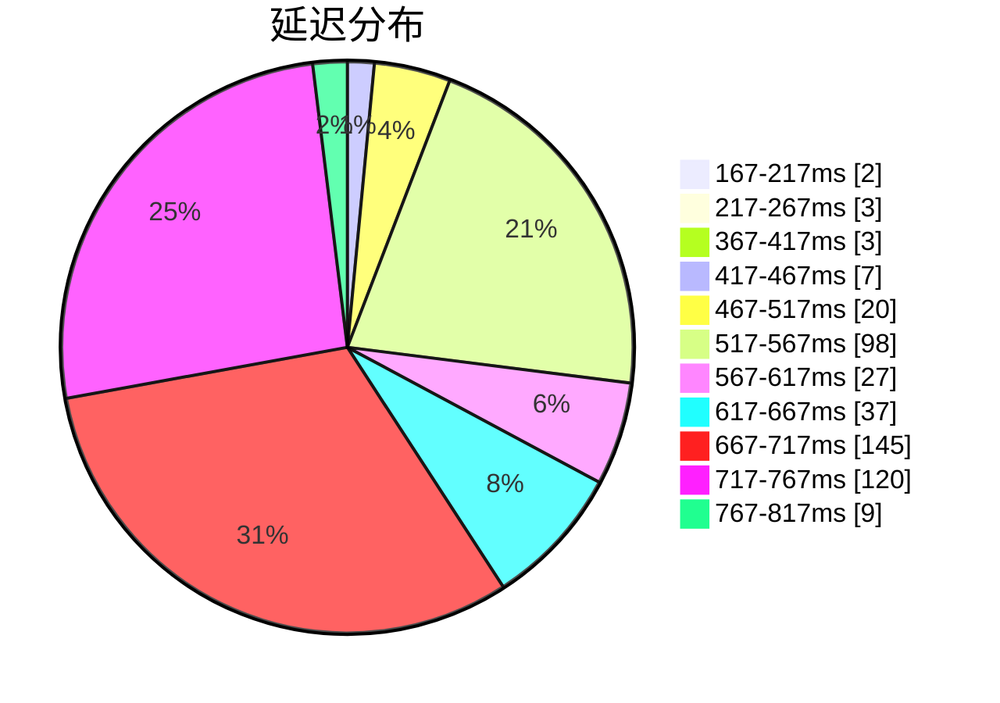
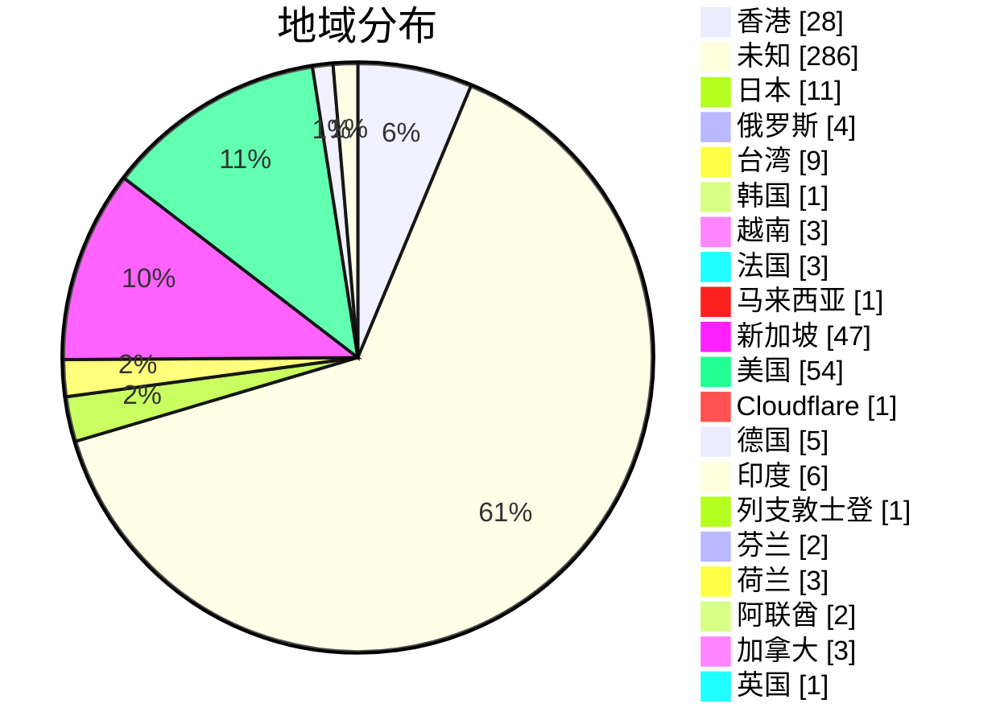
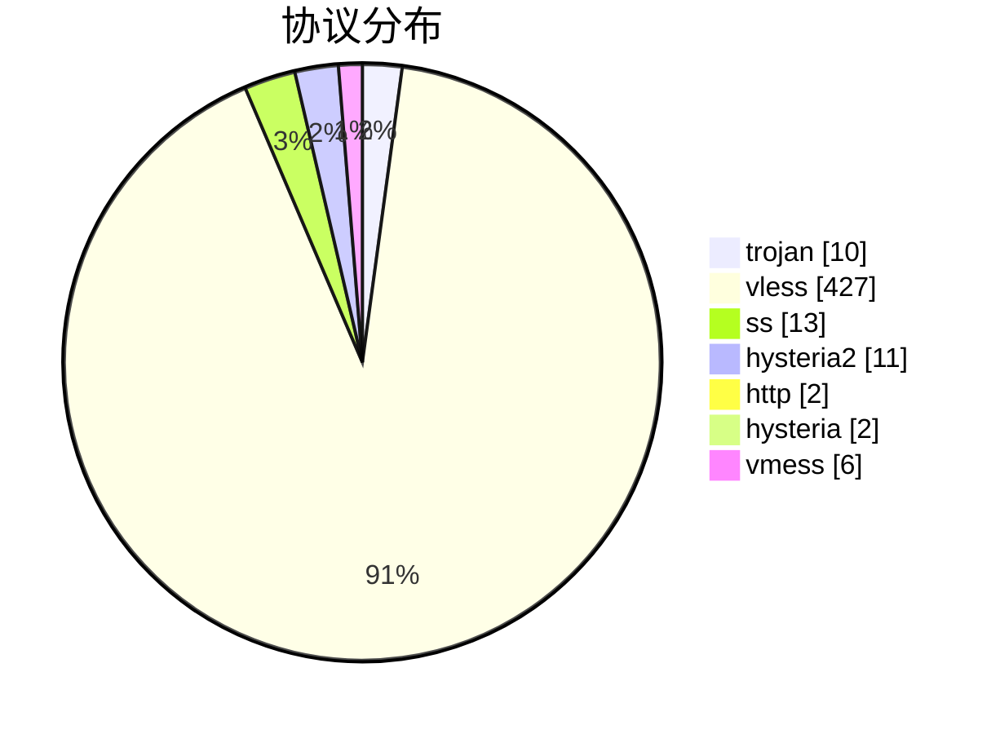

```mermaid
pie showData
title 延迟分布
"167-217ms" : 2
"217-267ms" : 3
"367-417ms" : 3
"417-467ms" : 7
"467-517ms" : 20
"517-567ms" : 98
"567-617ms" : 27
"617-667ms" : 37
"667-717ms" : 145
"717-767ms" : 120
"767-817ms" : 9
```

```mermaid
pie showData
title 地域分布
"香港" : 28
"未知" : 286
"日本" : 11
"俄罗斯" : 4
"台湾" : 9
"韩国" : 1
"越南" : 3
"法国" : 3
"马来西亚" : 1
"新加坡" : 47
"美国" : 54
"Cloudflare" : 1
"德国" : 5
"印度" : 6
"列支敦士登" : 1
"芬兰" : 2
"荷兰" : 3
"阿联酋" : 2
"加拿大" : 3
"英国" : 1
```

```mermaid
pie showData
title 协议分布
"trojan" : 10
"vless" : 427
"ss" : 13
"hysteria2" : 11
"http" : 2
"hysteria" : 2
"vmess" : 6
```