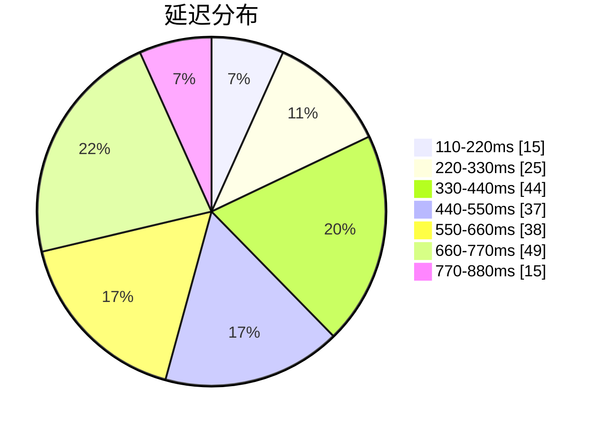
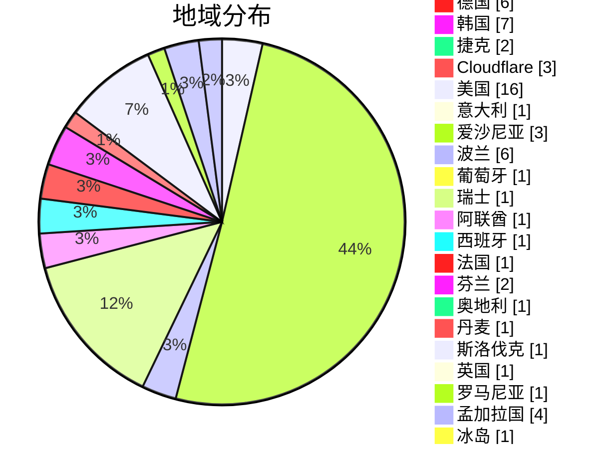
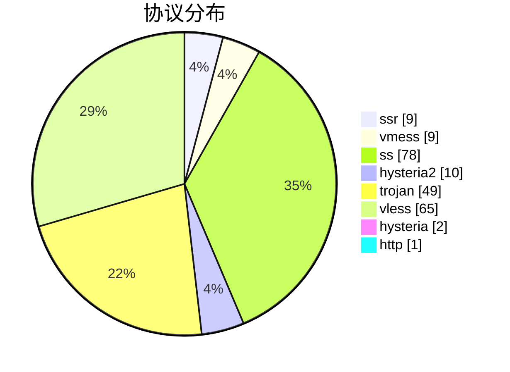

```mermaid
pie showData
title 延迟分布
"110-220ms" : 15
"220-330ms" : 25
"330-440ms" : 44
"440-550ms" : 37
"550-660ms" : 38
"660-770ms" : 49
"770-880ms" : 15
```

```mermaid
pie showData
title 地域分布
"日本" : 7
"中国" : 1
"未知" : 99
"新加坡" : 6
"俄罗斯" : 2
"台湾" : 27
"香港" : 6
"荷兰" : 6
"德国" : 6
"韩国" : 7
"捷克" : 2
"Cloudflare" : 3
"美国" : 16
"意大利" : 1
"爱沙尼亚" : 3
"波兰" : 6
"葡萄牙" : 1
"瑞士" : 1
"阿联酋" : 1
"西班牙" : 1
"法国" : 1
"芬兰" : 2
"奥地利" : 1
"丹麦" : 1
"斯洛伐克" : 1
"英国" : 1
"罗马尼亚" : 1
"孟加拉国" : 4
"冰岛" : 1
"保加利亚" : 1
"爱尔兰" : 1
"希腊" : 1
"乌克兰" : 1
"匈牙利" : 1
"立陶宛" : 1
"拉脱维亚" : 1
"土耳其" : 1
```

```mermaid
pie showData
title 协议分布
"ssr" : 9
"vmess" : 9
"ss" : 78
"hysteria2" : 10
"trojan" : 49
"vless" : 65
"hysteria" : 2
"http" : 1
```