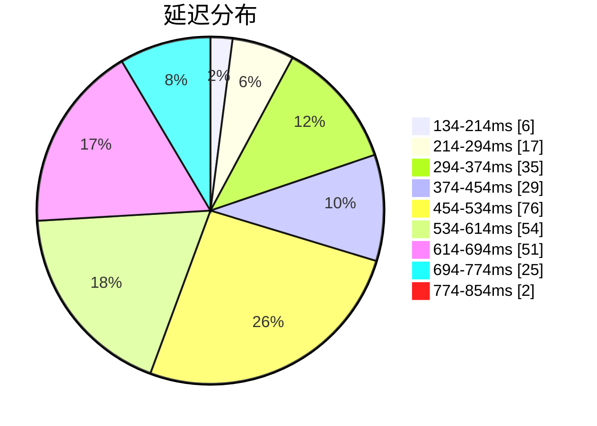
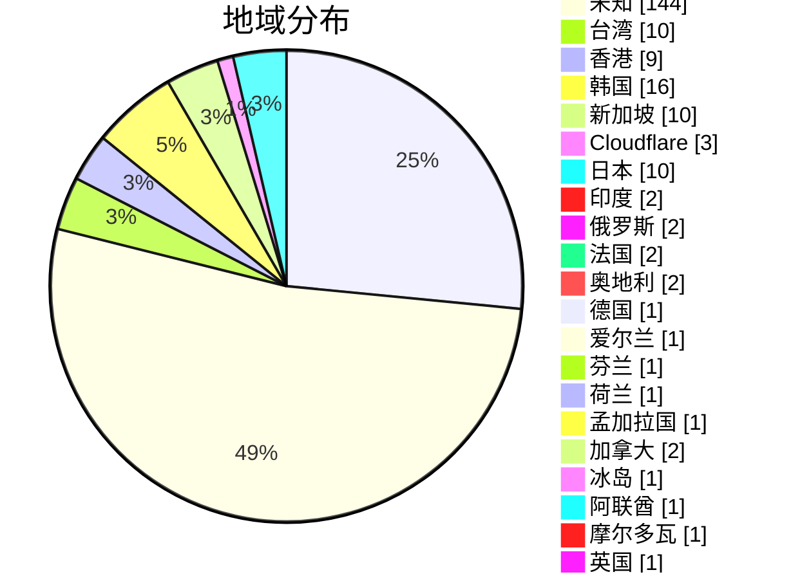
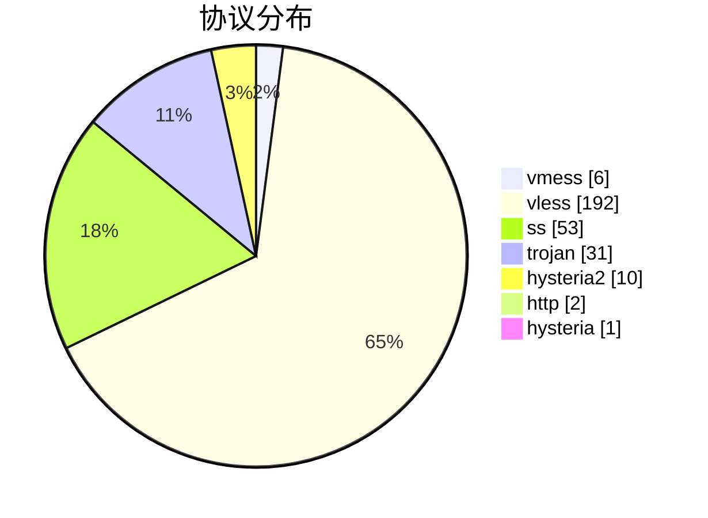

```mermaid
pie showData
title 延迟分布
"134-214ms" : 6
"214-294ms" : 17
"294-374ms" : 35
"374-454ms" : 29
"454-534ms" : 76
"534-614ms" : 54
"614-694ms" : 51
"694-774ms" : 25
"774-854ms" : 2
```

```mermaid
pie showData
title 地域分布
"美国" : 73
"未知" : 144
"台湾" : 10
"香港" : 9
"韩国" : 16
"新加坡" : 10
"Cloudflare" : 3
"日本" : 10
"印度" : 2
"俄罗斯" : 2
"法国" : 2
"奥地利" : 2
"德国" : 1
"爱尔兰" : 1
"芬兰" : 1
"荷兰" : 1
"孟加拉国" : 1
"加拿大" : 2
"冰岛" : 1
"阿联酋" : 1
"摩尔多瓦" : 1
"英国" : 1
"阿塞拜疆" : 1
```

```mermaid
pie showData
title 协议分布
"vmess" : 6
"vless" : 192
"ss" : 53
"trojan" : 31
"hysteria2" : 10
"http" : 2
"hysteria" : 1
```