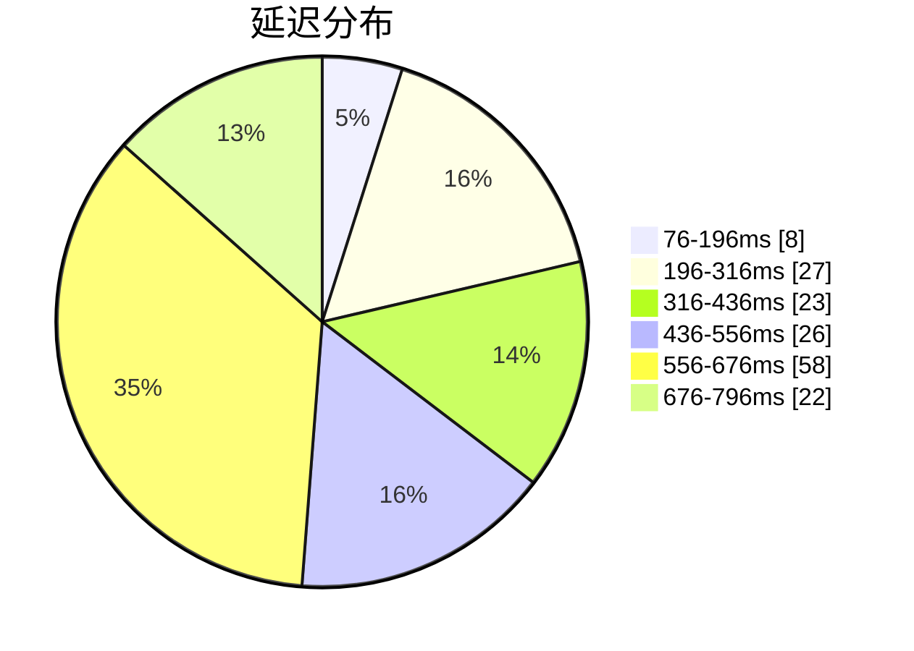
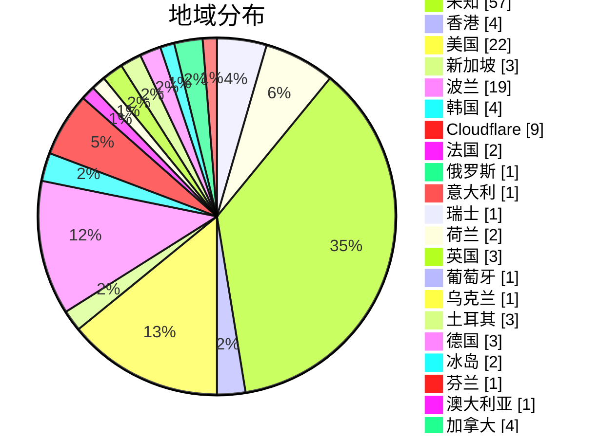
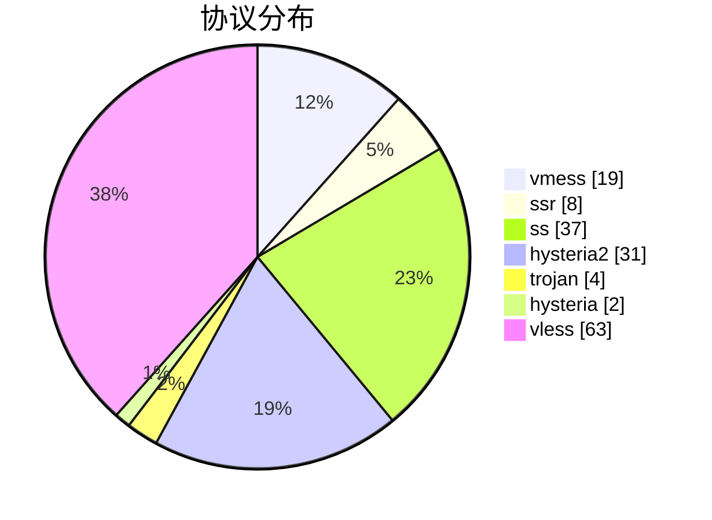

```mermaid
pie showData
title 延迟分布
"76-196ms" : 8
"196-316ms" : 27
"316-436ms" : 23
"436-556ms" : 26
"556-676ms" : 58
"676-796ms" : 22
```

```mermaid
pie showData
title 地域分布
"中国" : 7
"日本" : 10
"未知" : 57
"香港" : 4
"美国" : 22
"新加坡" : 3
"波兰" : 19
"韩国" : 4
"Cloudflare" : 9
"法国" : 2
"俄罗斯" : 1
"意大利" : 1
"瑞士" : 1
"荷兰" : 2
"英国" : 3
"葡萄牙" : 1
"乌克兰" : 1
"土耳其" : 3
"德国" : 3
"冰岛" : 2
"芬兰" : 1
"澳大利亚" : 1
"加拿大" : 4
"爱沙尼亚" : 2
"瑞典" : 1
```

```mermaid
pie showData
title 协议分布
"vmess" : 19
"ssr" : 8
"ss" : 37
"hysteria2" : 31
"trojan" : 4
"hysteria" : 2
"vless" : 63
```