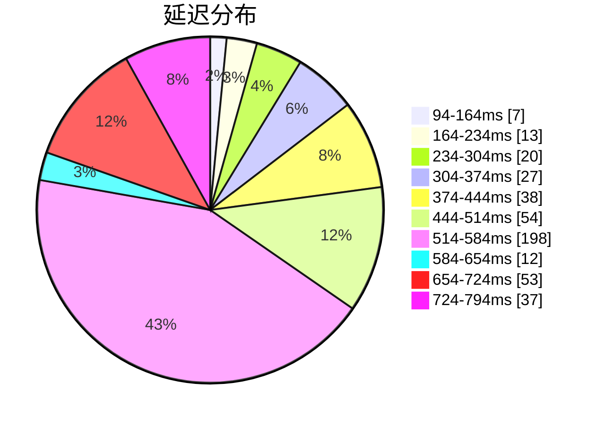
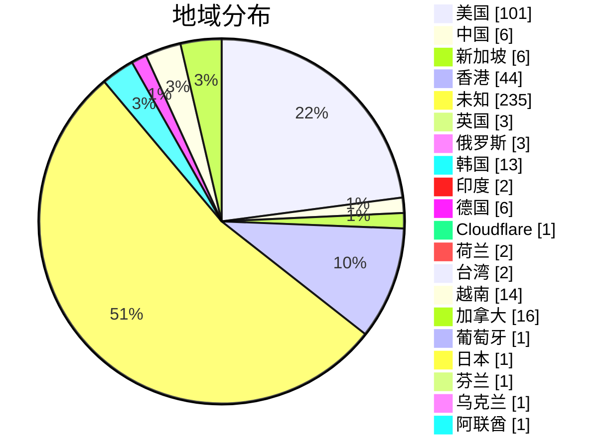
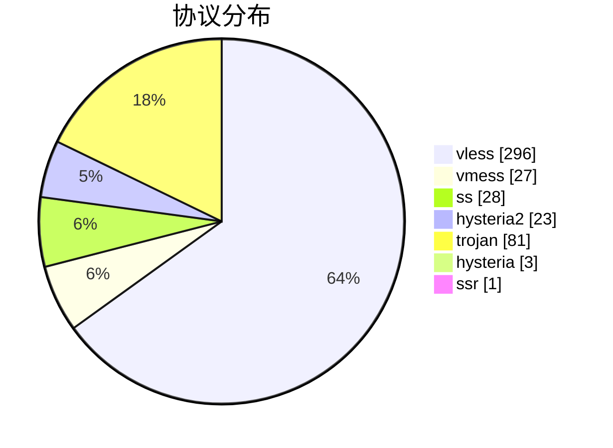

```mermaid
pie showData
title 延迟分布
"94-164ms" : 7
"164-234ms" : 13
"234-304ms" : 20
"304-374ms" : 27
"374-444ms" : 38
"444-514ms" : 54
"514-584ms" : 198
"584-654ms" : 12
"654-724ms" : 53
"724-794ms" : 37
```

```mermaid
pie showData
title 地域分布
"美国" : 101
"中国" : 6
"新加坡" : 6
"香港" : 44
"未知" : 235
"英国" : 3
"俄罗斯" : 3
"韩国" : 13
"印度" : 2
"德国" : 6
"Cloudflare" : 1
"荷兰" : 2
"台湾" : 2
"越南" : 14
"加拿大" : 16
"葡萄牙" : 1
"日本" : 1
"芬兰" : 1
"乌克兰" : 1
"阿联酋" : 1
```

```mermaid
pie showData
title 协议分布
"vless" : 296
"vmess" : 27
"ss" : 28
"hysteria2" : 23
"trojan" : 81
"hysteria" : 3
"ssr" : 1
```