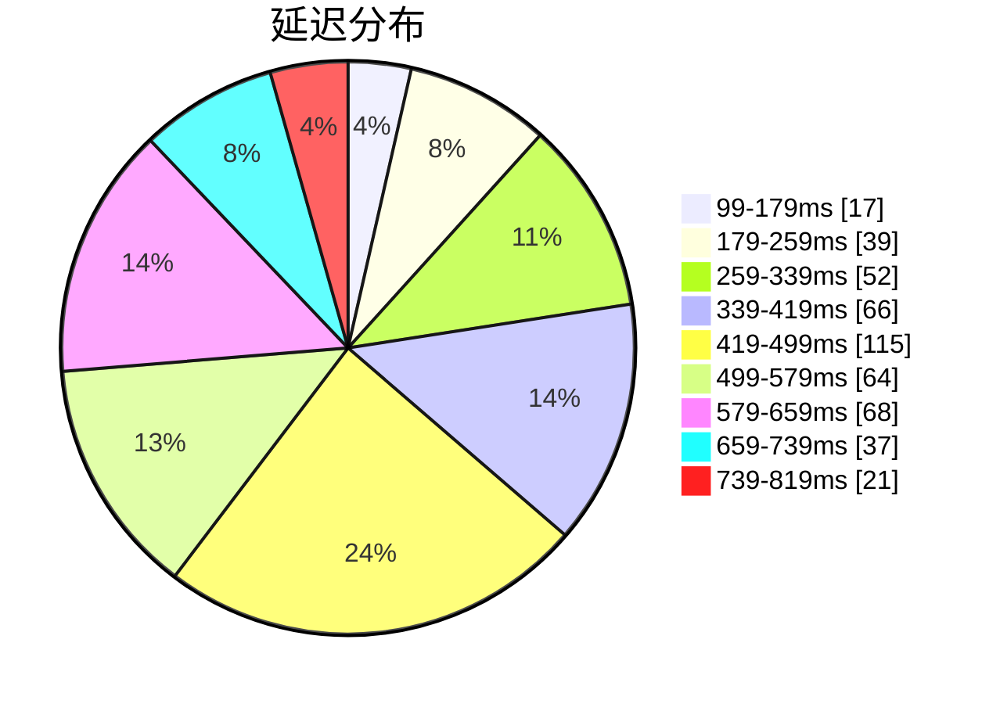
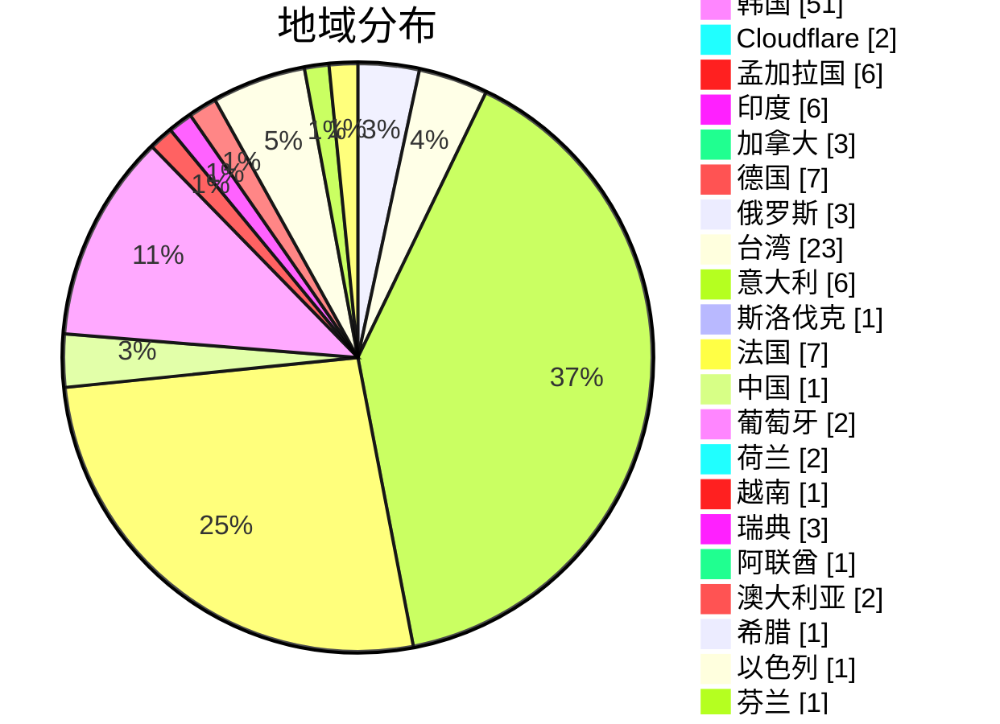
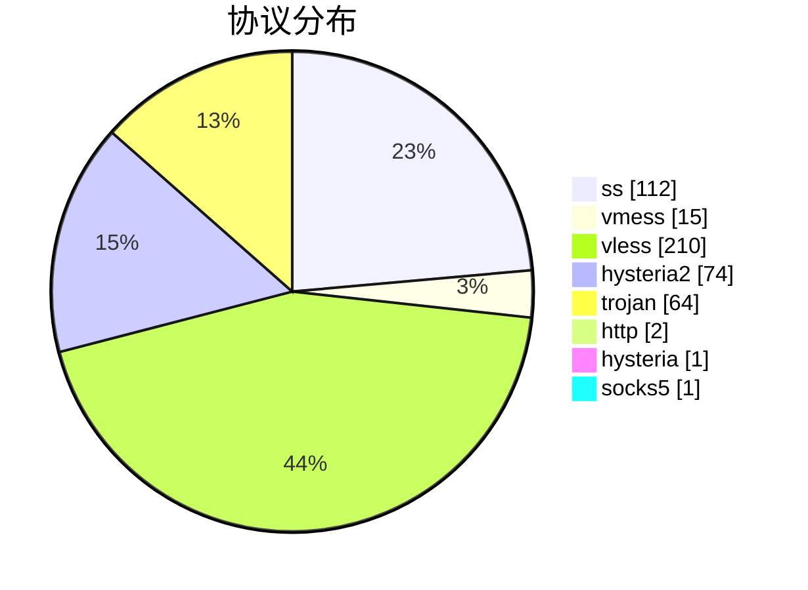

```mermaid
pie showData
title 延迟分布
"99-179ms" : 17
"179-259ms" : 39
"259-339ms" : 52
"339-419ms" : 66
"419-499ms" : 115
"499-579ms" : 64
"579-659ms" : 68
"659-739ms" : 37
"739-819ms" : 21
```

```mermaid
pie showData
title 地域分布
"香港" : 15
"日本" : 17
"未知" : 178
"墨西哥" : 1
"美国" : 118
"新加坡" : 13
"韩国" : 51
"Cloudflare" : 2
"孟加拉国" : 6
"印度" : 6
"加拿大" : 3
"德国" : 7
"俄罗斯" : 3
"台湾" : 23
"意大利" : 6
"斯洛伐克" : 1
"法国" : 7
"中国" : 1
"葡萄牙" : 2
"荷兰" : 2
"越南" : 1
"瑞典" : 3
"阿联酋" : 1
"澳大利亚" : 2
"希腊" : 1
"以色列" : 1
"芬兰" : 1
"英国" : 2
"斯洛文尼亚" : 1
"爱沙尼亚" : 1
"哥伦比亚" : 1
"卢森堡" : 1
"阿塞拜疆" : 1
```

```mermaid
pie showData
title 协议分布
"ss" : 112
"vmess" : 15
"vless" : 210
"hysteria2" : 74
"trojan" : 64
"http" : 2
"hysteria" : 1
"socks5" : 1
```