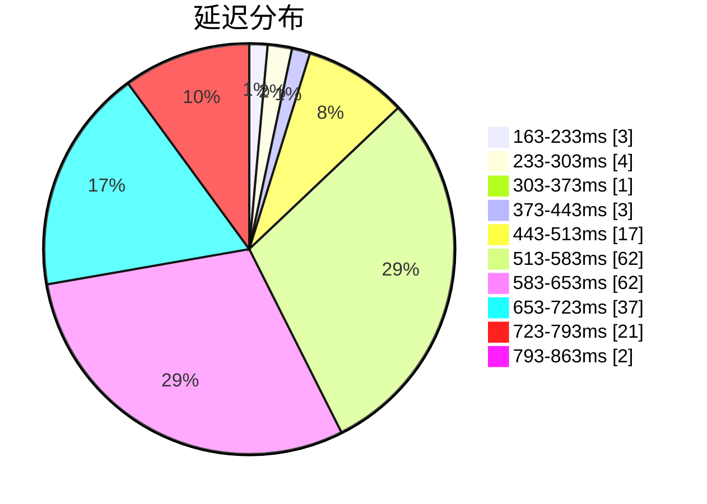
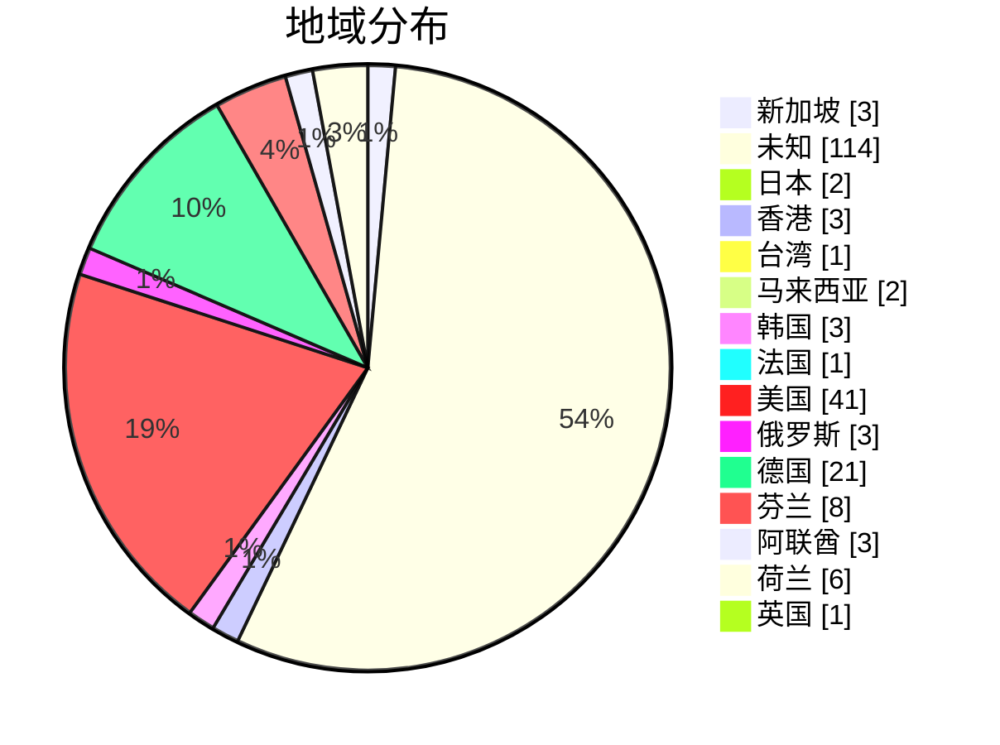
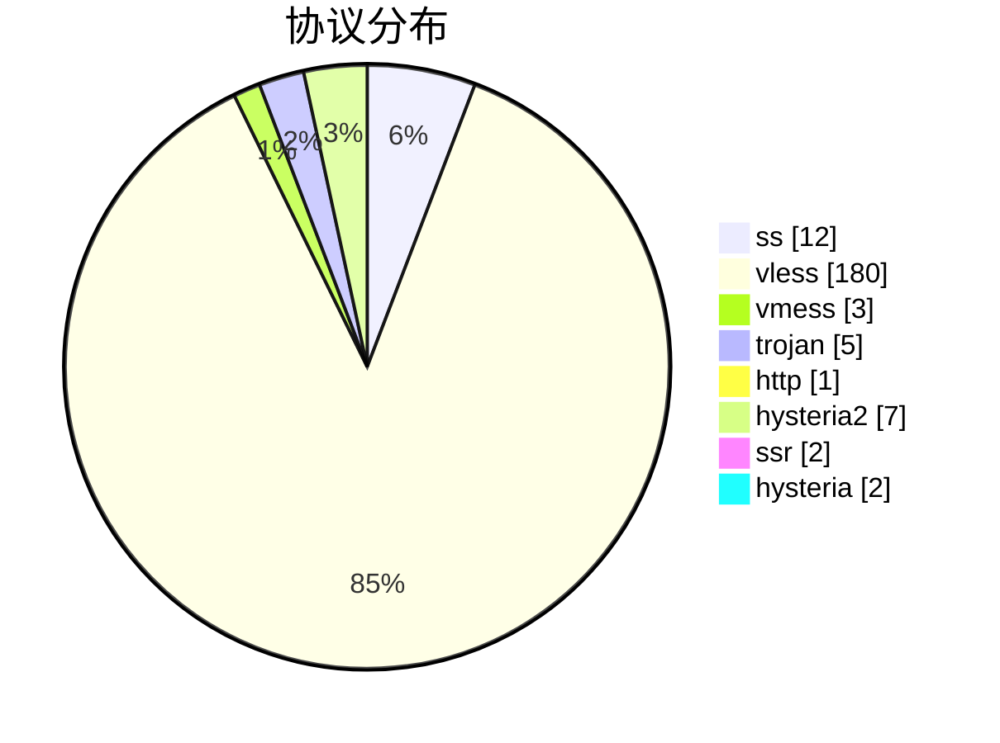

```mermaid
pie showData
title 延迟分布
"163-233ms" : 3
"233-303ms" : 4
"303-373ms" : 1
"373-443ms" : 3
"443-513ms" : 17
"513-583ms" : 62
"583-653ms" : 62
"653-723ms" : 37
"723-793ms" : 21
"793-863ms" : 2
```

```mermaid
pie showData
title 地域分布
"新加坡" : 3
"未知" : 114
"日本" : 2
"香港" : 3
"台湾" : 1
"马来西亚" : 2
"韩国" : 3
"法国" : 1
"美国" : 41
"俄罗斯" : 3
"德国" : 21
"芬兰" : 8
"阿联酋" : 3
"荷兰" : 6
"英国" : 1
```

```mermaid
pie showData
title 协议分布
"ss" : 12
"vless" : 180
"vmess" : 3
"trojan" : 5
"http" : 1
"hysteria2" : 7
"ssr" : 2
"hysteria" : 2
```