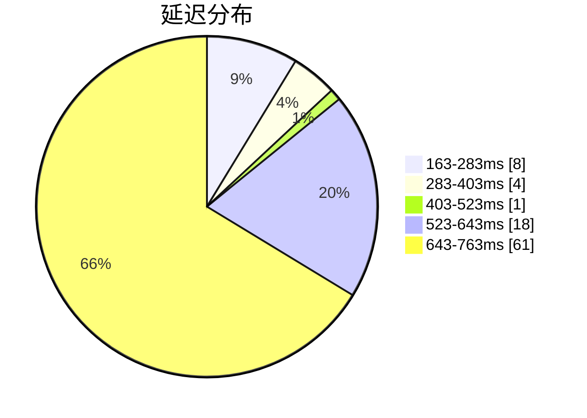
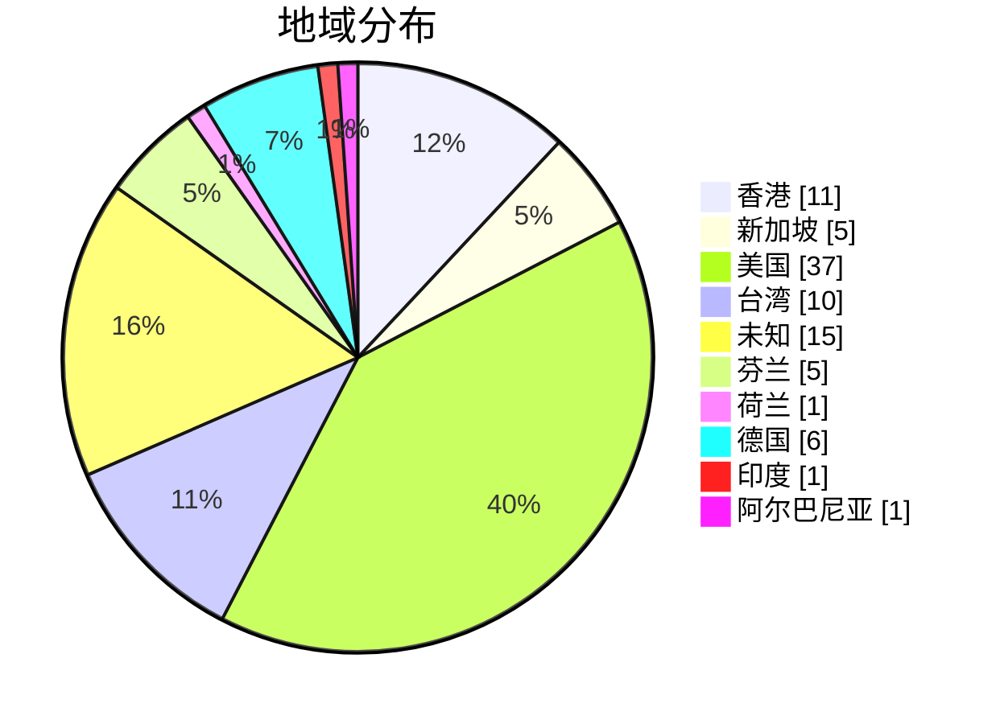
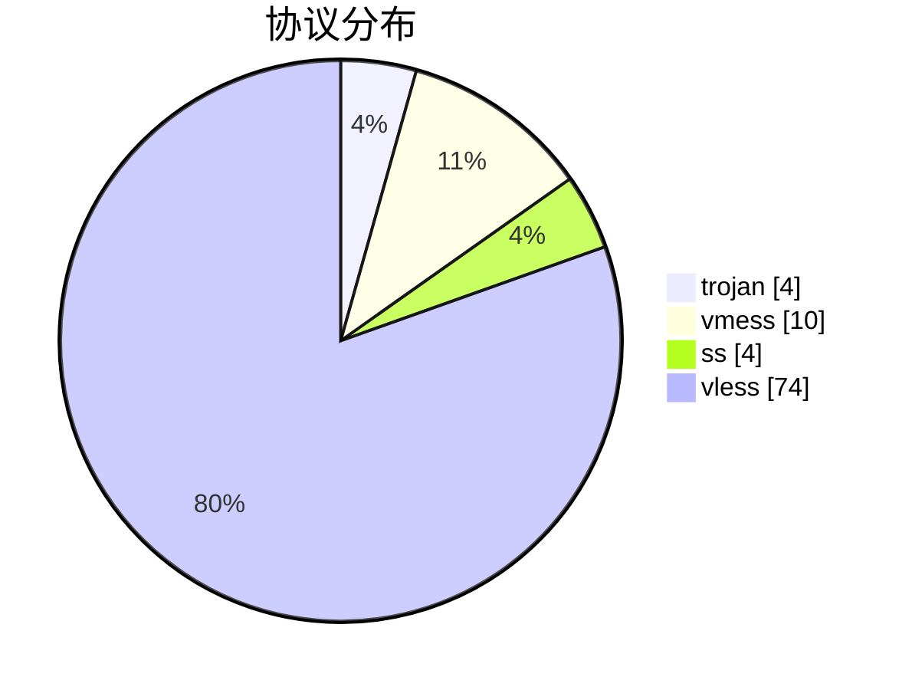

```mermaid
pie showData
title 延迟分布
"163-283ms" : 8
"283-403ms" : 4
"403-523ms" : 1
"523-643ms" : 18
"643-763ms" : 61
```

```mermaid
pie showData
title 地域分布
"香港" : 11
"新加坡" : 5
"美国" : 37
"台湾" : 10
"未知" : 15
"芬兰" : 5
"荷兰" : 1
"德国" : 6
"印度" : 1
"阿尔巴尼亚" : 1
```

```mermaid
pie showData
title 协议分布
"trojan" : 4
"vmess" : 10
"ss" : 4
"vless" : 74
```