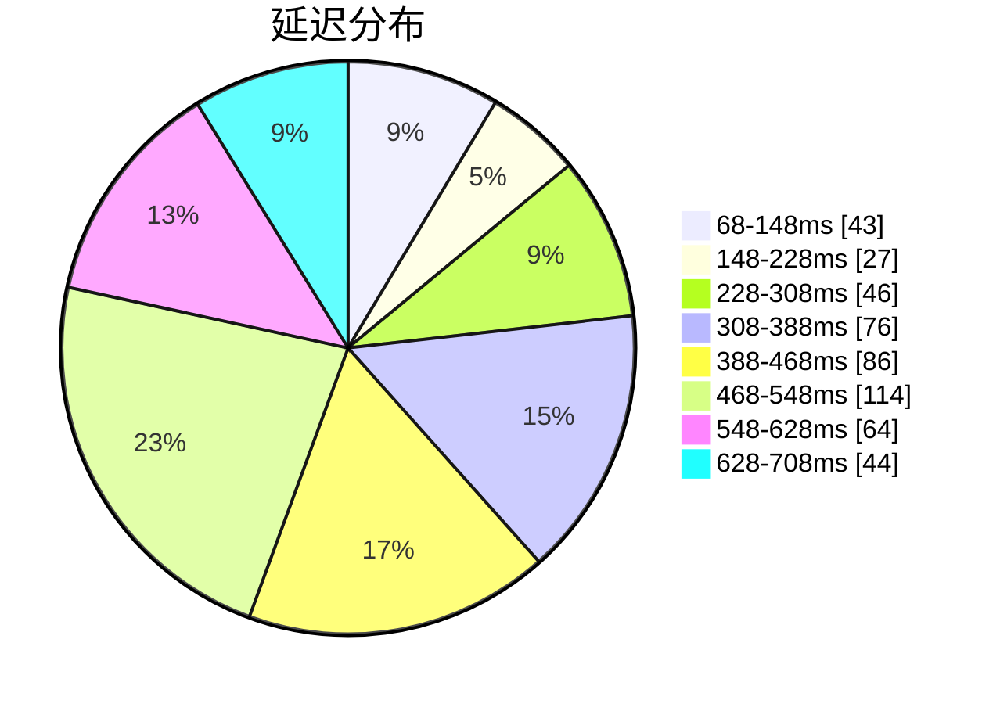
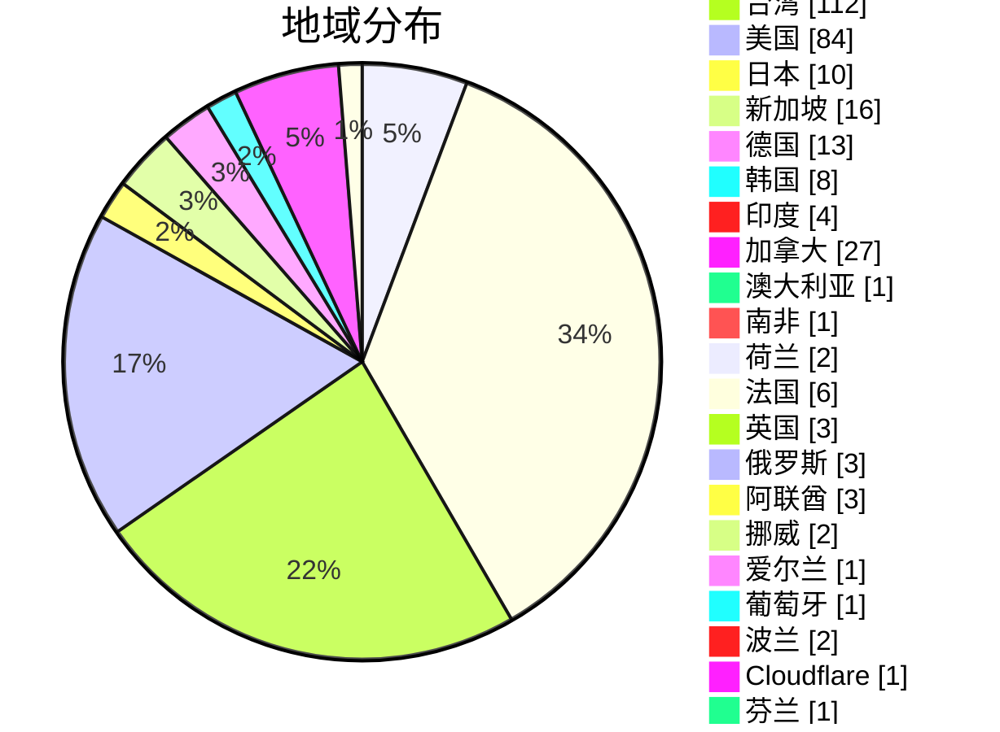
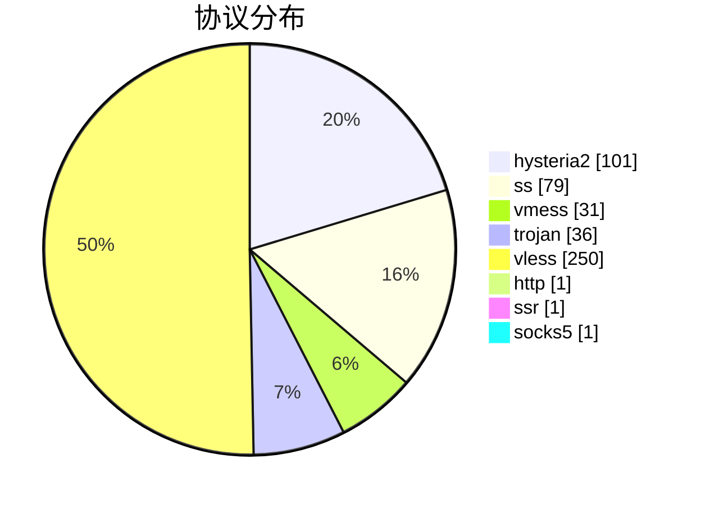

```mermaid
pie showData
title 延迟分布
"68-148ms" : 43
"148-228ms" : 27
"228-308ms" : 46
"308-388ms" : 76
"388-468ms" : 86
"468-548ms" : 114
"548-628ms" : 64
"628-708ms" : 44
```

```mermaid
pie showData
title 地域分布
"香港" : 27
"未知" : 170
"台湾" : 112
"美国" : 84
"日本" : 10
"新加坡" : 16
"德国" : 13
"韩国" : 8
"印度" : 4
"加拿大" : 27
"澳大利亚" : 1
"南非" : 1
"荷兰" : 2
"法国" : 6
"英国" : 3
"俄罗斯" : 3
"阿联酋" : 3
"挪威" : 2
"爱尔兰" : 1
"葡萄牙" : 1
"波兰" : 2
"Cloudflare" : 1
"芬兰" : 1
"墨西哥" : 1
"中国" : 1
```

```mermaid
pie showData
title 协议分布
"hysteria2" : 101
"ss" : 79
"vmess" : 31
"trojan" : 36
"vless" : 250
"http" : 1
"ssr" : 1
"socks5" : 1
```