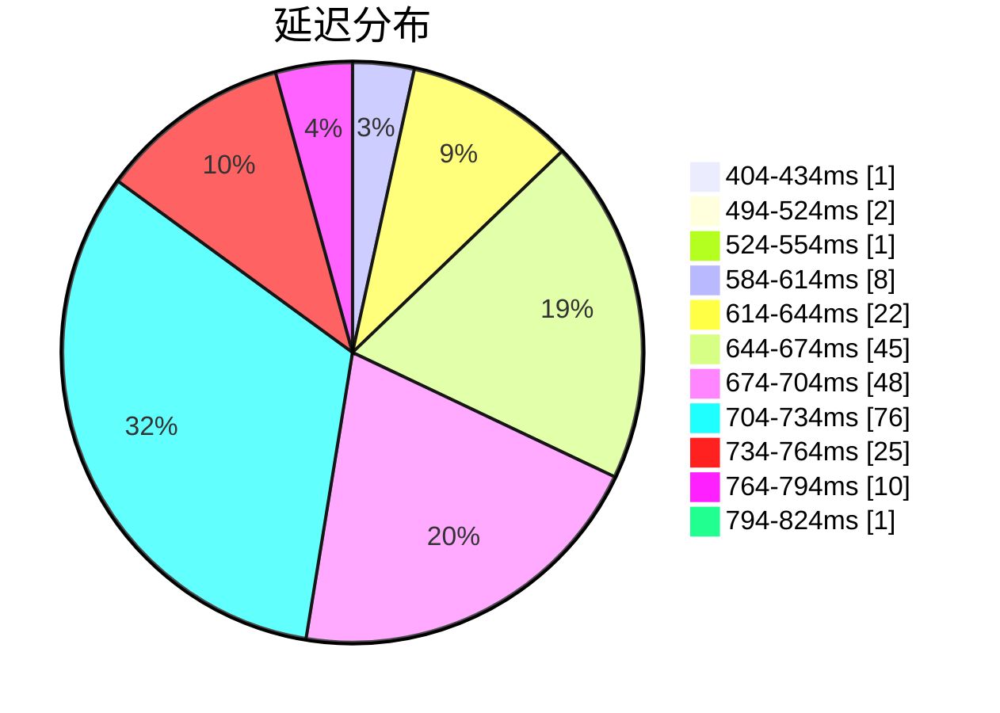
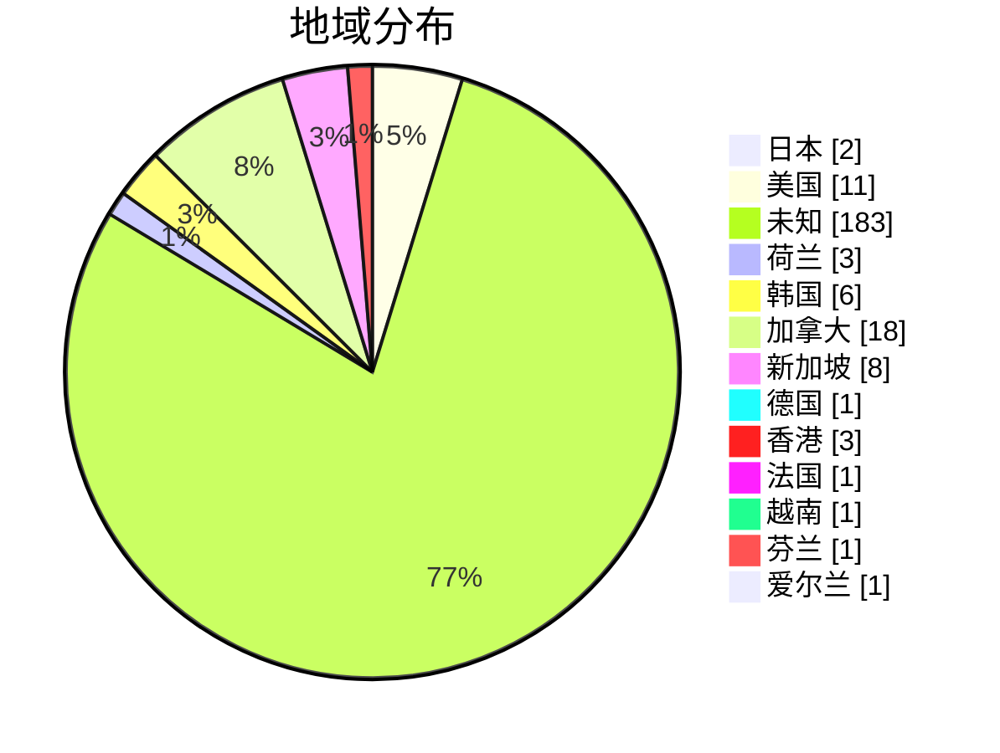
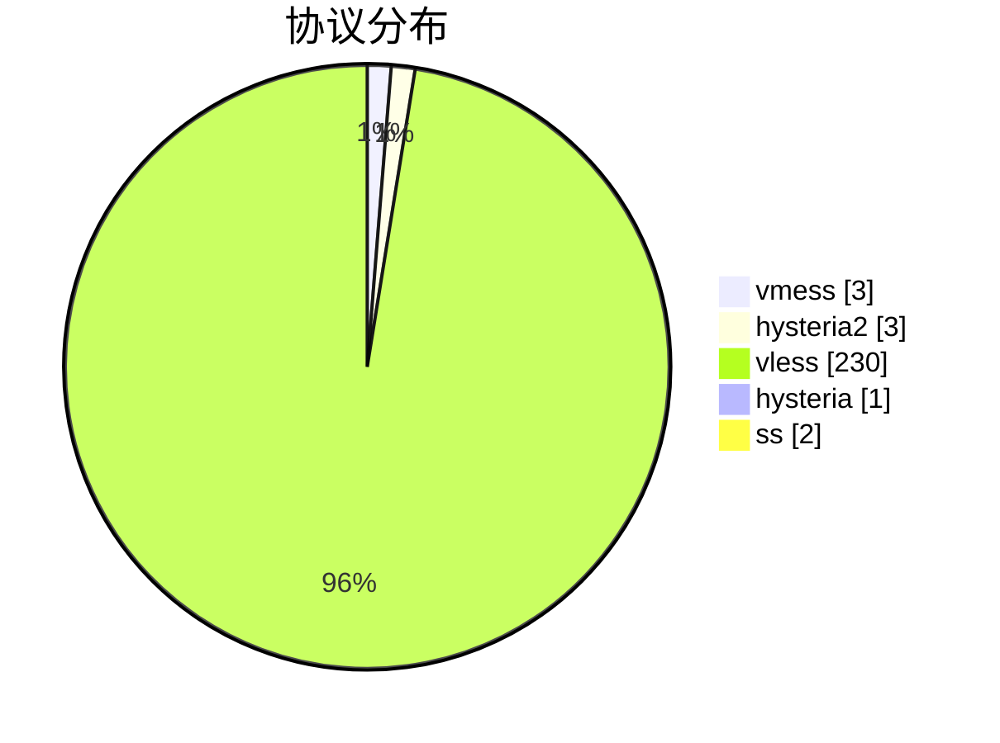

```mermaid
pie showData
title 延迟分布
"404-434ms" : 1
"494-524ms" : 2
"524-554ms" : 1
"584-614ms" : 8
"614-644ms" : 22
"644-674ms" : 45
"674-704ms" : 48
"704-734ms" : 76
"734-764ms" : 25
"764-794ms" : 10
"794-824ms" : 1
```

```mermaid
pie showData
title 地域分布
"日本" : 2
"美国" : 11
"未知" : 183
"荷兰" : 3
"韩国" : 6
"加拿大" : 18
"新加坡" : 8
"德国" : 1
"香港" : 3
"法国" : 1
"越南" : 1
"芬兰" : 1
"爱尔兰" : 1
```

```mermaid
pie showData
title 协议分布
"vmess" : 3
"hysteria2" : 3
"vless" : 230
"hysteria" : 1
"ss" : 2
```