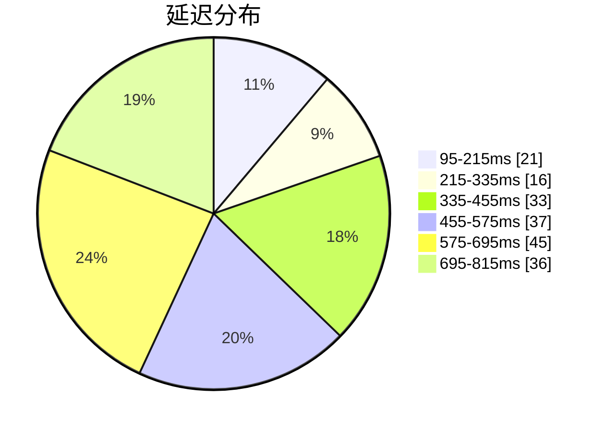
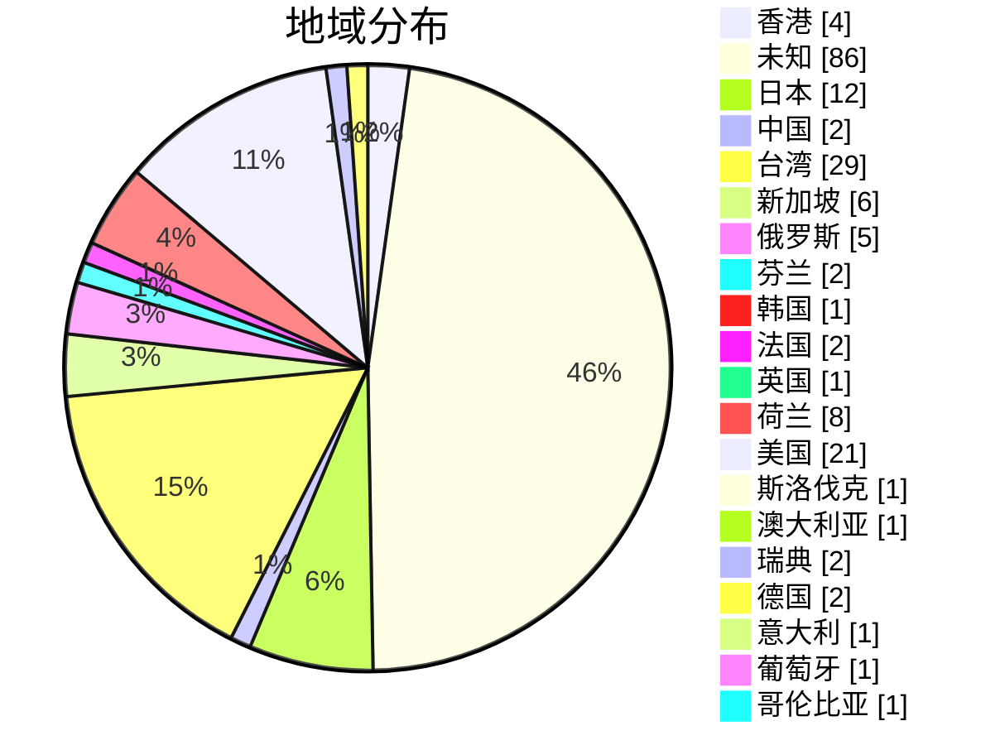
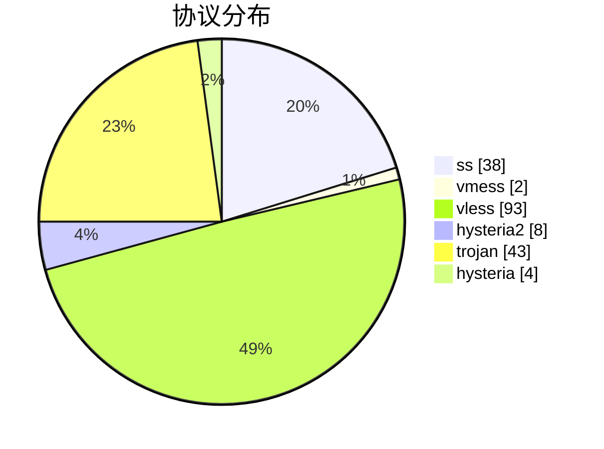

```mermaid
pie showData
title 延迟分布
"95-215ms" : 21
"215-335ms" : 16
"335-455ms" : 33
"455-575ms" : 37
"575-695ms" : 45
"695-815ms" : 36
```

```mermaid
pie showData
title 地域分布
"香港" : 4
"未知" : 86
"日本" : 12
"中国" : 2
"台湾" : 29
"新加坡" : 6
"俄罗斯" : 5
"芬兰" : 2
"韩国" : 1
"法国" : 2
"英国" : 1
"荷兰" : 8
"美国" : 21
"斯洛伐克" : 1
"澳大利亚" : 1
"瑞典" : 2
"德国" : 2
"意大利" : 1
"葡萄牙" : 1
"哥伦比亚" : 1
```

```mermaid
pie showData
title 协议分布
"ss" : 38
"vmess" : 2
"vless" : 93
"hysteria2" : 8
"trojan" : 43
"hysteria" : 4
```