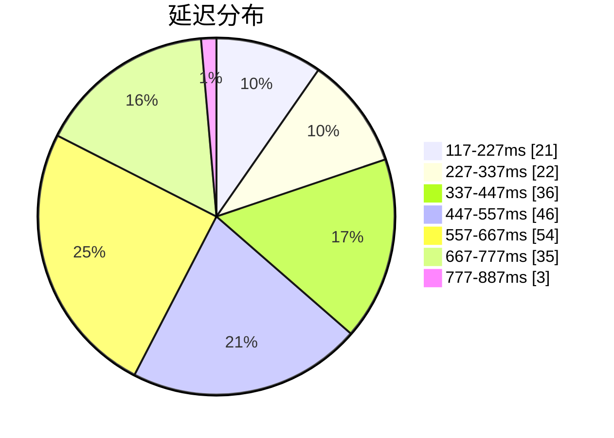
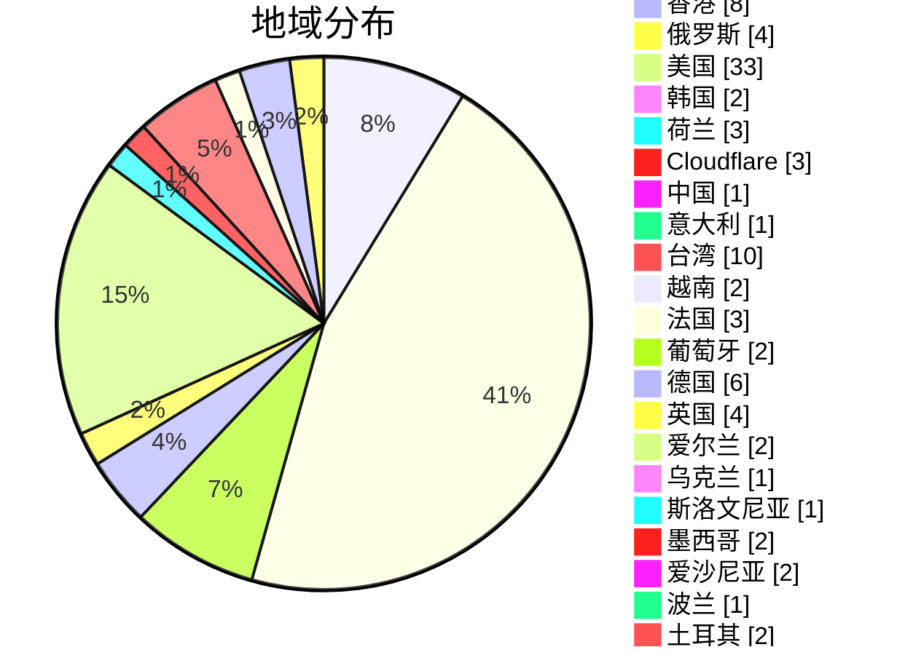
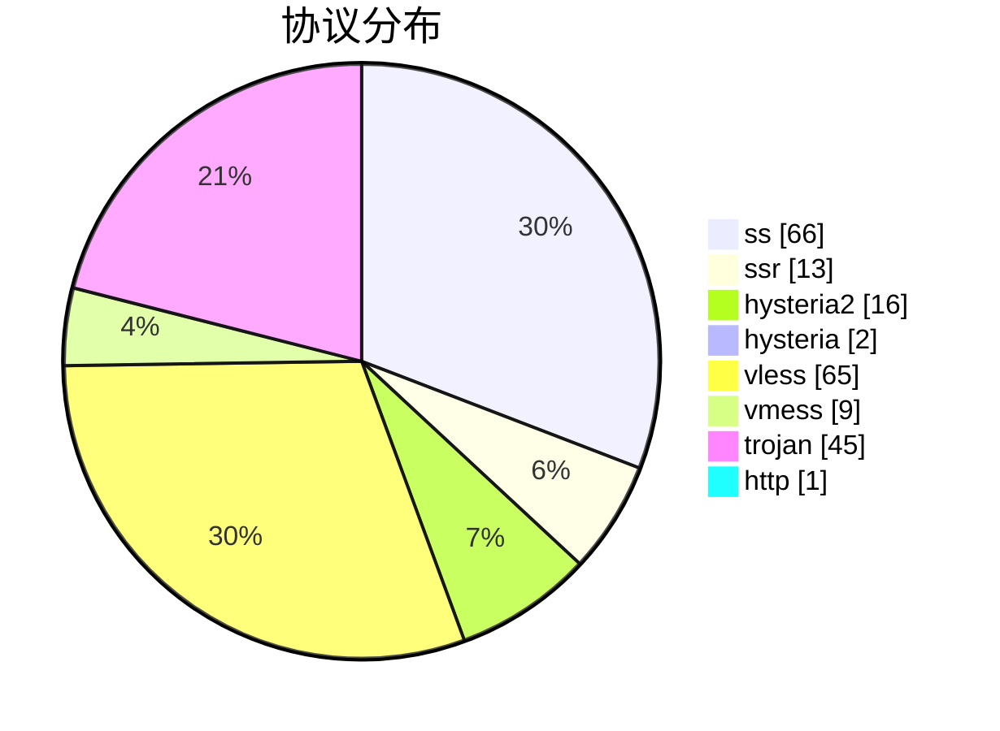

```mermaid
pie showData
title 延迟分布
"117-227ms" : 21
"227-337ms" : 22
"337-447ms" : 36
"447-557ms" : 46
"557-667ms" : 54
"667-777ms" : 35
"777-887ms" : 3
```

```mermaid
pie showData
title 地域分布
"日本" : 17
"未知" : 89
"新加坡" : 15
"香港" : 8
"俄罗斯" : 4
"美国" : 33
"韩国" : 2
"荷兰" : 3
"Cloudflare" : 3
"中国" : 1
"意大利" : 1
"台湾" : 10
"越南" : 2
"法国" : 3
"葡萄牙" : 2
"德国" : 6
"英国" : 4
"爱尔兰" : 2
"乌克兰" : 1
"斯洛文尼亚" : 1
"墨西哥" : 2
"爱沙尼亚" : 2
"波兰" : 1
"土耳其" : 2
"加拿大" : 1
"捷克" : 1
"以色列" : 1
```

```mermaid
pie showData
title 协议分布
"ss" : 66
"ssr" : 13
"hysteria2" : 16
"hysteria" : 2
"vless" : 65
"vmess" : 9
"trojan" : 45
"http" : 1
```