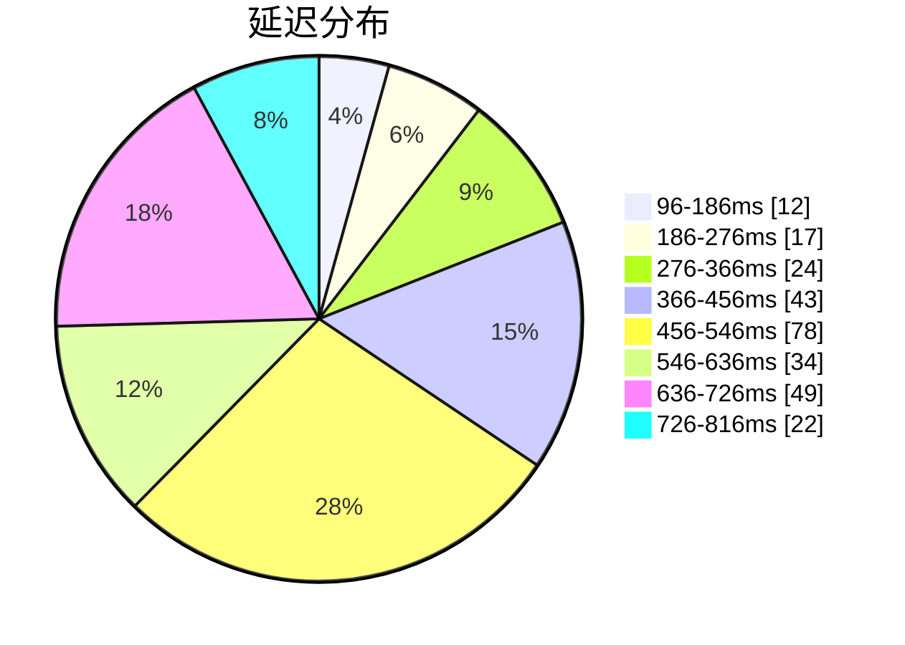
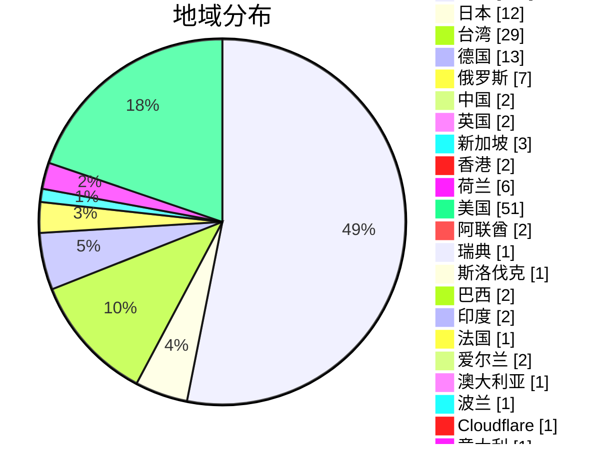
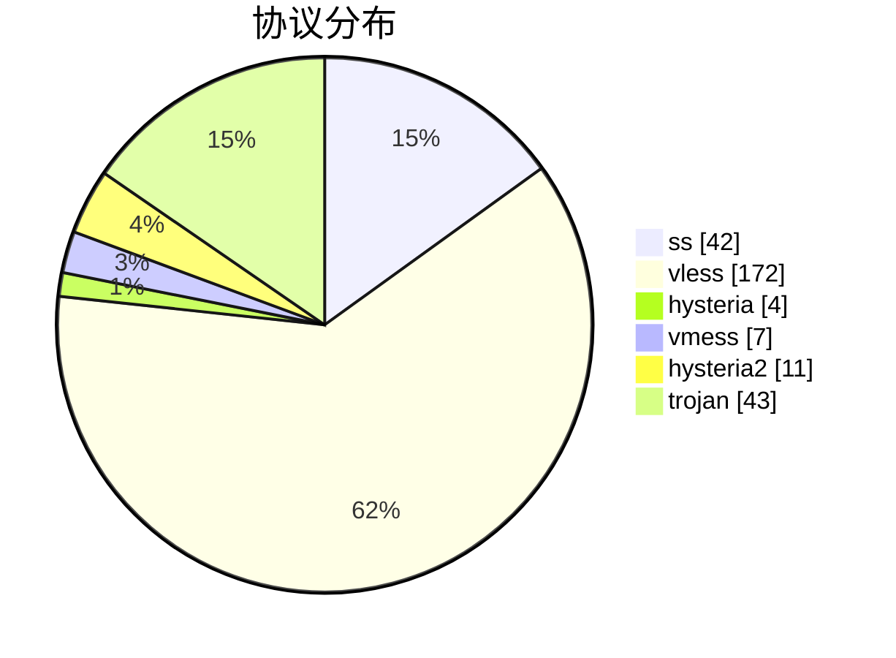

```mermaid
pie showData
title 延迟分布
"96-186ms" : 12
"186-276ms" : 17
"276-366ms" : 24
"366-456ms" : 43
"456-546ms" : 78
"546-636ms" : 34
"636-726ms" : 49
"726-816ms" : 22
```

```mermaid
pie showData
title 地域分布
"未知" : 137
"日本" : 12
"台湾" : 29
"德国" : 13
"俄罗斯" : 7
"中国" : 2
"英国" : 2
"新加坡" : 3
"香港" : 2
"荷兰" : 6
"美国" : 51
"阿联酋" : 2
"瑞典" : 1
"斯洛伐克" : 1
"巴西" : 2
"印度" : 2
"法国" : 1
"爱尔兰" : 2
"澳大利亚" : 1
"波兰" : 1
"Cloudflare" : 1
"意大利" : 1
```

```mermaid
pie showData
title 协议分布
"ss" : 42
"vless" : 172
"hysteria" : 4
"vmess" : 7
"hysteria2" : 11
"trojan" : 43
```