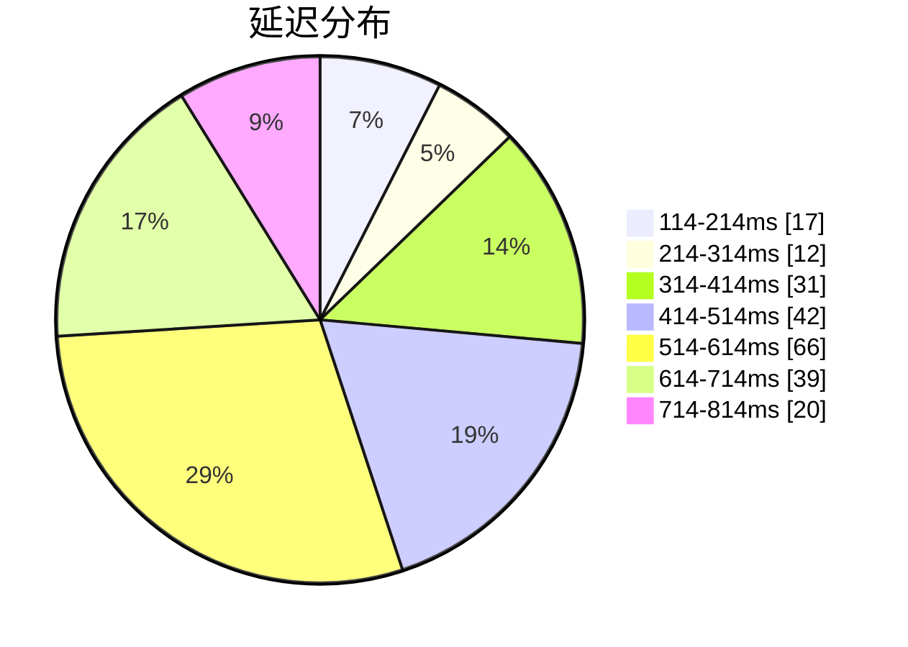
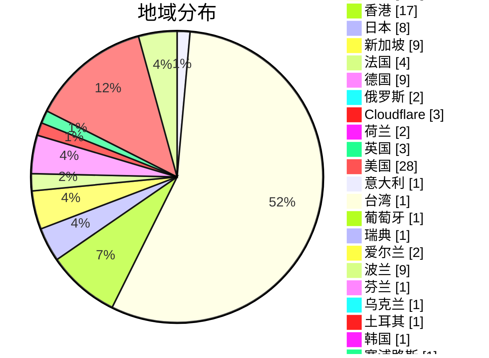
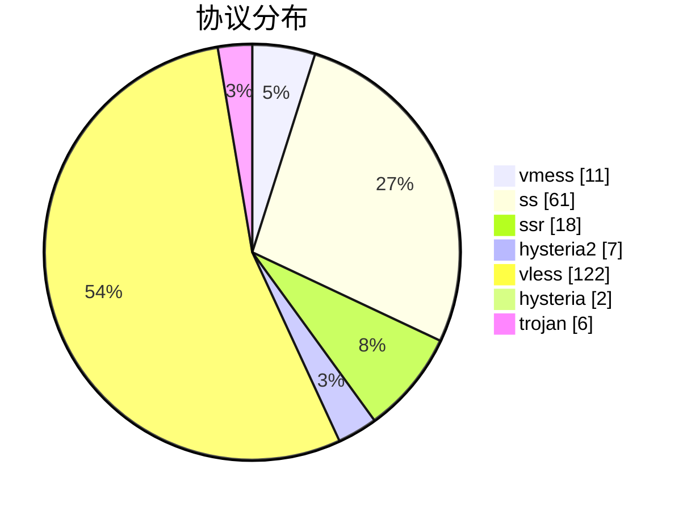

```mermaid
pie showData
title 延迟分布
"114-214ms" : 17
"214-314ms" : 12
"314-414ms" : 31
"414-514ms" : 42
"514-614ms" : 66
"614-714ms" : 39
"714-814ms" : 20
```

```mermaid
pie showData
title 地域分布
"中国" : 3
"未知" : 118
"香港" : 17
"日本" : 8
"新加坡" : 9
"法国" : 4
"德国" : 9
"俄罗斯" : 2
"Cloudflare" : 3
"荷兰" : 2
"英国" : 3
"美国" : 28
"意大利" : 1
"台湾" : 1
"葡萄牙" : 1
"瑞典" : 1
"爱尔兰" : 2
"波兰" : 9
"芬兰" : 1
"乌克兰" : 1
"土耳其" : 1
"韩国" : 1
"塞浦路斯" : 1
"秘鲁" : 1
```

```mermaid
pie showData
title 协议分布
"vmess" : 11
"ss" : 61
"ssr" : 18
"hysteria2" : 7
"vless" : 122
"hysteria" : 2
"trojan" : 6
```