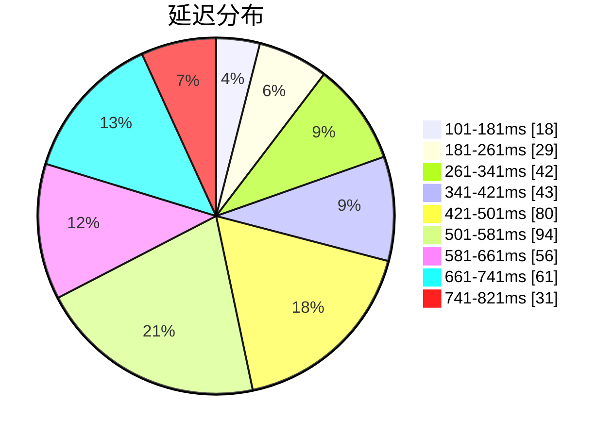
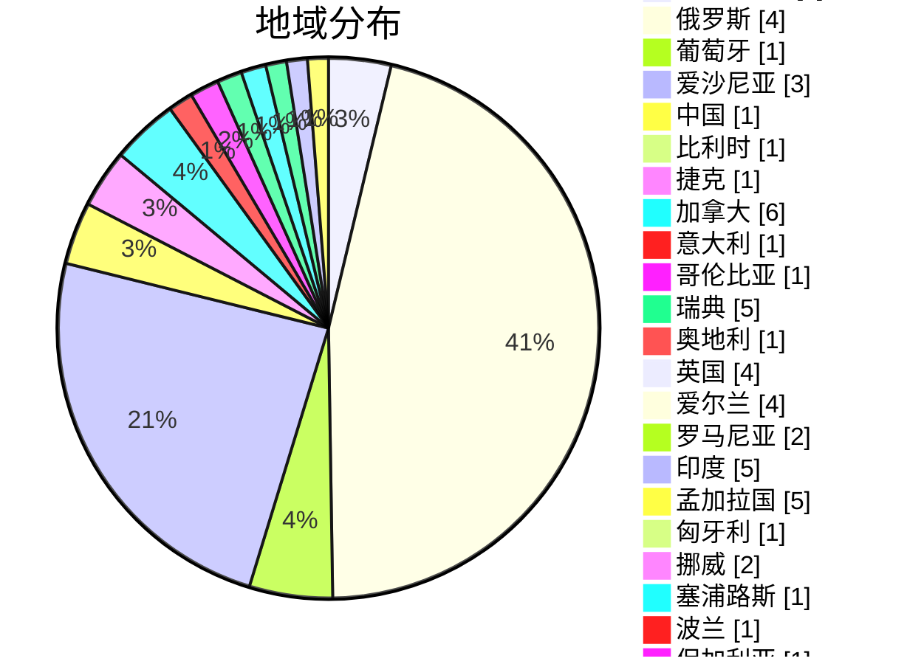
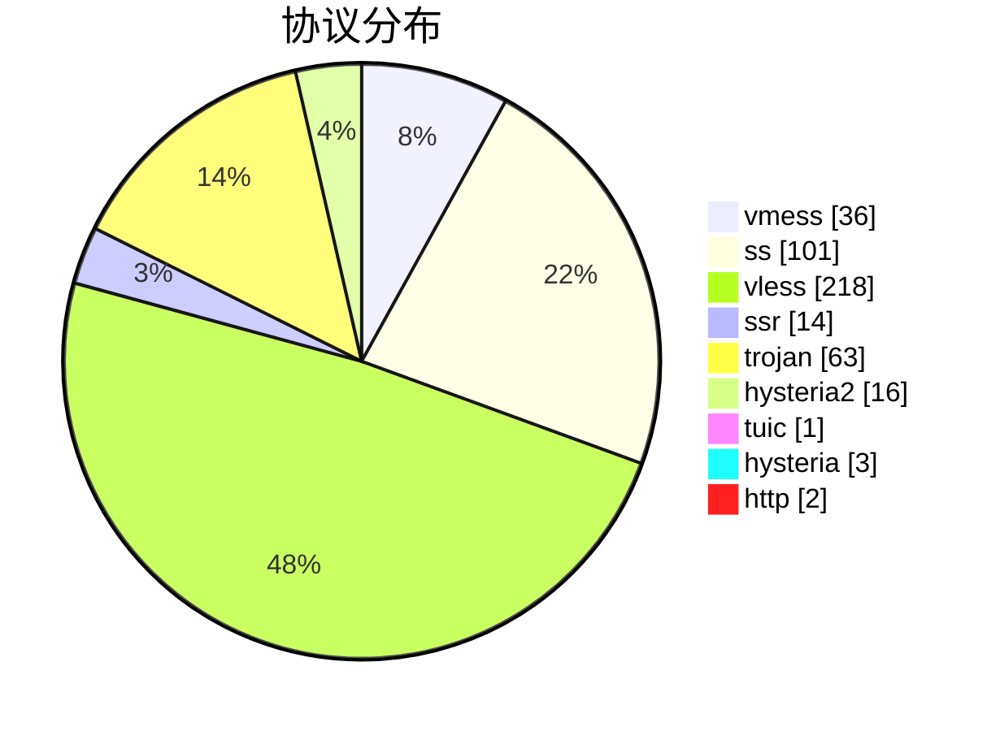

```mermaid
pie showData
title 延迟分布
"101-181ms" : 18
"181-261ms" : 29
"261-341ms" : 42
"341-421ms" : 43
"421-501ms" : 80
"501-581ms" : 94
"581-661ms" : 56
"661-741ms" : 61
"741-821ms" : 31
```

```mermaid
pie showData
title 地域分布
"香港" : 15
"未知" : 185
"日本" : 20
"美国" : 97
"新加坡" : 15
"台湾" : 4
"德国" : 14
"韩国" : 16
"澳大利亚" : 6
"法国" : 7
"荷兰" : 6
"斯洛伐克" : 2
"Cloudflare" : 3
"俄罗斯" : 4
"葡萄牙" : 1
"爱沙尼亚" : 3
"中国" : 1
"比利时" : 1
"捷克" : 1
"加拿大" : 6
"意大利" : 1
"哥伦比亚" : 1
"瑞典" : 5
"奥地利" : 1
"英国" : 4
"爱尔兰" : 4
"罗马尼亚" : 2
"印度" : 5
"孟加拉国" : 5
"匈牙利" : 1
"挪威" : 2
"塞浦路斯" : 1
"波兰" : 1
"保加利亚" : 1
"乌克兰" : 1
"拉脱维亚" : 2
"瑞士" : 1
"智利" : 1
"摩尔多瓦" : 1
"芬兰" : 1
"西班牙" : 1
"越南" : 1
"土耳其" : 1
"丹麦" : 1
"立陶宛" : 1
"冰岛" : 1
```

```mermaid
pie showData
title 协议分布
"vmess" : 36
"ss" : 101
"vless" : 218
"ssr" : 14
"trojan" : 63
"hysteria2" : 16
"tuic" : 1
"hysteria" : 3
"http" : 2
```