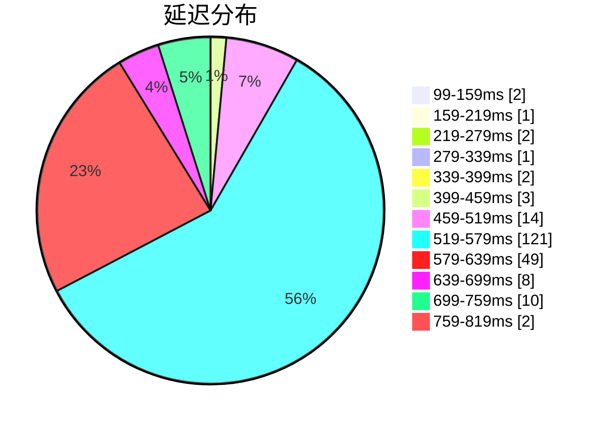
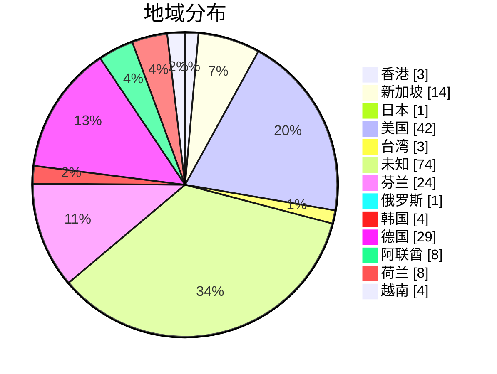
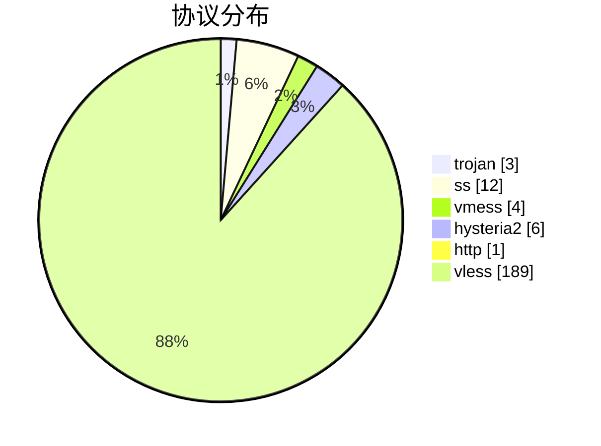

```mermaid
pie showData
title 延迟分布
"99-159ms" : 2
"159-219ms" : 1
"219-279ms" : 2
"279-339ms" : 1
"339-399ms" : 2
"399-459ms" : 3
"459-519ms" : 14
"519-579ms" : 121
"579-639ms" : 49
"639-699ms" : 8
"699-759ms" : 10
"759-819ms" : 2
```

```mermaid
pie showData
title 地域分布
"香港" : 3
"新加坡" : 14
"日本" : 1
"美国" : 42
"台湾" : 3
"未知" : 74
"芬兰" : 24
"俄罗斯" : 1
"韩国" : 4
"德国" : 29
"阿联酋" : 8
"荷兰" : 8
"越南" : 4
```

```mermaid
pie showData
title 协议分布
"trojan" : 3
"ss" : 12
"vmess" : 4
"hysteria2" : 6
"http" : 1
"vless" : 189
```