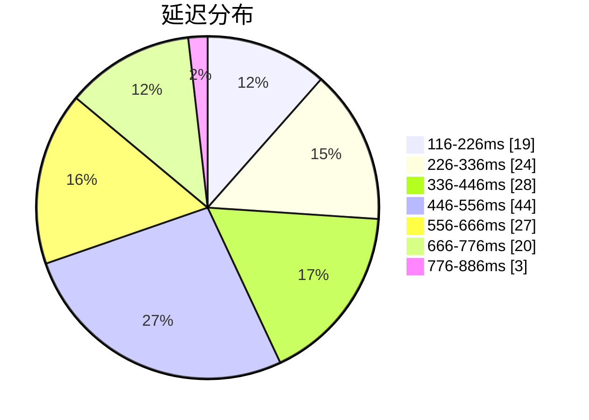
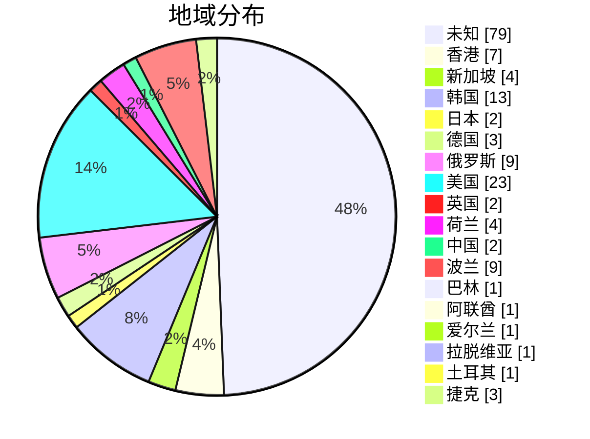
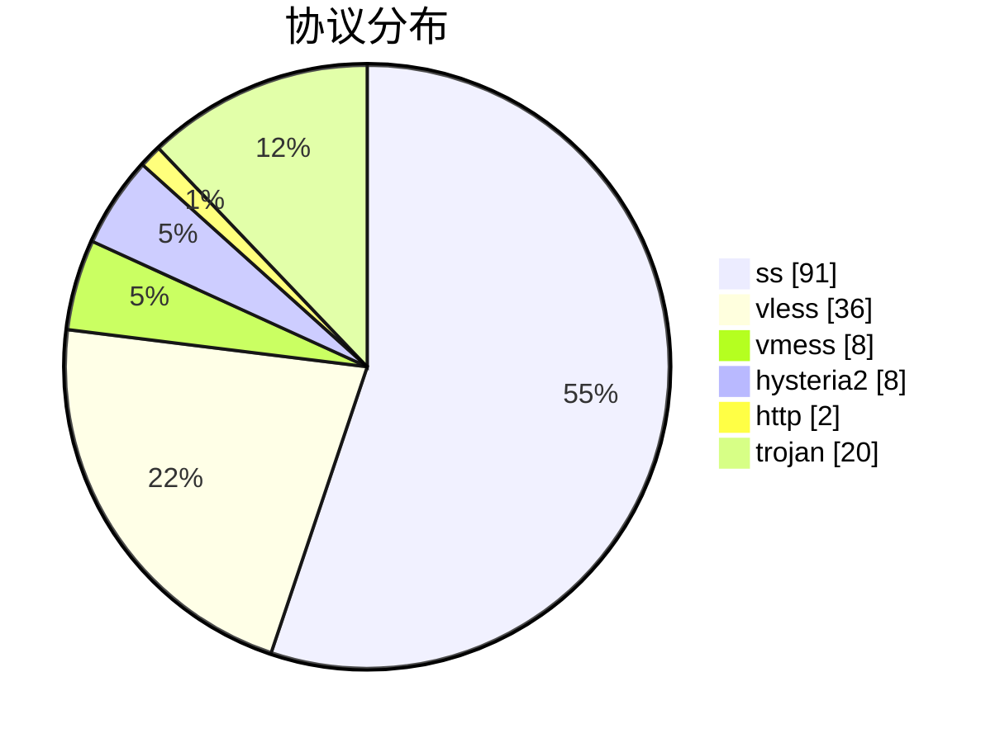

```mermaid
pie showData
title 延迟分布
"116-226ms" : 19
"226-336ms" : 24
"336-446ms" : 28
"446-556ms" : 44
"556-666ms" : 27
"666-776ms" : 20
"776-886ms" : 3
```

```mermaid
pie showData
title 地域分布
"未知" : 79
"香港" : 7
"新加坡" : 4
"韩国" : 13
"日本" : 2
"德国" : 3
"俄罗斯" : 9
"美国" : 23
"英国" : 2
"荷兰" : 4
"中国" : 2
"波兰" : 9
"巴林" : 1
"阿联酋" : 1
"爱尔兰" : 1
"拉脱维亚" : 1
"土耳其" : 1
"捷克" : 3
```

```mermaid
pie showData
title 协议分布
"ss" : 91
"vless" : 36
"vmess" : 8
"hysteria2" : 8
"http" : 2
"trojan" : 20
```