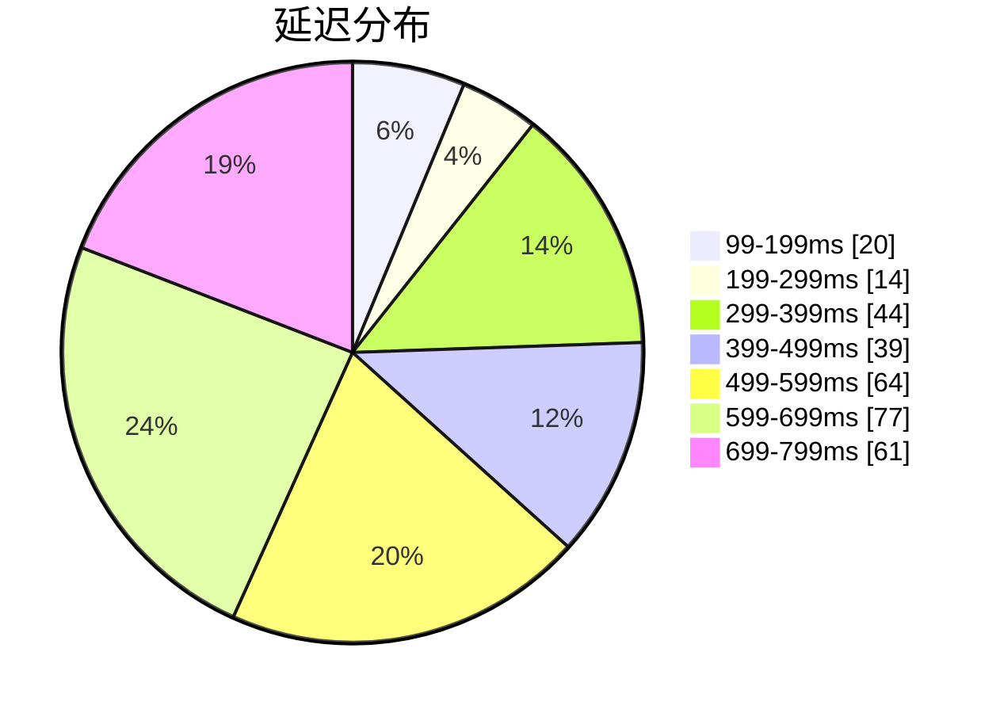
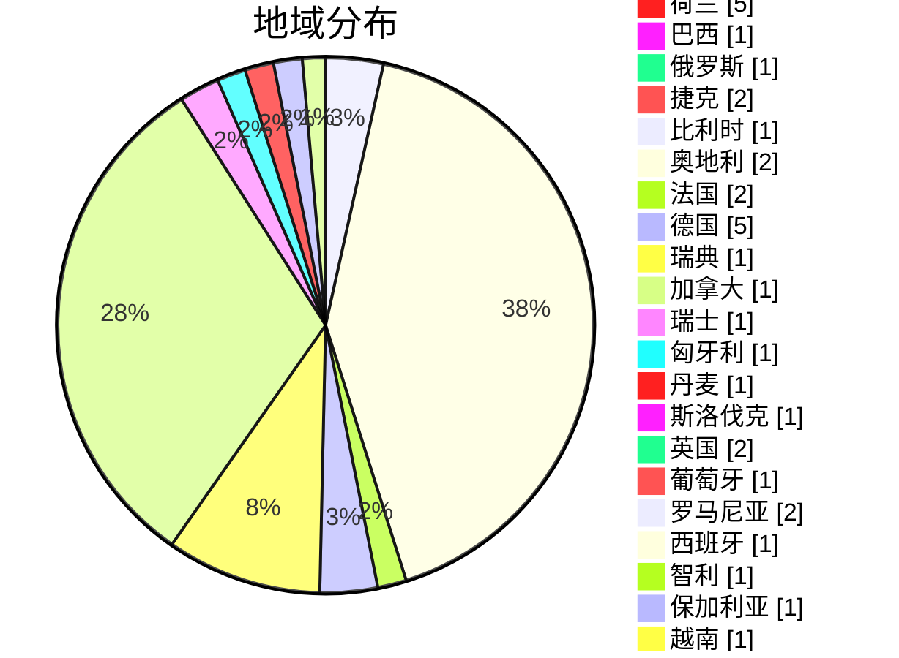
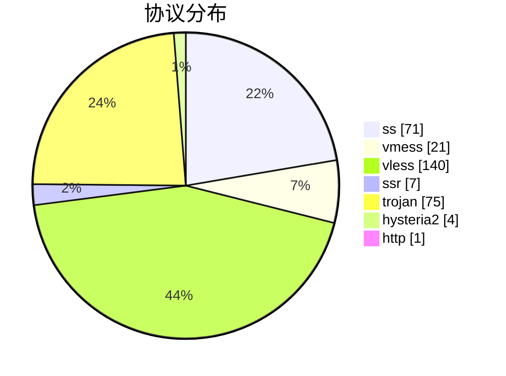

```mermaid
pie showData
title 延迟分布
"99-199ms" : 20
"199-299ms" : 14
"299-399ms" : 44
"399-499ms" : 39
"499-599ms" : 64
"599-699ms" : 77
"699-799ms" : 61
```

```mermaid
pie showData
title 地域分布
"香港" : 10
"未知" : 120
"日本" : 5
"美国" : 10
"波兰" : 27
"台湾" : 90
"新加坡" : 7
"韩国" : 5
"荷兰" : 5
"巴西" : 1
"俄罗斯" : 1
"捷克" : 2
"比利时" : 1
"奥地利" : 2
"法国" : 2
"德国" : 5
"瑞典" : 1
"加拿大" : 1
"瑞士" : 1
"匈牙利" : 1
"丹麦" : 1
"斯洛伐克" : 1
"英国" : 2
"葡萄牙" : 1
"罗马尼亚" : 2
"西班牙" : 1
"智利" : 1
"保加利亚" : 1
"越南" : 1
"孟加拉国" : 4
"立陶宛" : 1
"摩尔多瓦" : 1
"Cloudflare" : 1
"土耳其" : 1
"乌克兰" : 1
"拉脱维亚" : 1
"挪威" : 1
```

```mermaid
pie showData
title 协议分布
"ss" : 71
"vmess" : 21
"vless" : 140
"ssr" : 7
"trojan" : 75
"hysteria2" : 4
"http" : 1
```