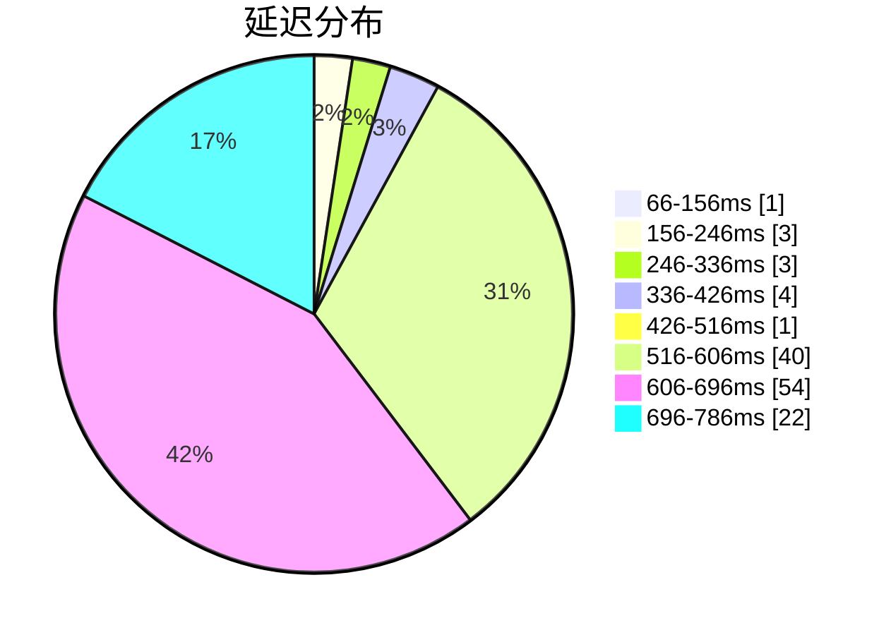
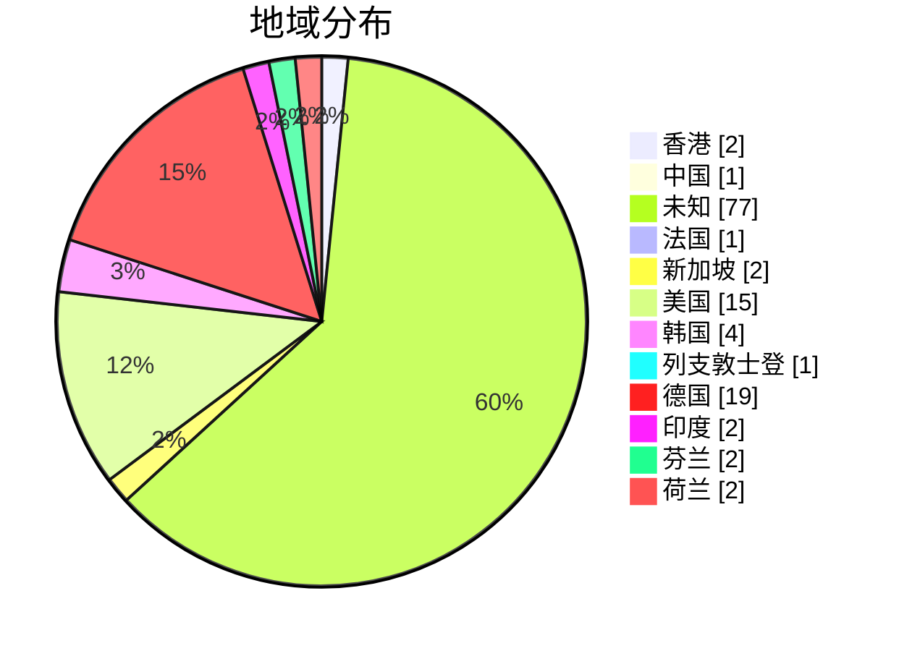
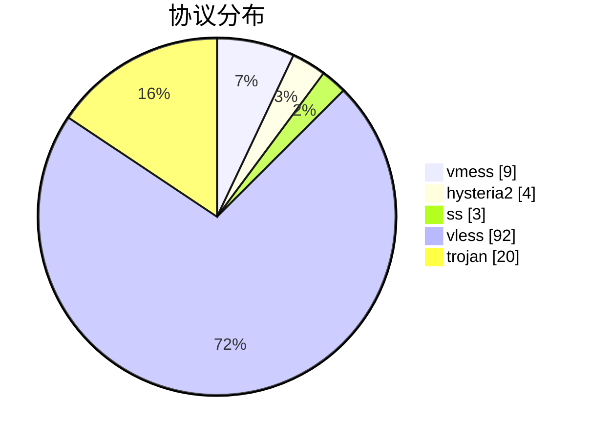

```mermaid
pie showData
title 延迟分布
"66-156ms" : 1
"156-246ms" : 3
"246-336ms" : 3
"336-426ms" : 4
"426-516ms" : 1
"516-606ms" : 40
"606-696ms" : 54
"696-786ms" : 22
```

```mermaid
pie showData
title 地域分布
"香港" : 2
"中国" : 1
"未知" : 77
"法国" : 1
"新加坡" : 2
"美国" : 15
"韩国" : 4
"列支敦士登" : 1
"德国" : 19
"印度" : 2
"芬兰" : 2
"荷兰" : 2
```

```mermaid
pie showData
title 协议分布
"vmess" : 9
"hysteria2" : 4
"ss" : 3
"vless" : 92
"trojan" : 20
```