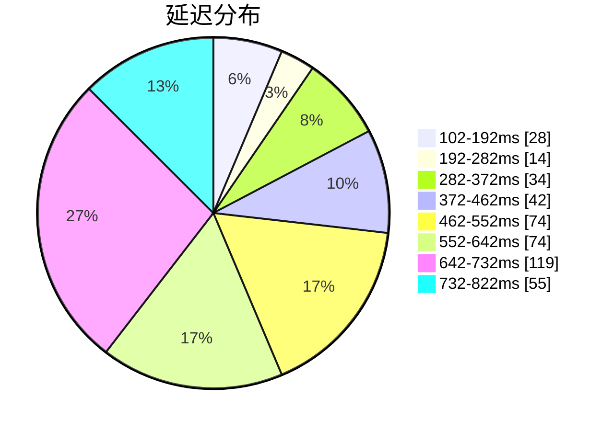
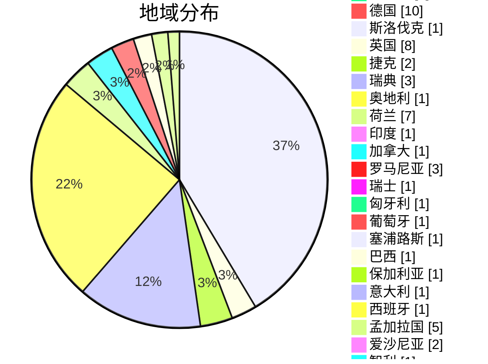
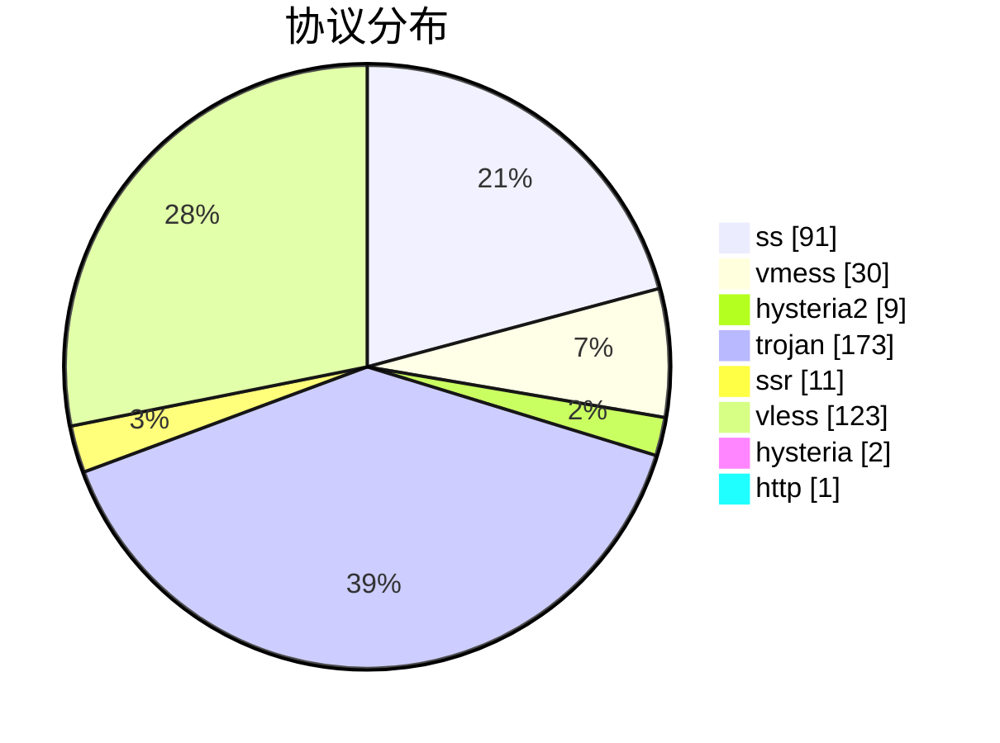

```mermaid
pie showData
title 延迟分布
"102-192ms" : 28
"192-282ms" : 14
"282-372ms" : 34
"372-462ms" : 42
"462-552ms" : 74
"552-642ms" : 74
"642-732ms" : 119
"732-822ms" : 55
```

```mermaid
pie showData
title 地域分布
"未知" : 164
"日本" : 11
"香港" : 14
"美国" : 54
"台湾" : 98
"新加坡" : 13
"中国" : 1
"韩国" : 12
"法国" : 4
"波兰" : 3
"俄罗斯" : 2
"德国" : 10
"斯洛伐克" : 1
"英国" : 8
"捷克" : 2
"瑞典" : 3
"奥地利" : 1
"荷兰" : 7
"印度" : 1
"加拿大" : 1
"罗马尼亚" : 3
"瑞士" : 1
"匈牙利" : 1
"葡萄牙" : 1
"塞浦路斯" : 1
"巴西" : 1
"保加利亚" : 1
"意大利" : 1
"西班牙" : 1
"孟加拉国" : 5
"爱沙尼亚" : 2
"智利" : 1
"爱尔兰" : 1
"冰岛" : 1
"乌克兰" : 1
"希腊" : 1
"芬兰" : 1
"拉脱维亚" : 2
"以色列" : 1
"摩尔多瓦" : 1
"立陶宛" : 1
"挪威" : 1
```

```mermaid
pie showData
title 协议分布
"ss" : 91
"vmess" : 30
"hysteria2" : 9
"trojan" : 173
"ssr" : 11
"vless" : 123
"hysteria" : 2
"http" : 1
```