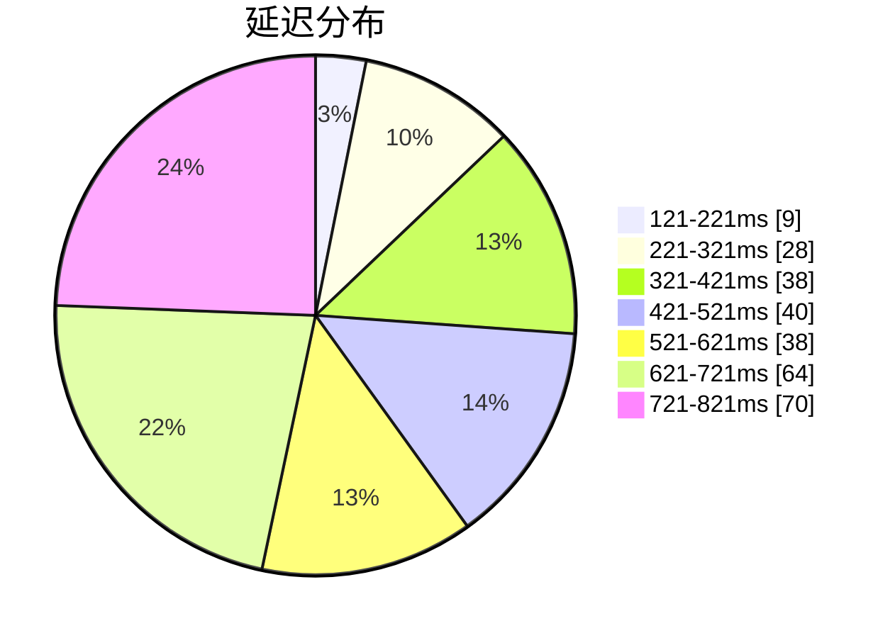
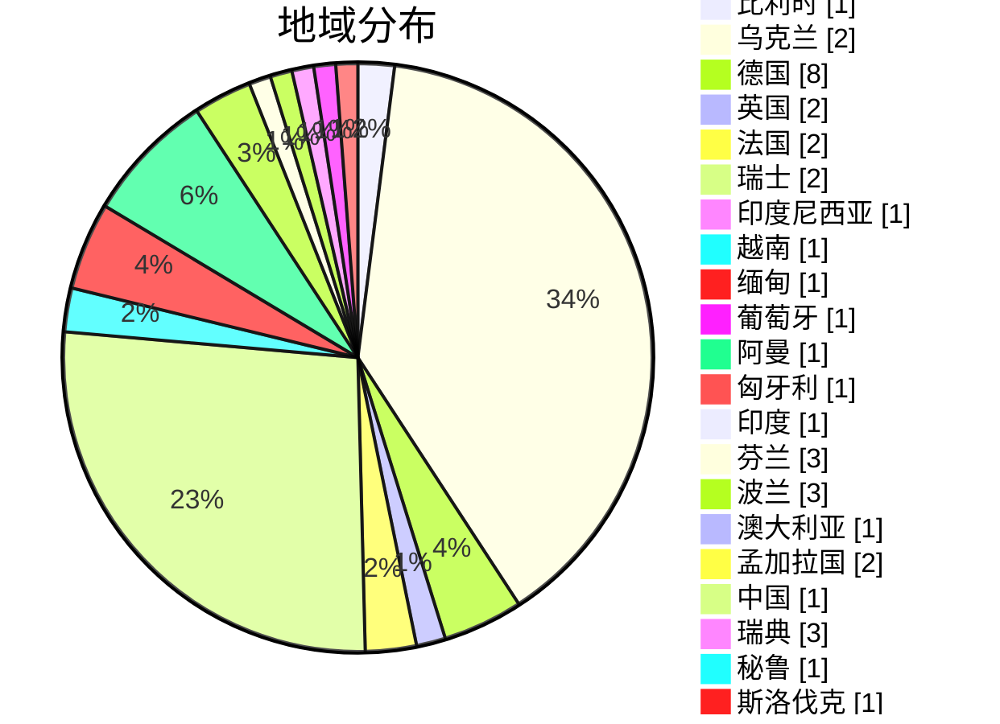
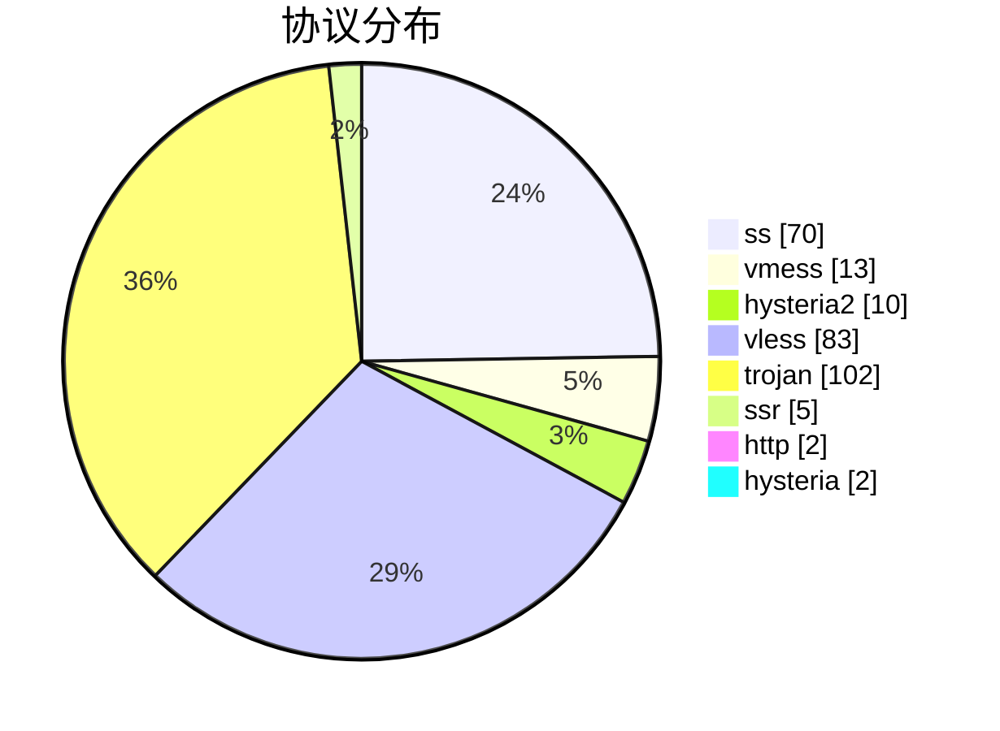

```mermaid
pie showData
title 延迟分布
"121-221ms" : 9
"221-321ms" : 28
"321-421ms" : 38
"421-521ms" : 40
"521-621ms" : 38
"621-721ms" : 64
"721-821ms" : 70
```

```mermaid
pie showData
title 地域分布
"日本" : 5
"未知" : 97
"香港" : 11
"新加坡" : 4
"韩国" : 7
"台湾" : 67
"Cloudflare" : 2
"荷兰" : 6
"加拿大" : 12
"俄罗斯" : 2
"美国" : 18
"捷克" : 1
"比利时" : 1
"乌克兰" : 2
"德国" : 8
"英国" : 2
"法国" : 2
"瑞士" : 2
"印度尼西亚" : 1
"越南" : 1
"缅甸" : 1
"葡萄牙" : 1
"阿曼" : 1
"匈牙利" : 1
"印度" : 1
"芬兰" : 3
"波兰" : 3
"澳大利亚" : 1
"孟加拉国" : 2
"中国" : 1
"瑞典" : 3
"秘鲁" : 1
"斯洛伐克" : 1
"土耳其" : 3
"希腊" : 1
"爱沙尼亚" : 3
"保加利亚" : 1
"冰岛" : 1
"爱尔兰" : 1
"丹麦" : 1
"意大利" : 1
"摩尔多瓦" : 1
"挪威" : 1
"立陶宛" : 1
"哥伦比亚" : 1
```

```mermaid
pie showData
title 协议分布
"ss" : 70
"vmess" : 13
"hysteria2" : 10
"vless" : 83
"trojan" : 102
"ssr" : 5
"http" : 2
"hysteria" : 2
```