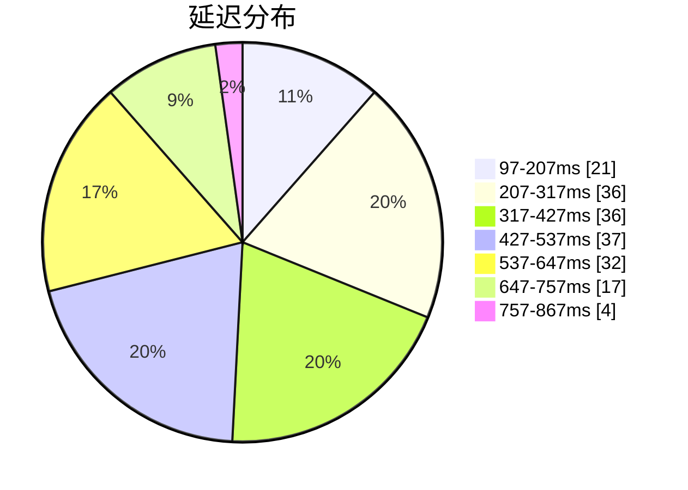
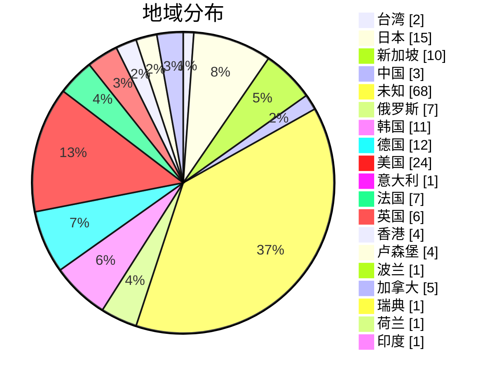
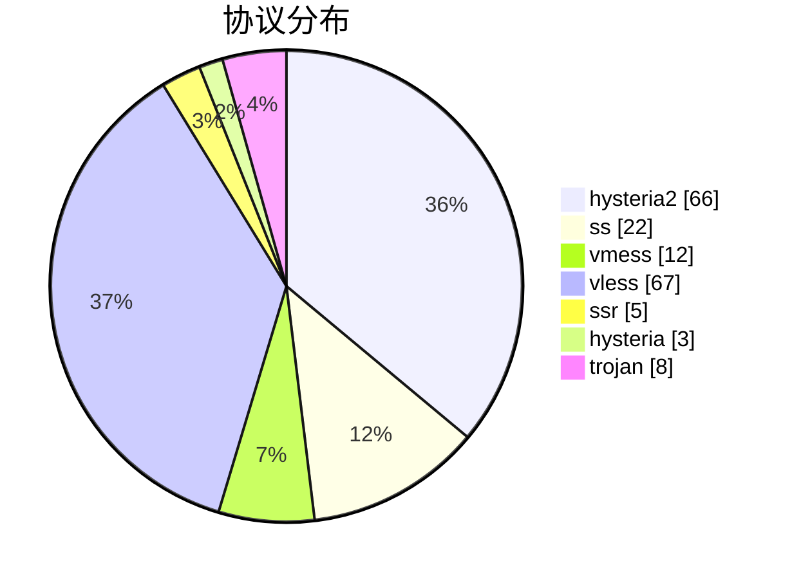

```mermaid
pie showData
title 延迟分布
"97-207ms" : 21
"207-317ms" : 36
"317-427ms" : 36
"427-537ms" : 37
"537-647ms" : 32
"647-757ms" : 17
"757-867ms" : 4
```

```mermaid
pie showData
title 地域分布
"台湾" : 2
"日本" : 15
"新加坡" : 10
"中国" : 3
"未知" : 68
"俄罗斯" : 7
"韩国" : 11
"德国" : 12
"美国" : 24
"意大利" : 1
"法国" : 7
"英国" : 6
"香港" : 4
"卢森堡" : 4
"波兰" : 1
"加拿大" : 5
"瑞典" : 1
"荷兰" : 1
"印度" : 1
```

```mermaid
pie showData
title 协议分布
"hysteria2" : 66
"ss" : 22
"vmess" : 12
"vless" : 67
"ssr" : 5
"hysteria" : 3
"trojan" : 8
```