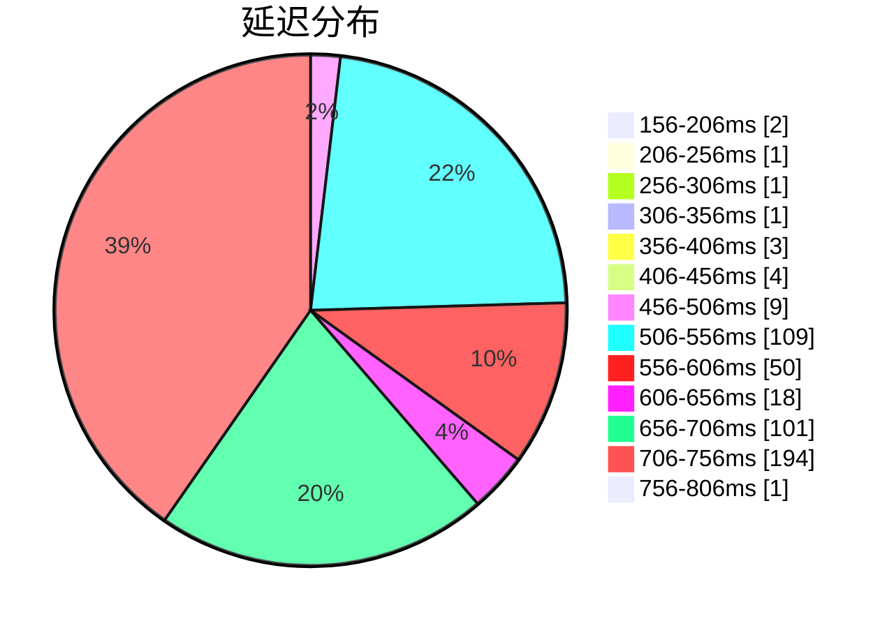
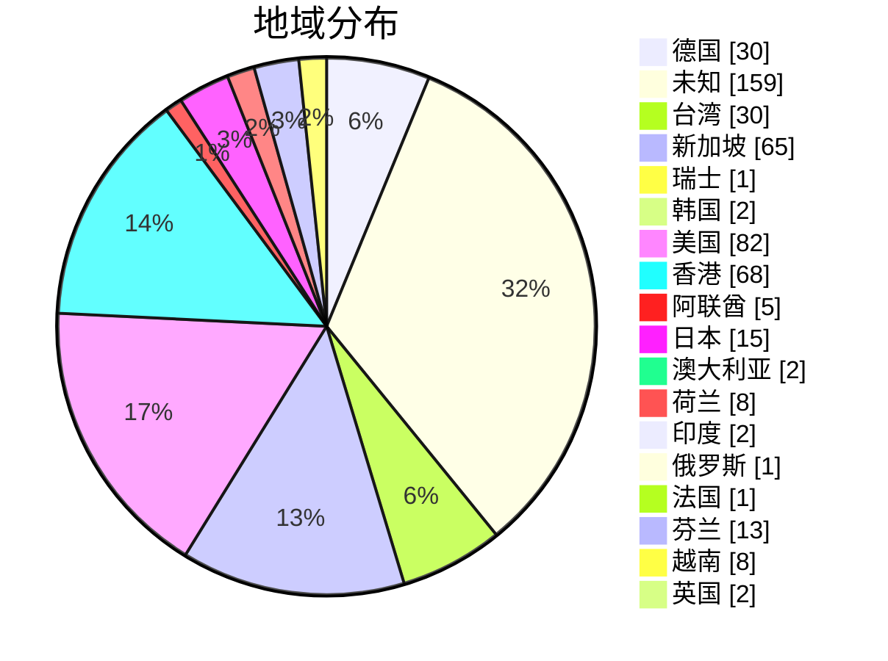
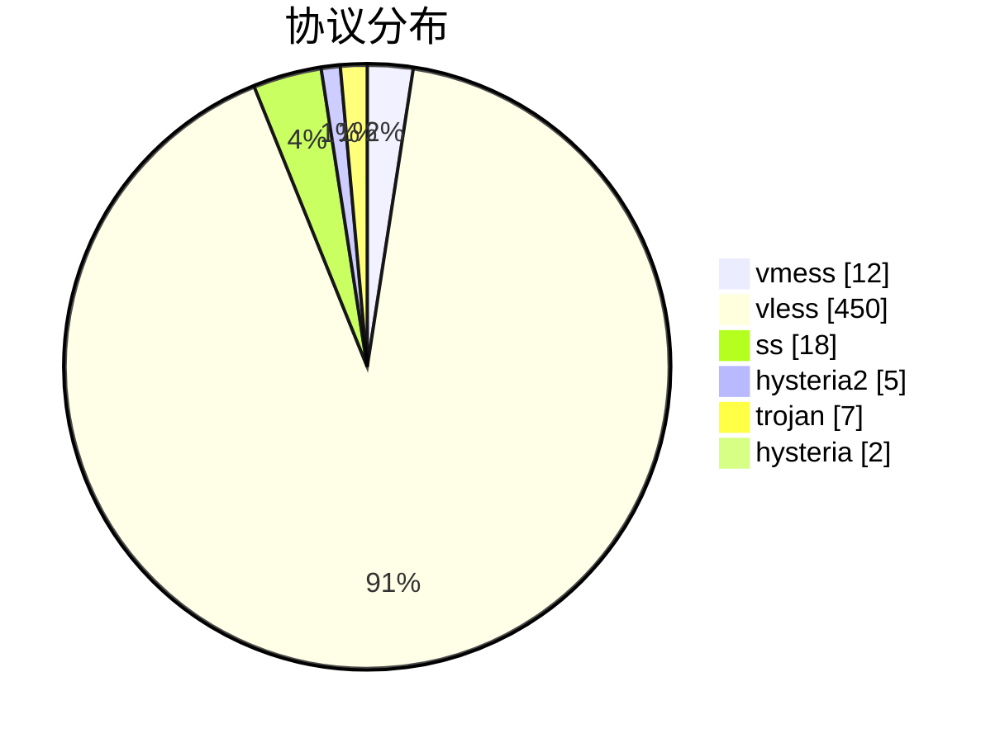

```mermaid
pie showData
title 延迟分布
"156-206ms" : 2
"206-256ms" : 1
"256-306ms" : 1
"306-356ms" : 1
"356-406ms" : 3
"406-456ms" : 4
"456-506ms" : 9
"506-556ms" : 109
"556-606ms" : 50
"606-656ms" : 18
"656-706ms" : 101
"706-756ms" : 194
"756-806ms" : 1
```

```mermaid
pie showData
title 地域分布
"德国" : 30
"未知" : 159
"台湾" : 30
"新加坡" : 65
"瑞士" : 1
"韩国" : 2
"美国" : 82
"香港" : 68
"阿联酋" : 5
"日本" : 15
"澳大利亚" : 2
"荷兰" : 8
"印度" : 2
"俄罗斯" : 1
"法国" : 1
"芬兰" : 13
"越南" : 8
"英国" : 2
```

```mermaid
pie showData
title 协议分布
"vmess" : 12
"vless" : 450
"ss" : 18
"hysteria2" : 5
"trojan" : 7
"hysteria" : 2
```