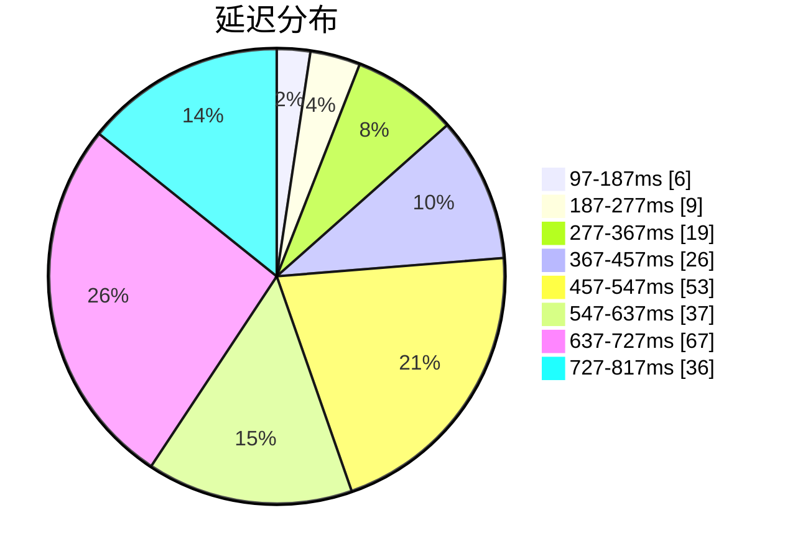
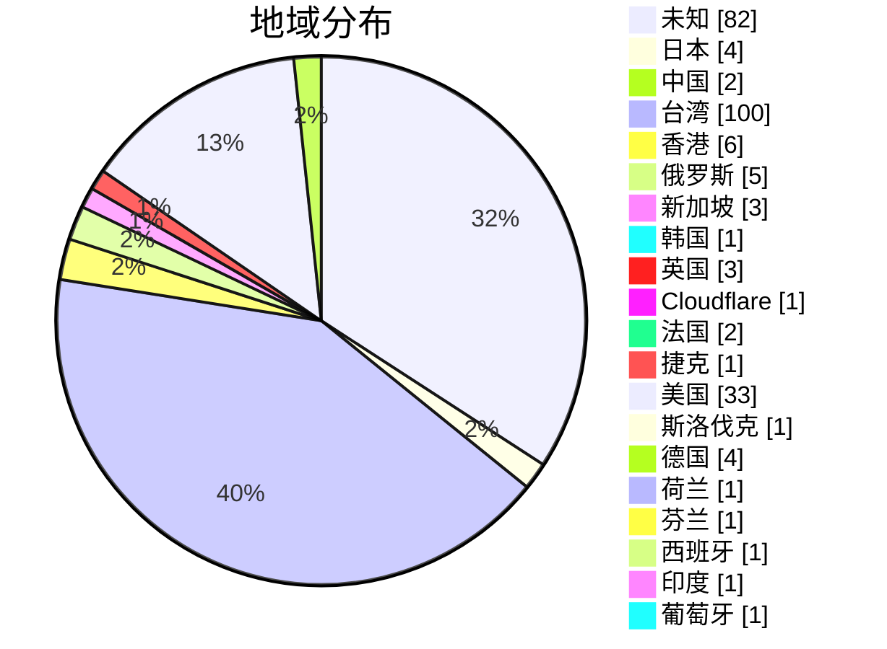
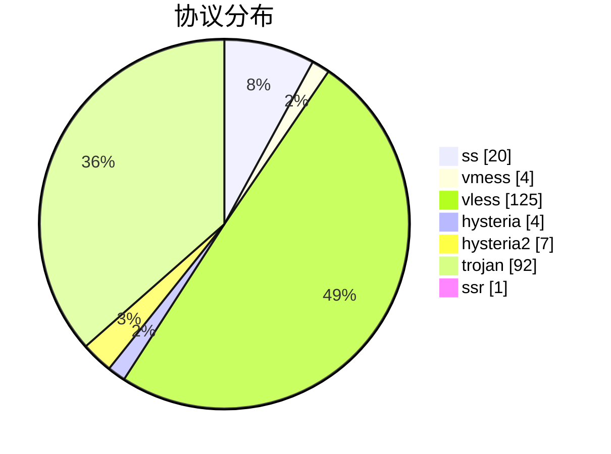

```mermaid
pie showData
title 延迟分布
"97-187ms" : 6
"187-277ms" : 9
"277-367ms" : 19
"367-457ms" : 26
"457-547ms" : 53
"547-637ms" : 37
"637-727ms" : 67
"727-817ms" : 36
```

```mermaid
pie showData
title 地域分布
"未知" : 82
"日本" : 4
"中国" : 2
"台湾" : 100
"香港" : 6
"俄罗斯" : 5
"新加坡" : 3
"韩国" : 1
"英国" : 3
"Cloudflare" : 1
"法国" : 2
"捷克" : 1
"美国" : 33
"斯洛伐克" : 1
"德国" : 4
"荷兰" : 1
"芬兰" : 1
"西班牙" : 1
"印度" : 1
"葡萄牙" : 1
```

```mermaid
pie showData
title 协议分布
"ss" : 20
"vmess" : 4
"vless" : 125
"hysteria" : 4
"hysteria2" : 7
"trojan" : 92
"ssr" : 1
```