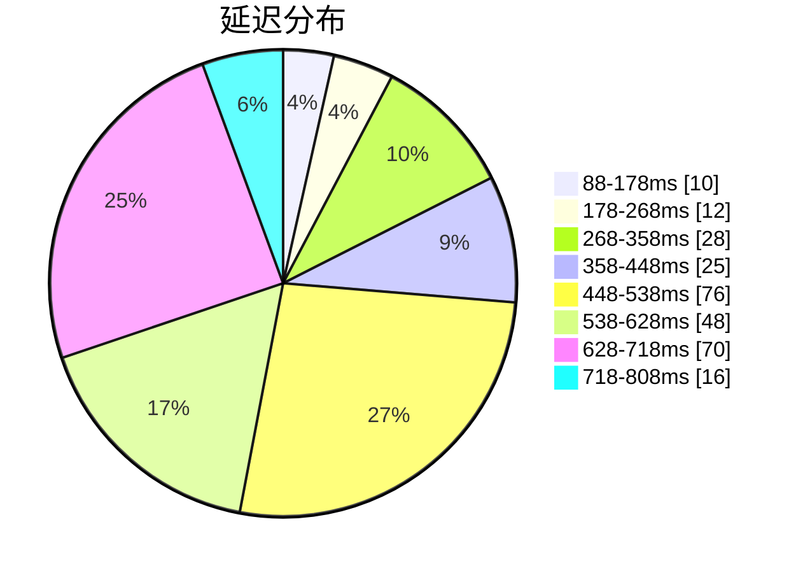
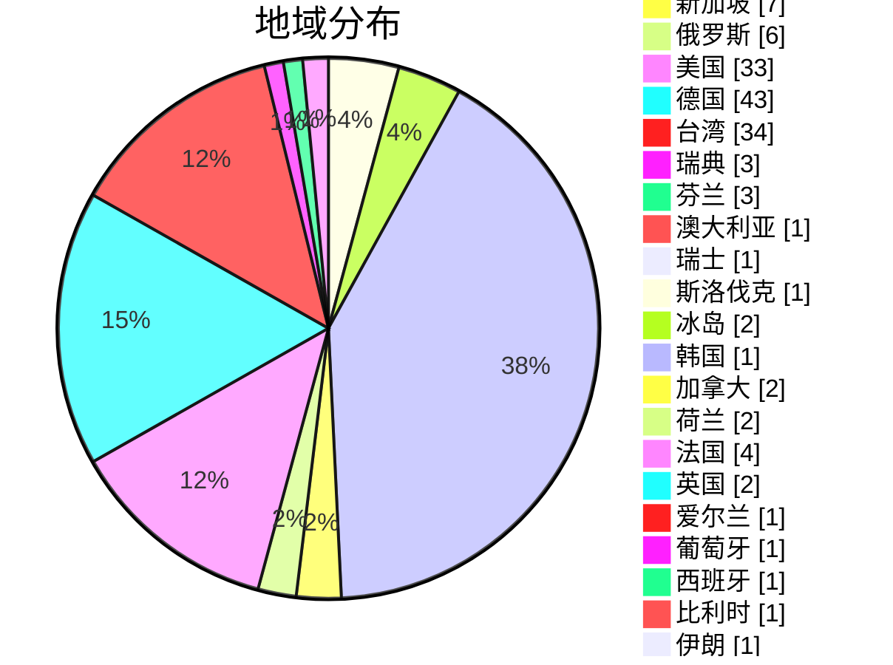
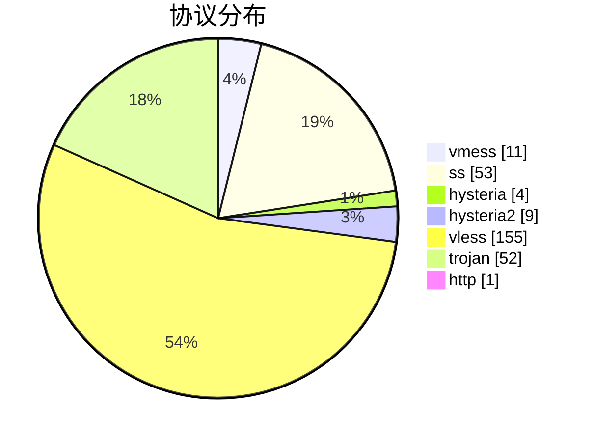

```mermaid
pie showData
title 延迟分布
"88-178ms" : 10
"178-268ms" : 12
"268-358ms" : 28
"358-448ms" : 25
"448-538ms" : 76
"538-628ms" : 48
"628-718ms" : 70
"718-808ms" : 16
```

```mermaid
pie showData
title 地域分布
"中国" : 2
"香港" : 11
"日本" : 10
"未知" : 108
"新加坡" : 7
"俄罗斯" : 6
"美国" : 33
"德国" : 43
"台湾" : 34
"瑞典" : 3
"芬兰" : 3
"澳大利亚" : 1
"瑞士" : 1
"斯洛伐克" : 1
"冰岛" : 2
"韩国" : 1
"加拿大" : 2
"荷兰" : 2
"法国" : 4
"英国" : 2
"爱尔兰" : 1
"葡萄牙" : 1
"西班牙" : 1
"比利时" : 1
"伊朗" : 1
"科威特" : 1
"乌克兰" : 1
"土耳其" : 1
"墨西哥" : 1
```

```mermaid
pie showData
title 协议分布
"vmess" : 11
"ss" : 53
"hysteria" : 4
"hysteria2" : 9
"vless" : 155
"trojan" : 52
"http" : 1
```