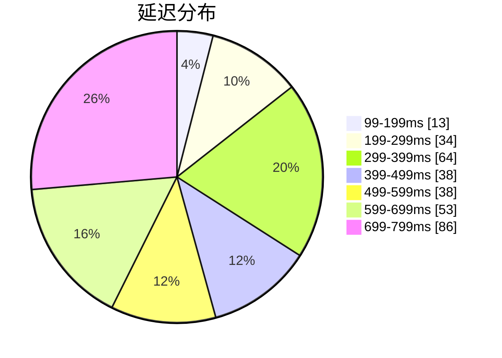
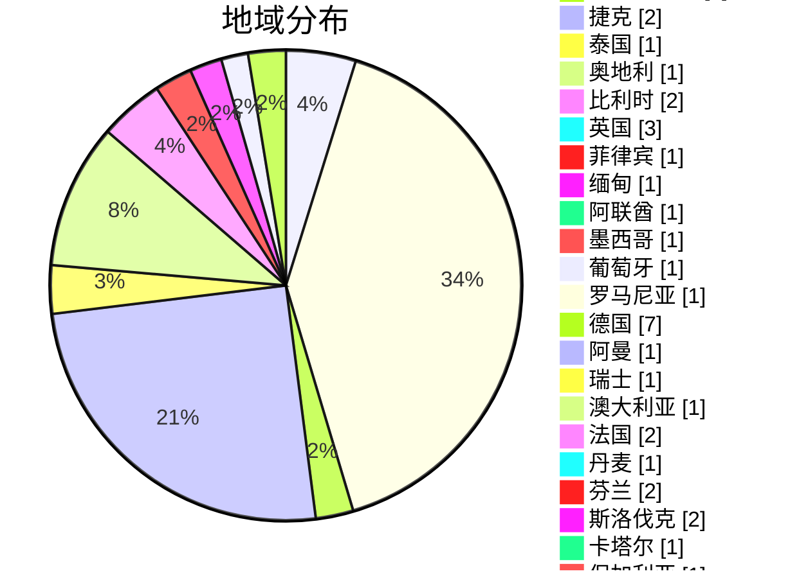
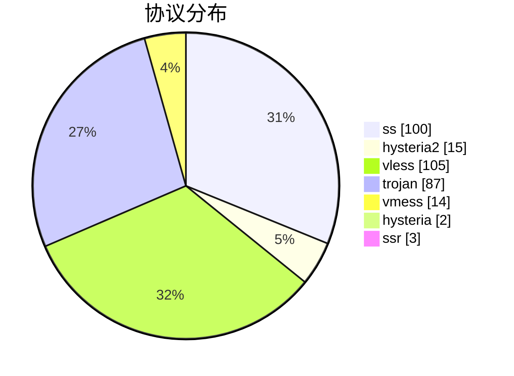

```mermaid
pie showData
title 延迟分布
"99-199ms" : 13
"199-299ms" : 34
"299-399ms" : 64
"399-499ms" : 38
"499-599ms" : 38
"599-699ms" : 53
"699-799ms" : 86
```

```mermaid
pie showData
title 地域分布
"香港" : 13
"未知" : 110
"新加坡" : 7
"台湾" : 68
"日本" : 9
"波兰" : 27
"美国" : 12
"印度" : 2
"韩国" : 7
"加拿大" : 6
"Cloudflare" : 2
"俄罗斯" : 2
"荷兰" : 5
"意大利" : 2
"印度尼西亚" : 1
"捷克" : 2
"泰国" : 1
"奥地利" : 1
"比利时" : 2
"英国" : 3
"菲律宾" : 1
"缅甸" : 1
"阿联酋" : 1
"墨西哥" : 1
"葡萄牙" : 1
"罗马尼亚" : 1
"德国" : 7
"阿曼" : 1
"瑞士" : 1
"澳大利亚" : 1
"法国" : 2
"丹麦" : 1
"芬兰" : 2
"斯洛伐克" : 2
"卡塔尔" : 1
"保加利亚" : 1
"新西兰" : 1
"土耳其" : 2
"哥伦比亚" : 1
"摩尔多瓦" : 1
"冰岛" : 1
"爱沙尼亚" : 1
"爱尔兰" : 2
"立陶宛" : 1
"拉脱维亚" : 1
"白俄罗斯" : 1
"孟加拉国" : 3
"希腊" : 1
"西班牙" : 2
"塞尔维亚" : 1
```

```mermaid
pie showData
title 协议分布
"ss" : 100
"hysteria2" : 15
"vless" : 105
"trojan" : 87
"vmess" : 14
"hysteria" : 2
"ssr" : 3
```