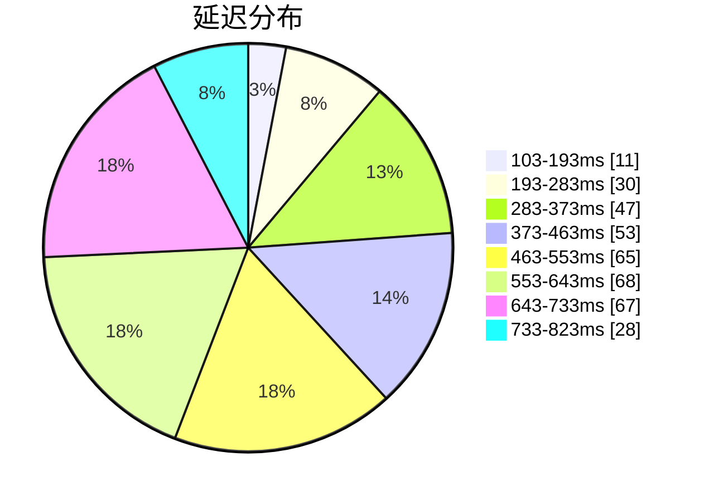
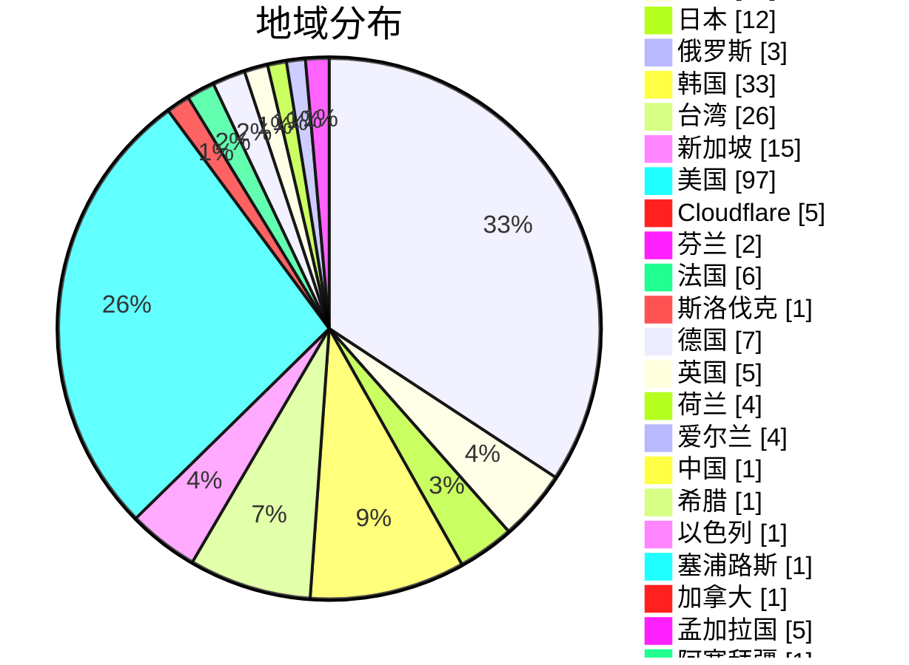
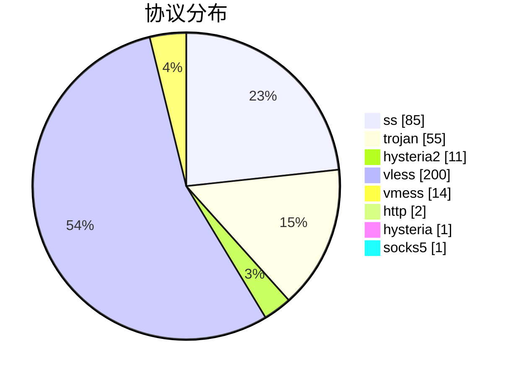

```mermaid
pie showData
title 延迟分布
"103-193ms" : 11
"193-283ms" : 30
"283-373ms" : 47
"373-463ms" : 53
"463-553ms" : 65
"553-643ms" : 68
"643-733ms" : 67
"733-823ms" : 28
```

```mermaid
pie showData
title 地域分布
"未知" : 122
"香港" : 15
"日本" : 12
"俄罗斯" : 3
"韩国" : 33
"台湾" : 26
"新加坡" : 15
"美国" : 97
"Cloudflare" : 5
"芬兰" : 2
"法国" : 6
"斯洛伐克" : 1
"德国" : 7
"英国" : 5
"荷兰" : 4
"爱尔兰" : 4
"中国" : 1
"希腊" : 1
"以色列" : 1
"塞浦路斯" : 1
"加拿大" : 1
"孟加拉国" : 5
"阿塞拜疆" : 1
"印度" : 1
```

```mermaid
pie showData
title 协议分布
"ss" : 85
"trojan" : 55
"hysteria2" : 11
"vless" : 200
"vmess" : 14
"http" : 2
"hysteria" : 1
"socks5" : 1
```