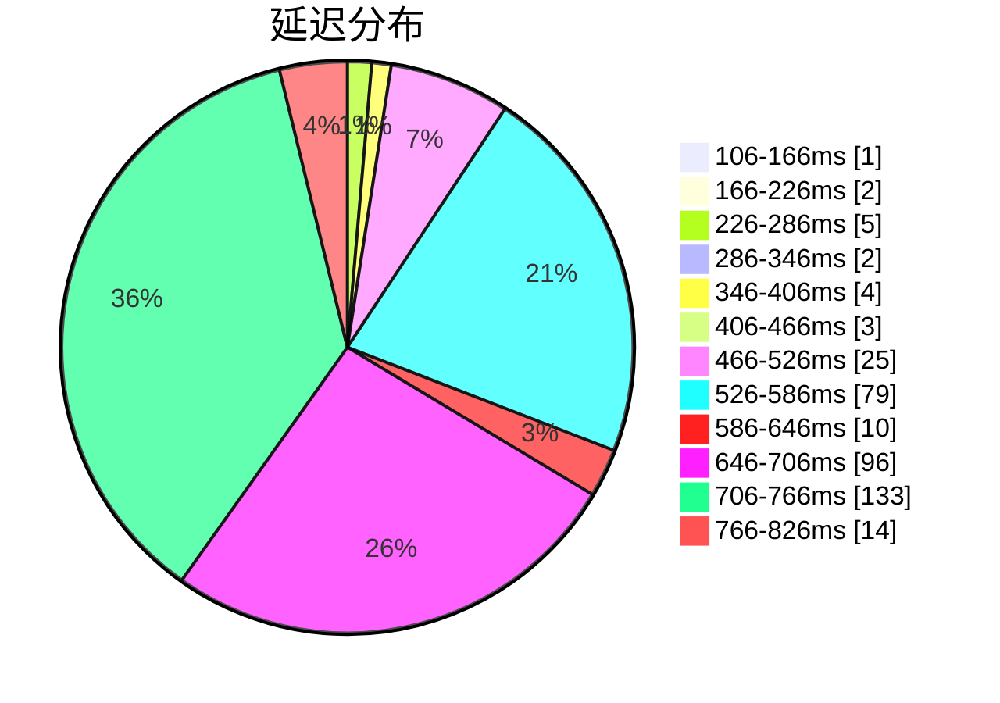
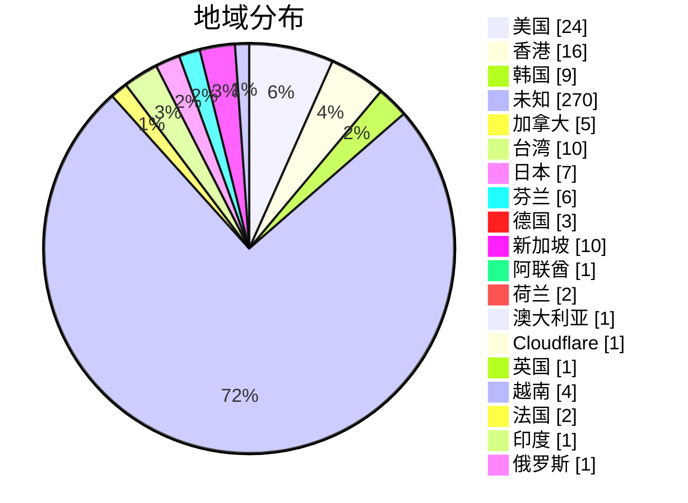
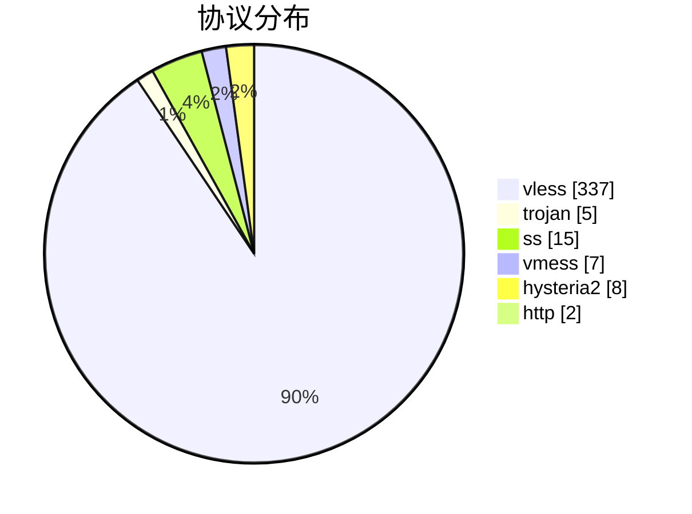

```mermaid
pie showData
title 延迟分布
"106-166ms" : 1
"166-226ms" : 2
"226-286ms" : 5
"286-346ms" : 2
"346-406ms" : 4
"406-466ms" : 3
"466-526ms" : 25
"526-586ms" : 79
"586-646ms" : 10
"646-706ms" : 96
"706-766ms" : 133
"766-826ms" : 14
```

```mermaid
pie showData
title 地域分布
"美国" : 24
"香港" : 16
"韩国" : 9
"未知" : 270
"加拿大" : 5
"台湾" : 10
"日本" : 7
"芬兰" : 6
"德国" : 3
"新加坡" : 10
"阿联酋" : 1
"荷兰" : 2
"澳大利亚" : 1
"Cloudflare" : 1
"英国" : 1
"越南" : 4
"法国" : 2
"印度" : 1
"俄罗斯" : 1
```

```mermaid
pie showData
title 协议分布
"vless" : 337
"trojan" : 5
"ss" : 15
"vmess" : 7
"hysteria2" : 8
"http" : 2
```