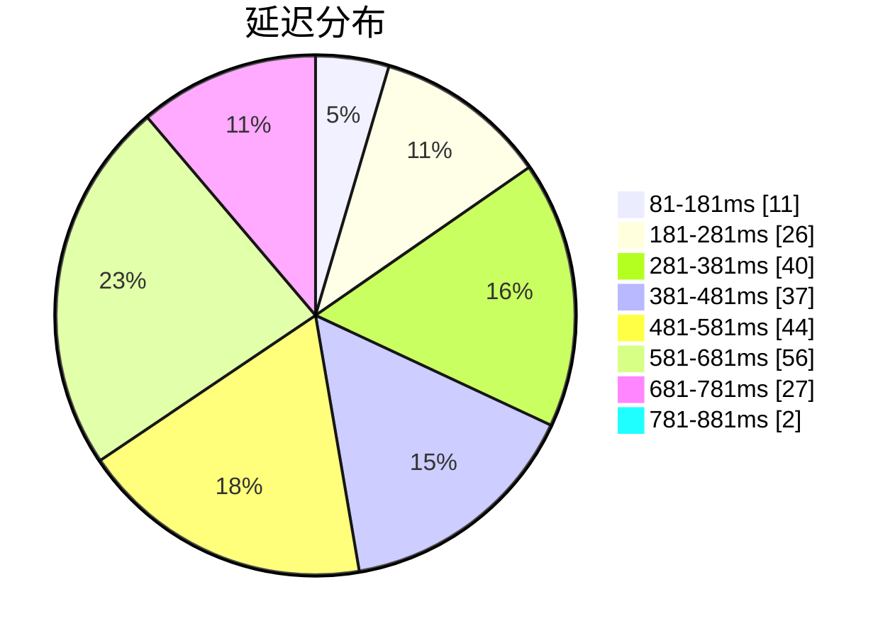
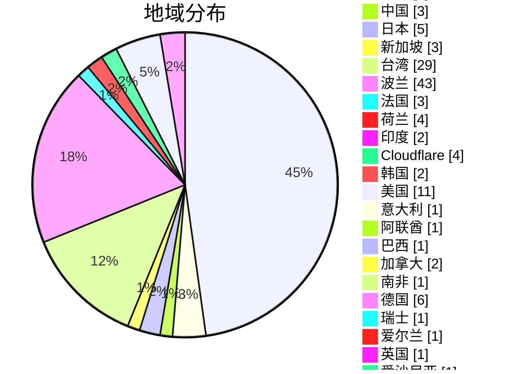
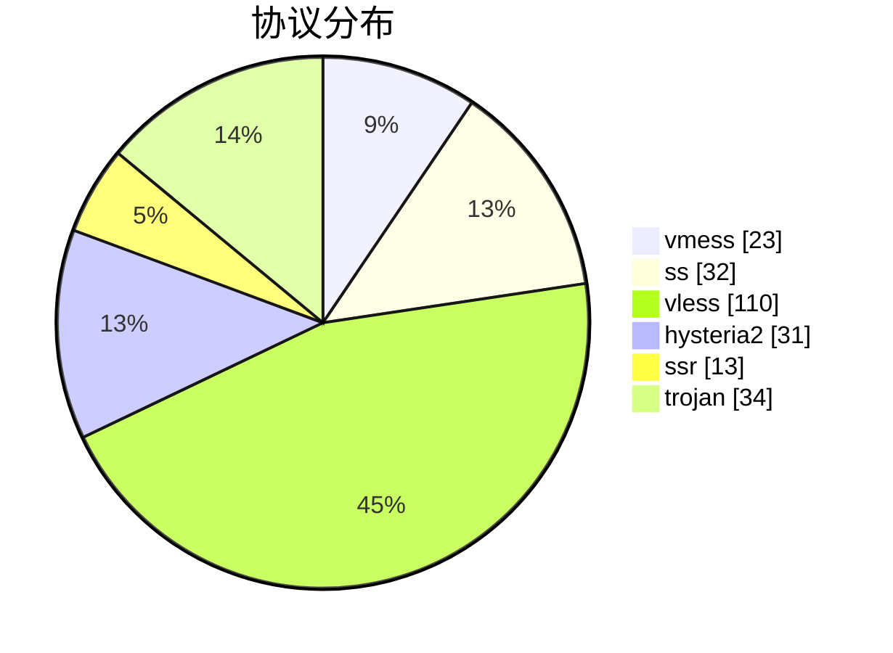

```mermaid
pie showData
title 延迟分布
"81-181ms" : 11
"181-281ms" : 26
"281-381ms" : 40
"381-481ms" : 37
"481-581ms" : 44
"581-681ms" : 56
"681-781ms" : 27
"781-881ms" : 2
```

```mermaid
pie showData
title 地域分布
"未知" : 109
"香港" : 8
"中国" : 3
"日本" : 5
"新加坡" : 3
"台湾" : 29
"波兰" : 43
"法国" : 3
"荷兰" : 4
"印度" : 2
"Cloudflare" : 4
"韩国" : 2
"美国" : 11
"意大利" : 1
"阿联酋" : 1
"巴西" : 1
"加拿大" : 2
"南非" : 1
"德国" : 6
"瑞士" : 1
"爱尔兰" : 1
"英国" : 1
"爱沙尼亚" : 1
"芬兰" : 1
```

```mermaid
pie showData
title 协议分布
"vmess" : 23
"ss" : 32
"vless" : 110
"hysteria2" : 31
"ssr" : 13
"trojan" : 34
```