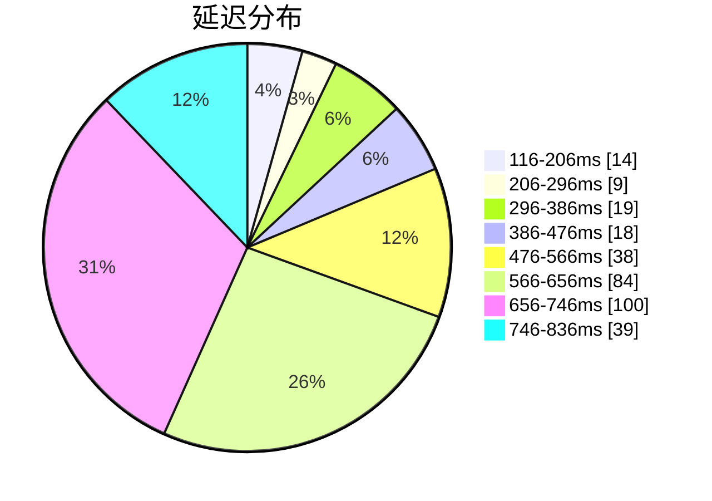
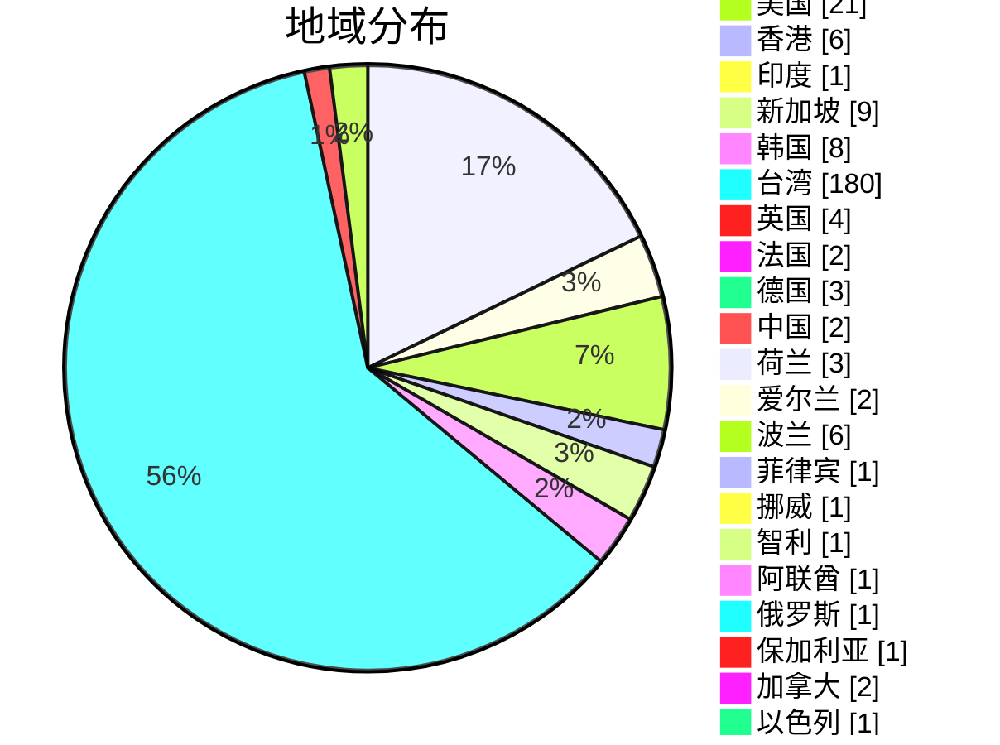
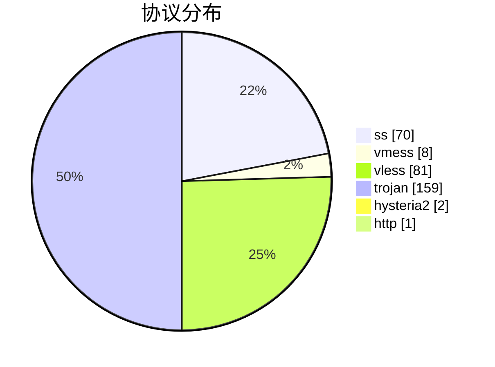

```mermaid
pie showData
title 延迟分布
"116-206ms" : 14
"206-296ms" : 9
"296-386ms" : 19
"386-476ms" : 18
"476-566ms" : 38
"566-656ms" : 84
"656-746ms" : 100
"746-836ms" : 39
```

```mermaid
pie showData
title 地域分布
"未知" : 53
"日本" : 10
"美国" : 21
"香港" : 6
"印度" : 1
"新加坡" : 9
"韩国" : 8
"台湾" : 180
"英国" : 4
"法国" : 2
"德国" : 3
"中国" : 2
"荷兰" : 3
"爱尔兰" : 2
"波兰" : 6
"菲律宾" : 1
"挪威" : 1
"智利" : 1
"阿联酋" : 1
"俄罗斯" : 1
"保加利亚" : 1
"加拿大" : 2
"以色列" : 1
"丹麦" : 1
"土耳其" : 1
```

```mermaid
pie showData
title 协议分布
"ss" : 70
"vmess" : 8
"vless" : 81
"trojan" : 159
"hysteria2" : 2
"http" : 1
```