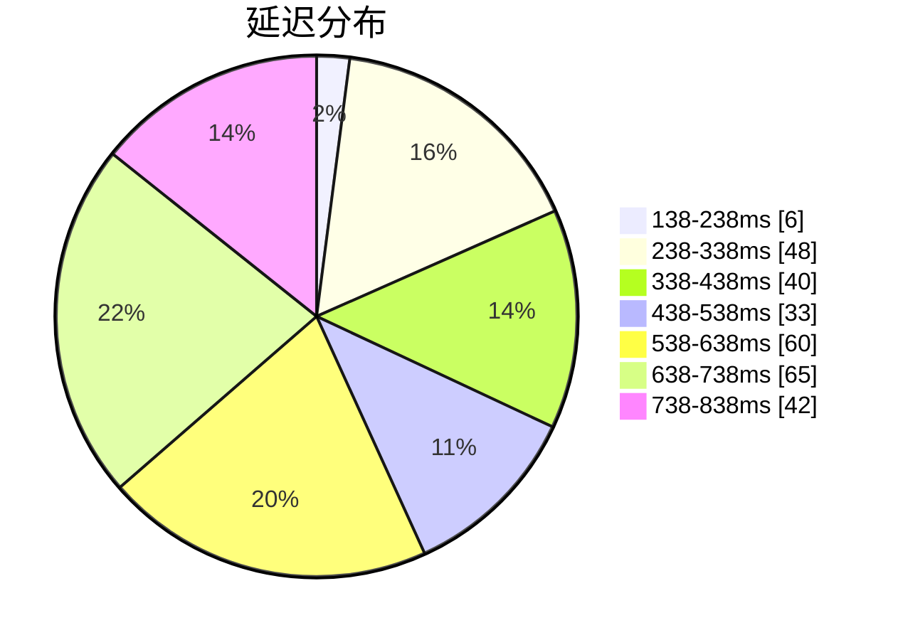
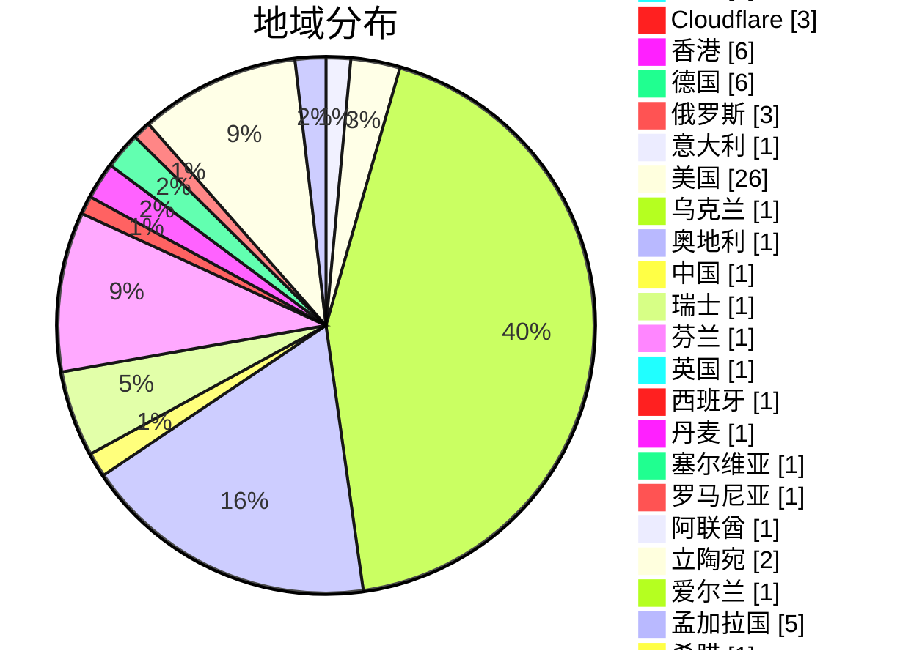
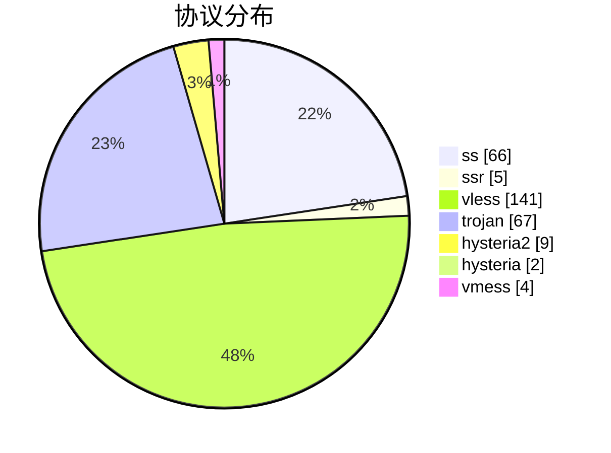

```mermaid
pie showData
title 延迟分布
"138-238ms" : 6
"238-338ms" : 48
"338-438ms" : 40
"438-538ms" : 33
"538-638ms" : 60
"638-738ms" : 65
"738-838ms" : 42
```

```mermaid
pie showData
title 地域分布
"日本" : 4
"新加坡" : 8
"未知" : 117
"台湾" : 48
"荷兰" : 4
"韩国" : 14
"波兰" : 26
"印度" : 1
"Cloudflare" : 3
"香港" : 6
"德国" : 6
"俄罗斯" : 3
"意大利" : 1
"美国" : 26
"乌克兰" : 1
"奥地利" : 1
"中国" : 1
"瑞士" : 1
"芬兰" : 1
"英国" : 1
"西班牙" : 1
"丹麦" : 1
"塞尔维亚" : 1
"罗马尼亚" : 1
"阿联酋" : 1
"立陶宛" : 2
"爱尔兰" : 1
"孟加拉国" : 5
"希腊" : 1
"捷克" : 1
"保加利亚" : 1
"冰岛" : 1
"哈萨克斯坦" : 1
"爱沙尼亚" : 1
"哥伦比亚" : 1
"拉脱维亚" : 1
```

```mermaid
pie showData
title 协议分布
"ss" : 66
"ssr" : 5
"vless" : 141
"trojan" : 67
"hysteria2" : 9
"hysteria" : 2
"vmess" : 4
```