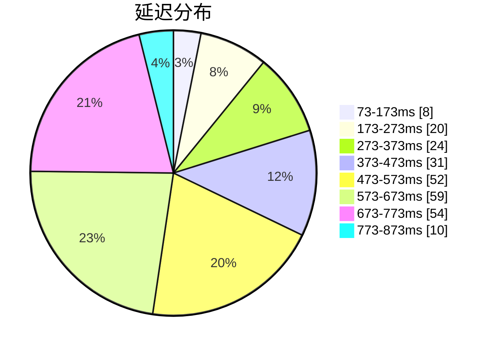
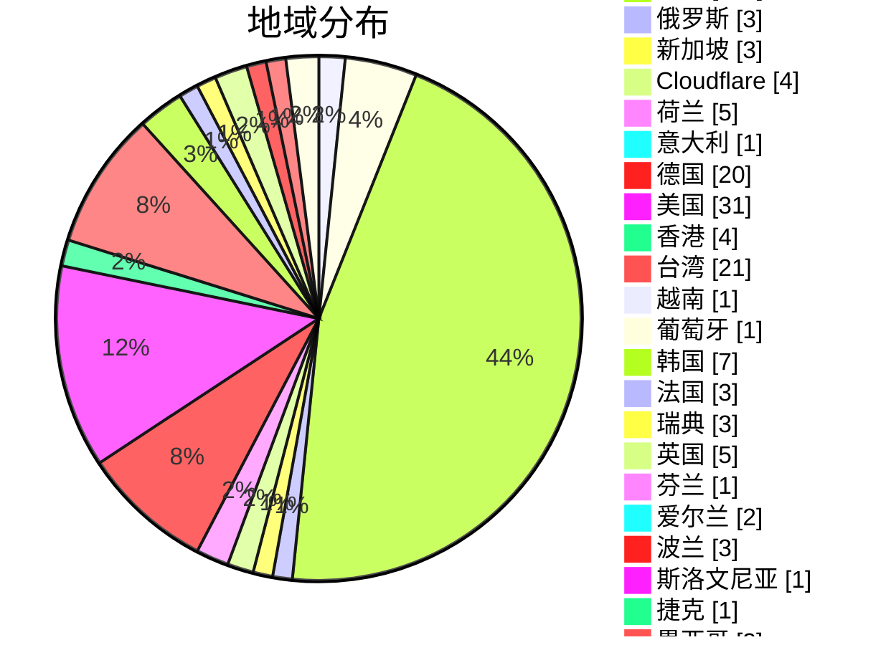
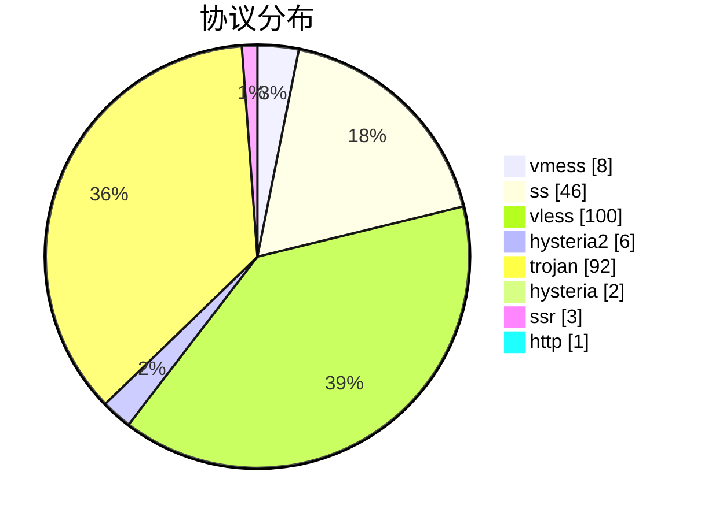

```mermaid
pie showData
title 延迟分布
"73-173ms" : 8
"173-273ms" : 20
"273-373ms" : 24
"373-473ms" : 31
"473-573ms" : 52
"573-673ms" : 59
"673-773ms" : 54
"773-873ms" : 10
```

```mermaid
pie showData
title 地域分布
"中国" : 4
"日本" : 11
"未知" : 113
"俄罗斯" : 3
"新加坡" : 3
"Cloudflare" : 4
"荷兰" : 5
"意大利" : 1
"德国" : 20
"美国" : 31
"香港" : 4
"台湾" : 21
"越南" : 1
"葡萄牙" : 1
"韩国" : 7
"法国" : 3
"瑞典" : 3
"英国" : 5
"芬兰" : 1
"爱尔兰" : 2
"波兰" : 3
"斯洛文尼亚" : 1
"捷克" : 1
"墨西哥" : 3
"加拿大" : 2
"印度" : 5
```

```mermaid
pie showData
title 协议分布
"vmess" : 8
"ss" : 46
"vless" : 100
"hysteria2" : 6
"trojan" : 92
"hysteria" : 2
"ssr" : 3
"http" : 1
```