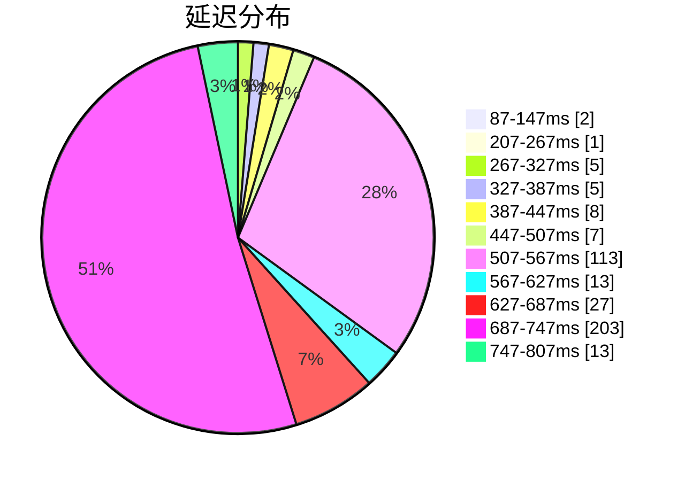
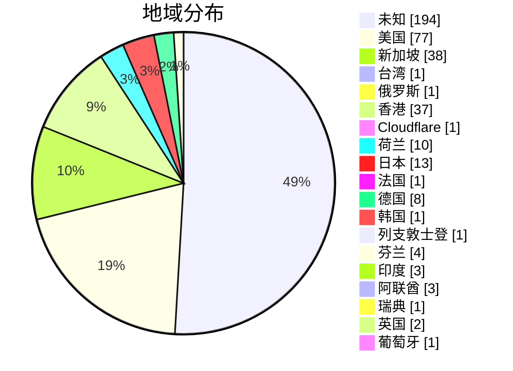
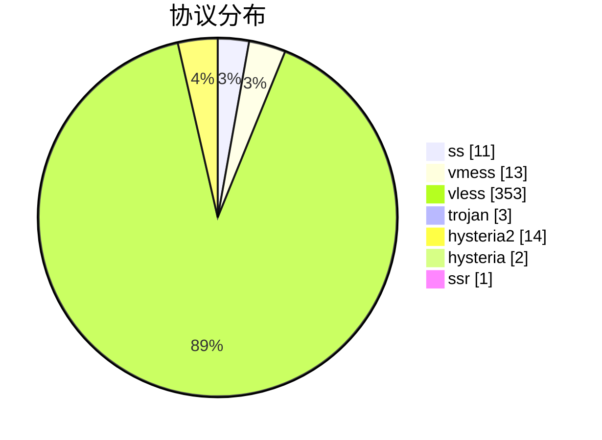

```mermaid
pie showData
title 延迟分布
"87-147ms" : 2
"207-267ms" : 1
"267-327ms" : 5
"327-387ms" : 5
"387-447ms" : 8
"447-507ms" : 7
"507-567ms" : 113
"567-627ms" : 13
"627-687ms" : 27
"687-747ms" : 203
"747-807ms" : 13
```

```mermaid
pie showData
title 地域分布
"未知" : 194
"美国" : 77
"新加坡" : 38
"台湾" : 1
"俄罗斯" : 1
"香港" : 37
"Cloudflare" : 1
"荷兰" : 10
"日本" : 13
"法国" : 1
"德国" : 8
"韩国" : 1
"列支敦士登" : 1
"芬兰" : 4
"印度" : 3
"阿联酋" : 3
"瑞典" : 1
"英国" : 2
"葡萄牙" : 1
```

```mermaid
pie showData
title 协议分布
"ss" : 11
"vmess" : 13
"vless" : 353
"trojan" : 3
"hysteria2" : 14
"hysteria" : 2
"ssr" : 1
```