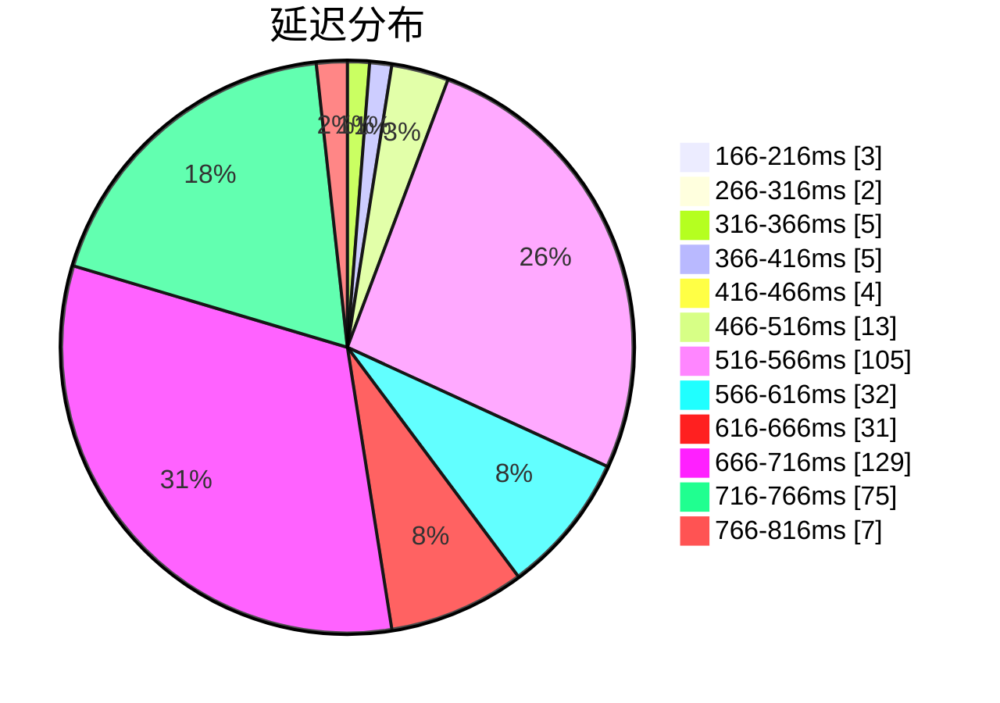
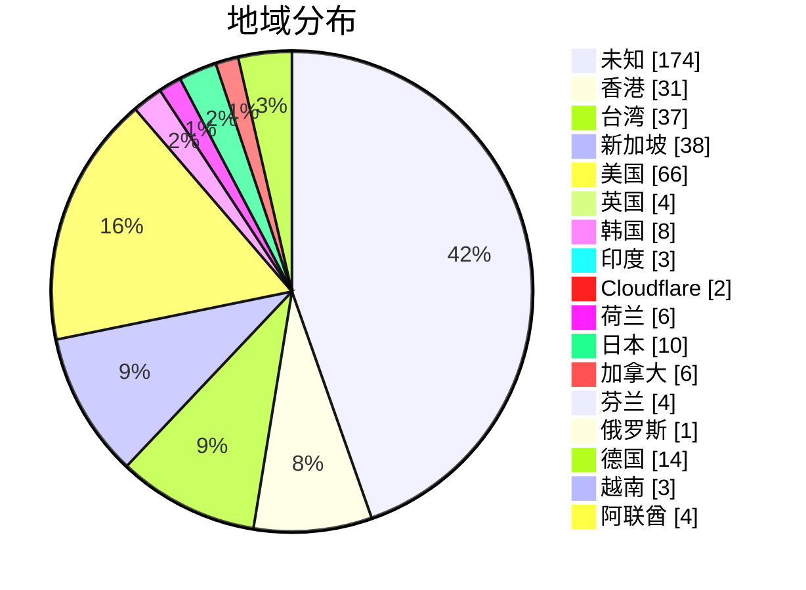
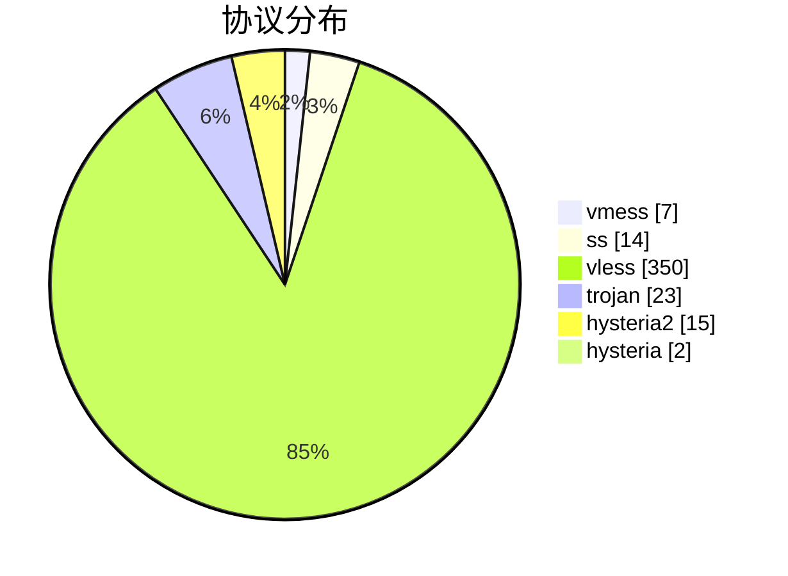

```mermaid
pie showData
title 延迟分布
"166-216ms" : 3
"266-316ms" : 2
"316-366ms" : 5
"366-416ms" : 5
"416-466ms" : 4
"466-516ms" : 13
"516-566ms" : 105
"566-616ms" : 32
"616-666ms" : 31
"666-716ms" : 129
"716-766ms" : 75
"766-816ms" : 7
```

```mermaid
pie showData
title 地域分布
"未知" : 174
"香港" : 31
"台湾" : 37
"新加坡" : 38
"美国" : 66
"英国" : 4
"韩国" : 8
"印度" : 3
"Cloudflare" : 2
"荷兰" : 6
"日本" : 10
"加拿大" : 6
"芬兰" : 4
"俄罗斯" : 1
"德国" : 14
"越南" : 3
"阿联酋" : 4
```

```mermaid
pie showData
title 协议分布
"vmess" : 7
"ss" : 14
"vless" : 350
"trojan" : 23
"hysteria2" : 15
"hysteria" : 2
```