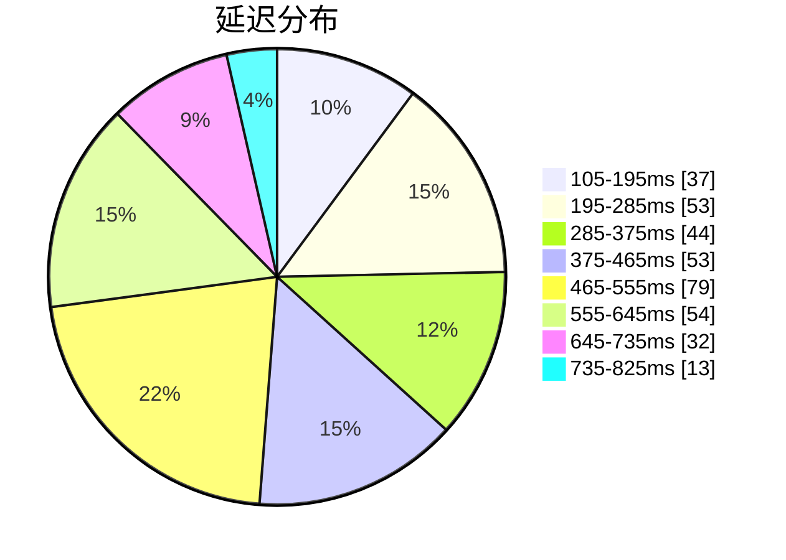
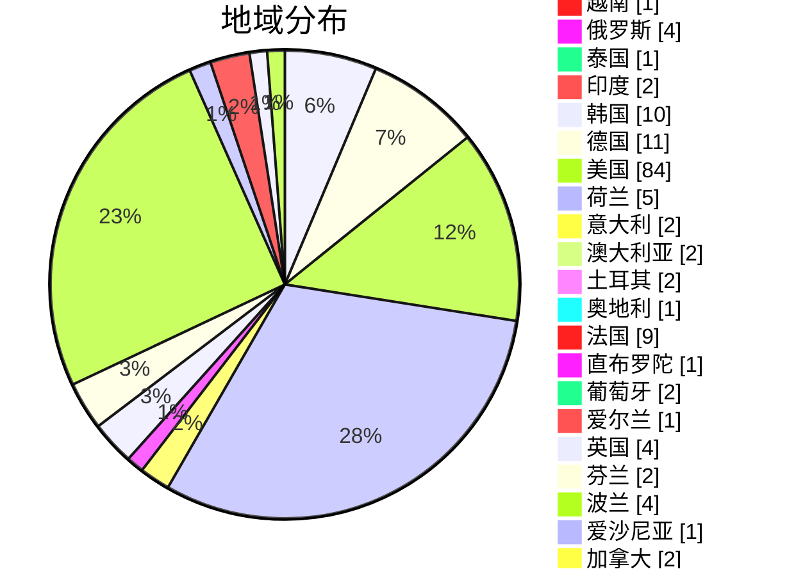
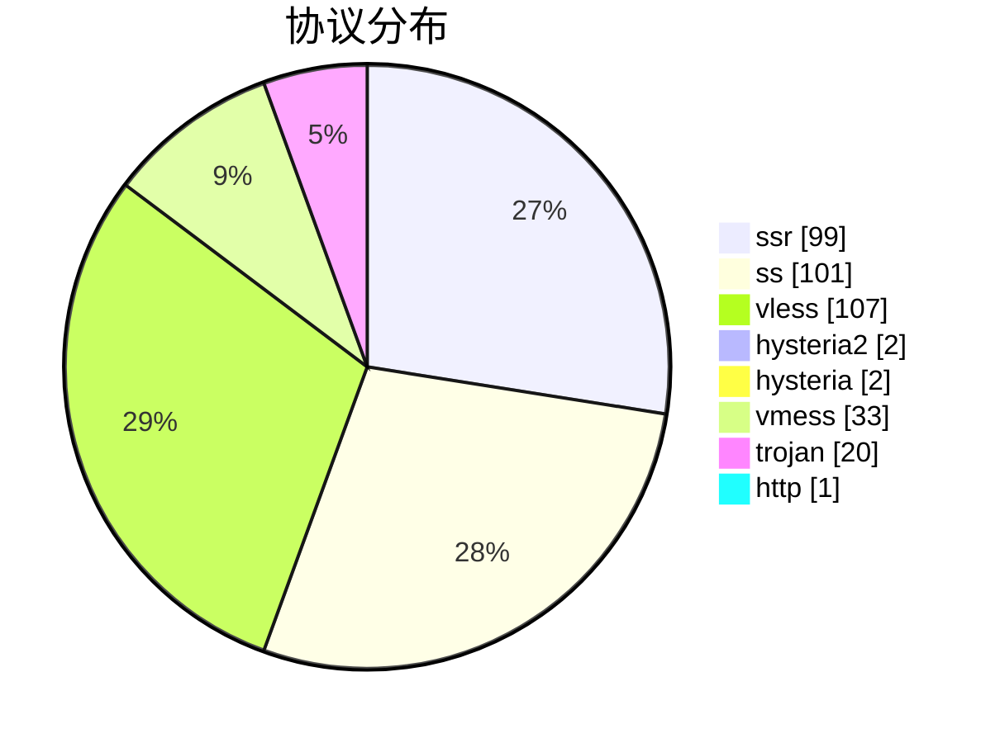

```mermaid
pie showData
title 延迟分布
"105-195ms" : 37
"195-285ms" : 53
"285-375ms" : 44
"375-465ms" : 53
"465-555ms" : 79
"555-645ms" : 54
"645-735ms" : 32
"735-825ms" : 13
```

```mermaid
pie showData
title 地域分布
"日本" : 21
"香港" : 26
"新加坡" : 44
"未知" : 102
"台湾" : 7
"中国" : 1
"马来西亚" : 1
"菲律宾" : 3
"越南" : 1
"俄罗斯" : 4
"泰国" : 1
"印度" : 2
"韩国" : 10
"德国" : 11
"美国" : 84
"荷兰" : 5
"意大利" : 2
"澳大利亚" : 2
"土耳其" : 2
"奥地利" : 1
"法国" : 9
"直布罗陀" : 1
"葡萄牙" : 2
"爱尔兰" : 1
"英国" : 4
"芬兰" : 2
"波兰" : 4
"爱沙尼亚" : 1
"加拿大" : 2
"哥伦比亚" : 1
"冰岛" : 1
"西班牙" : 2
"比利时" : 1
"以色列" : 1
"巴西" : 1
"斯洛文尼亚" : 1
"孟加拉国" : 1
```

```mermaid
pie showData
title 协议分布
"ssr" : 99
"ss" : 101
"vless" : 107
"hysteria2" : 2
"hysteria" : 2
"vmess" : 33
"trojan" : 20
"http" : 1
```