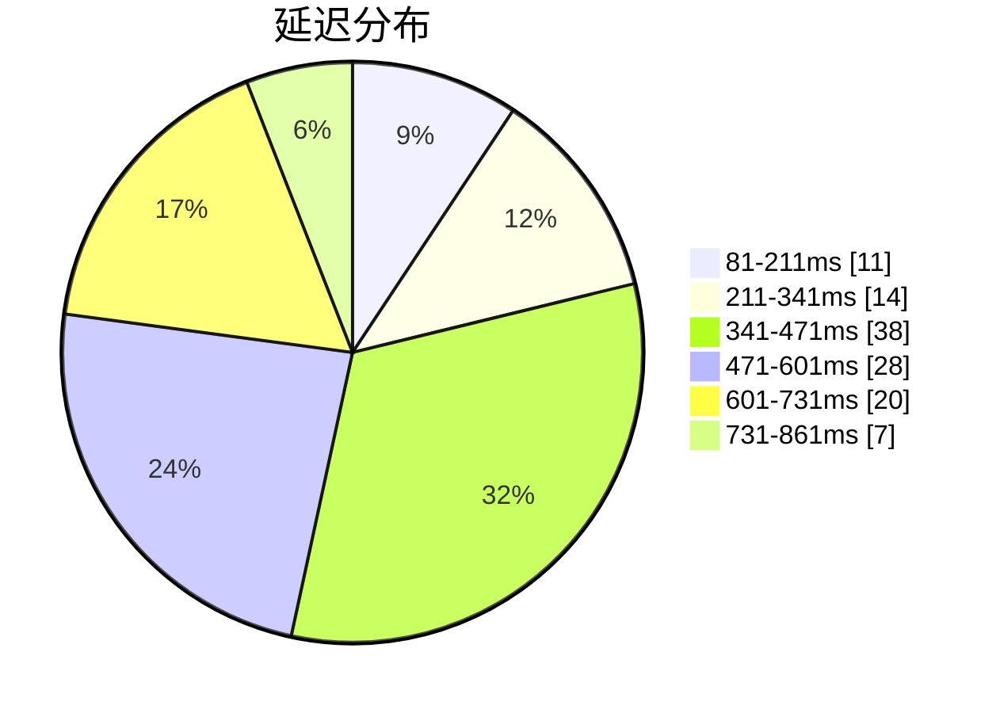
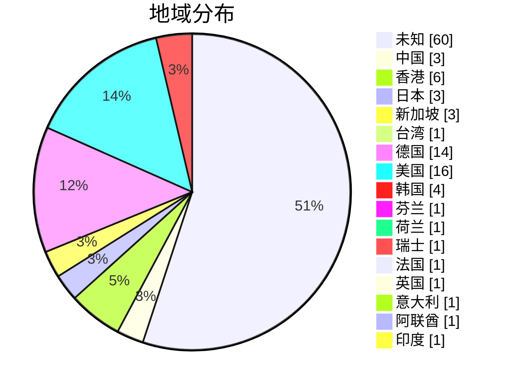
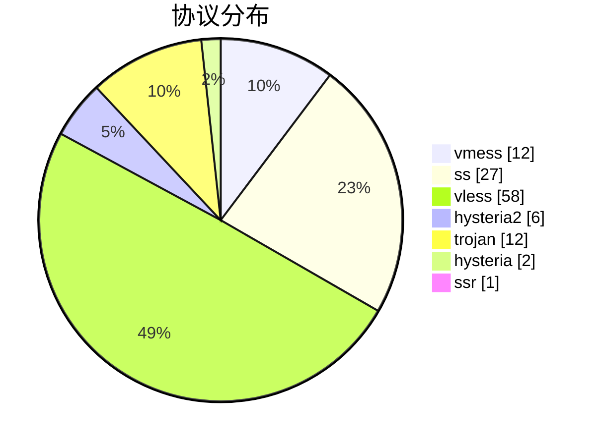

```mermaid
pie showData
title 延迟分布
"81-211ms" : 11
"211-341ms" : 14
"341-471ms" : 38
"471-601ms" : 28
"601-731ms" : 20
"731-861ms" : 7
```

```mermaid
pie showData
title 地域分布
"未知" : 60
"中国" : 3
"香港" : 6
"日本" : 3
"新加坡" : 3
"台湾" : 1
"德国" : 14
"美国" : 16
"韩国" : 4
"芬兰" : 1
"荷兰" : 1
"瑞士" : 1
"法国" : 1
"英国" : 1
"意大利" : 1
"阿联酋" : 1
"印度" : 1
```

```mermaid
pie showData
title 协议分布
"vmess" : 12
"ss" : 27
"vless" : 58
"hysteria2" : 6
"trojan" : 12
"hysteria" : 2
"ssr" : 1
```