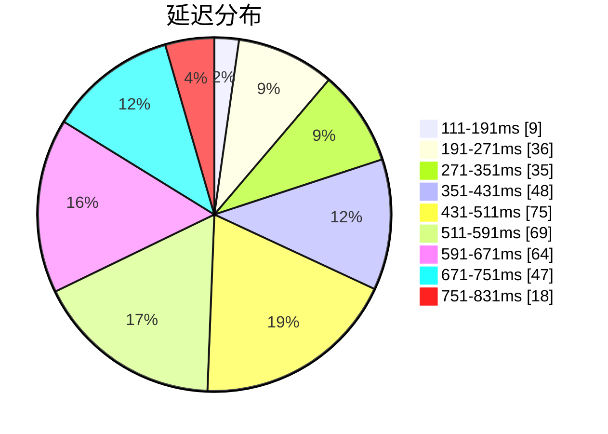
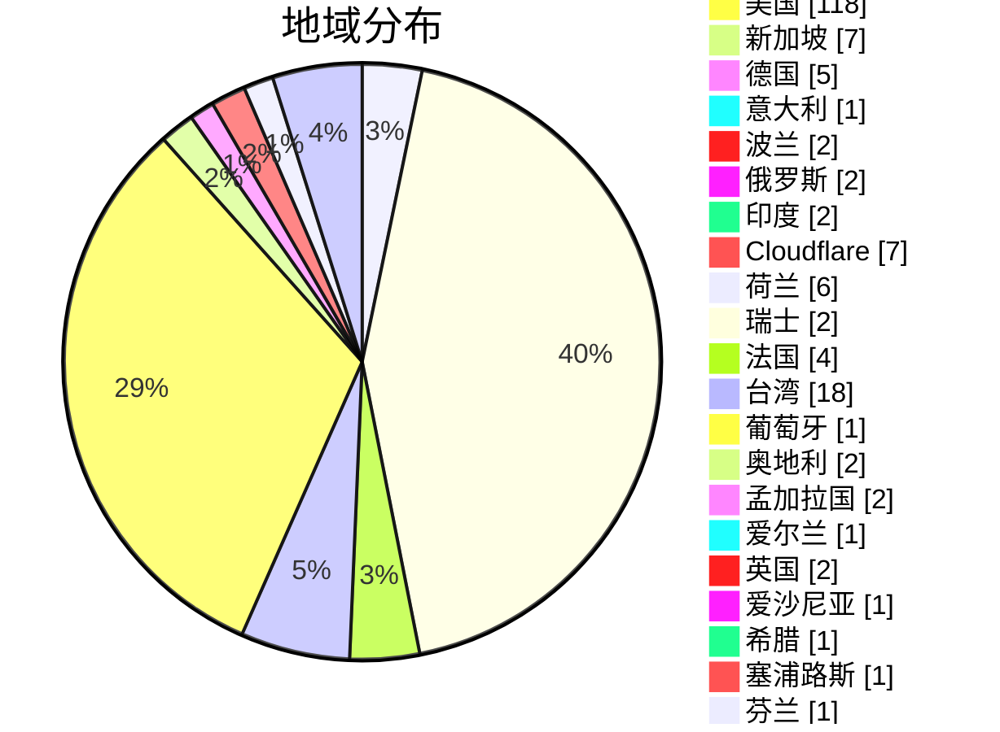
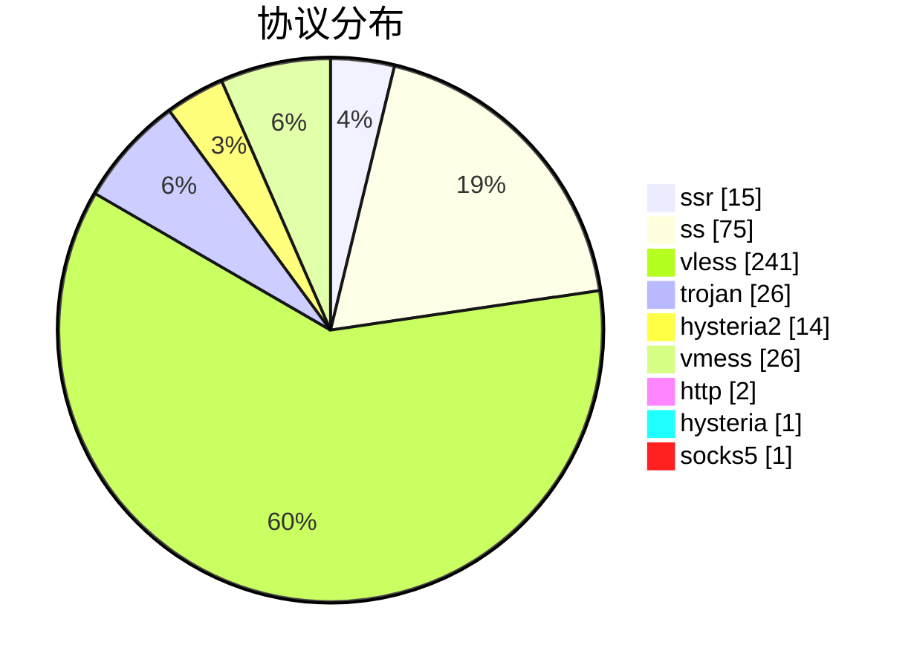

```mermaid
pie showData
title 延迟分布
"111-191ms" : 9
"191-271ms" : 36
"271-351ms" : 35
"351-431ms" : 48
"431-511ms" : 75
"511-591ms" : 69
"591-671ms" : 64
"671-751ms" : 47
"751-831ms" : 18
```

```mermaid
pie showData
title 地域分布
"日本" : 12
"未知" : 162
"香港" : 14
"韩国" : 22
"美国" : 118
"新加坡" : 7
"德国" : 5
"意大利" : 1
"波兰" : 2
"俄罗斯" : 2
"印度" : 2
"Cloudflare" : 7
"荷兰" : 6
"瑞士" : 2
"法国" : 4
"台湾" : 18
"葡萄牙" : 1
"奥地利" : 2
"孟加拉国" : 2
"爱尔兰" : 1
"英国" : 2
"爱沙尼亚" : 1
"希腊" : 1
"塞浦路斯" : 1
"芬兰" : 1
"加拿大" : 2
"摩尔多瓦" : 1
"冰岛" : 1
"哥伦比亚" : 1
```

```mermaid
pie showData
title 协议分布
"ssr" : 15
"ss" : 75
"vless" : 241
"trojan" : 26
"hysteria2" : 14
"vmess" : 26
"http" : 2
"hysteria" : 1
"socks5" : 1
```