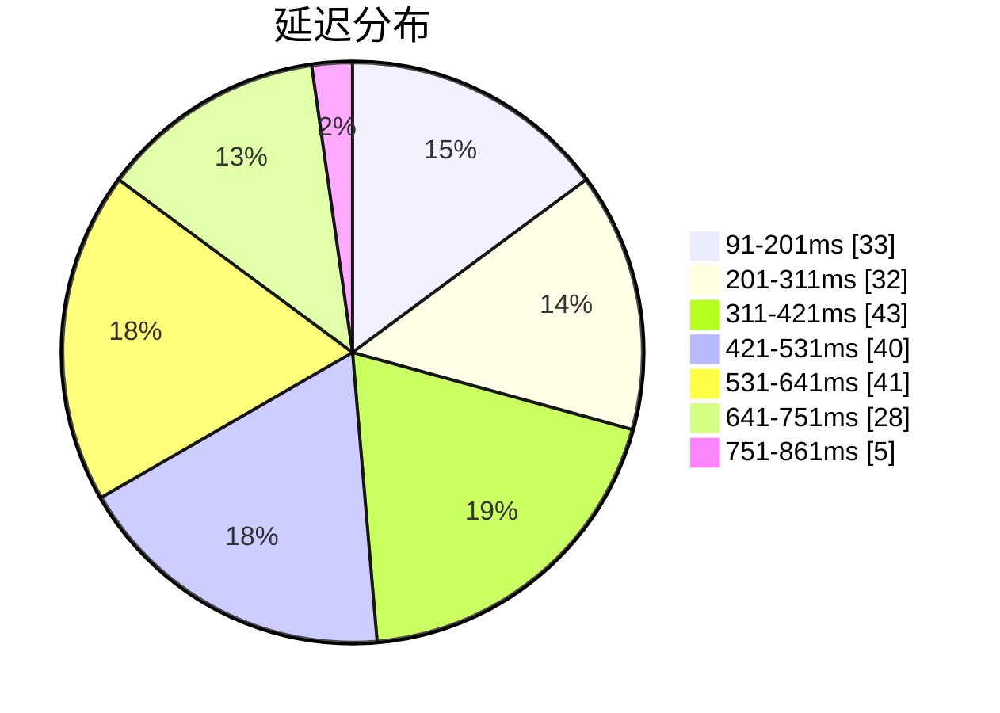
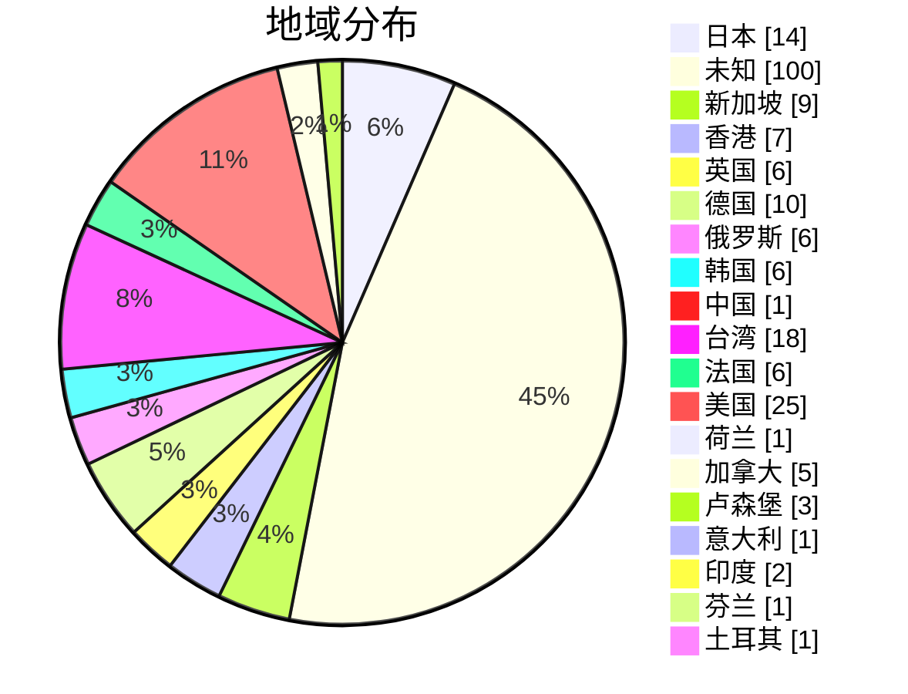
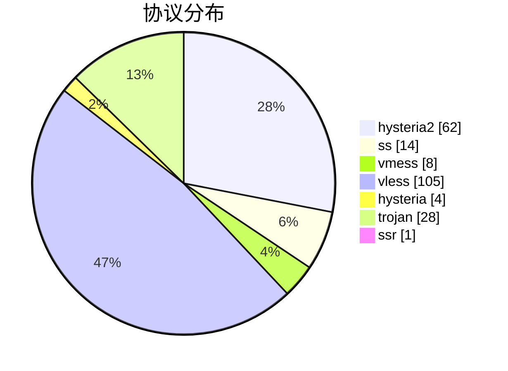

```mermaid
pie showData
title 延迟分布
"91-201ms" : 33
"201-311ms" : 32
"311-421ms" : 43
"421-531ms" : 40
"531-641ms" : 41
"641-751ms" : 28
"751-861ms" : 5
```

```mermaid
pie showData
title 地域分布
"日本" : 14
"未知" : 100
"新加坡" : 9
"香港" : 7
"英国" : 6
"德国" : 10
"俄罗斯" : 6
"韩国" : 6
"中国" : 1
"台湾" : 18
"法国" : 6
"美国" : 25
"荷兰" : 1
"加拿大" : 5
"卢森堡" : 3
"意大利" : 1
"印度" : 2
"芬兰" : 1
"土耳其" : 1
```

```mermaid
pie showData
title 协议分布
"hysteria2" : 62
"ss" : 14
"vmess" : 8
"vless" : 105
"hysteria" : 4
"trojan" : 28
"ssr" : 1
```