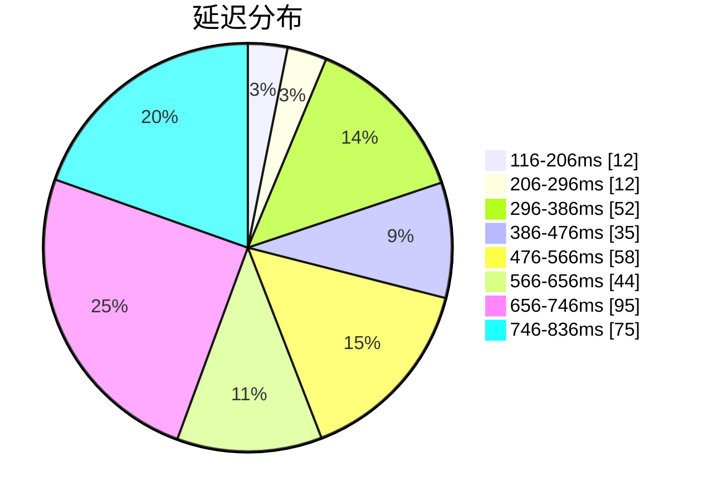
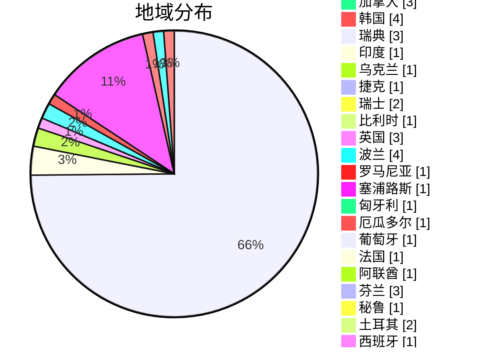
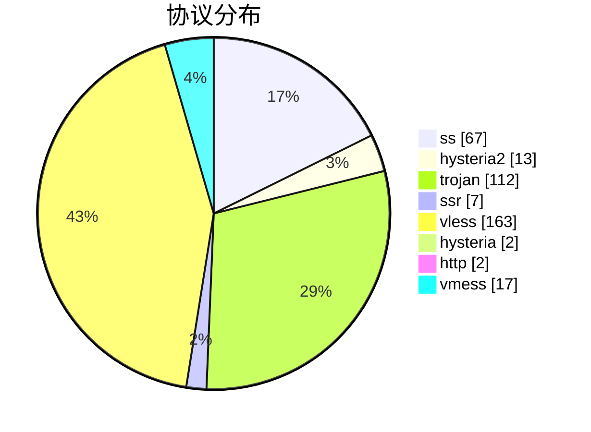

```mermaid
pie showData
title 延迟分布
"116-206ms" : 12
"206-296ms" : 12
"296-386ms" : 52
"386-476ms" : 35
"476-566ms" : 58
"566-656ms" : 44
"656-746ms" : 95
"746-836ms" : 75
```

```mermaid
pie showData
title 地域分布
"未知" : 253
"日本" : 11
"香港" : 7
"台湾" : 1
"俄罗斯" : 2
"新加坡" : 3
"Cloudflare" : 4
"荷兰" : 6
"德国" : 4
"美国" : 41
"加拿大" : 3
"韩国" : 4
"瑞典" : 3
"印度" : 1
"乌克兰" : 1
"捷克" : 1
"瑞士" : 2
"比利时" : 1
"英国" : 3
"波兰" : 4
"罗马尼亚" : 1
"塞浦路斯" : 1
"匈牙利" : 1
"厄瓜多尔" : 1
"葡萄牙" : 1
"法国" : 1
"阿联酋" : 1
"芬兰" : 3
"秘鲁" : 1
"土耳其" : 2
"西班牙" : 1
"斯洛伐克" : 1
"希腊" : 1
"冰岛" : 1
"保加利亚" : 1
"孟加拉国" : 4
"爱沙尼亚" : 2
"哈萨克斯坦" : 1
"立陶宛" : 1
"拉脱维亚" : 1
"挪威" : 1
```

```mermaid
pie showData
title 协议分布
"ss" : 67
"hysteria2" : 13
"trojan" : 112
"ssr" : 7
"vless" : 163
"hysteria" : 2
"http" : 2
"vmess" : 17
```