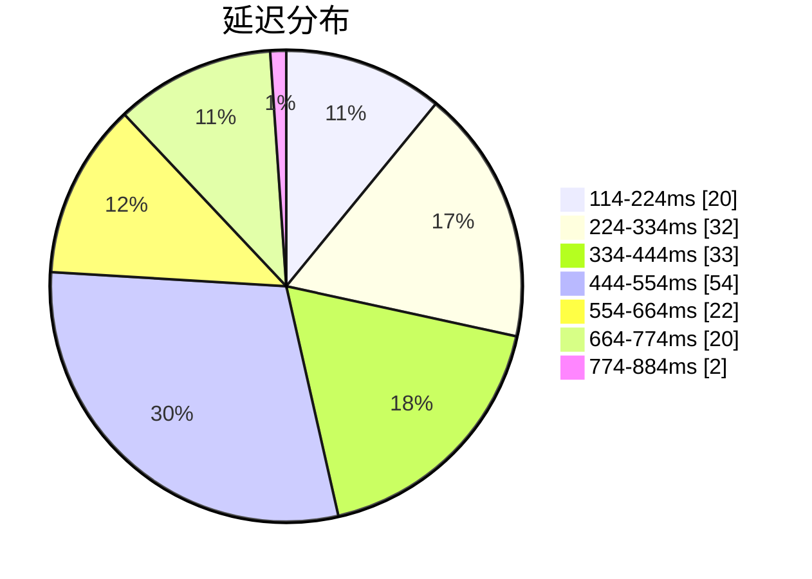
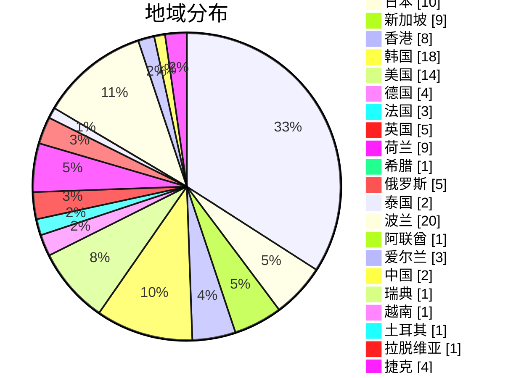
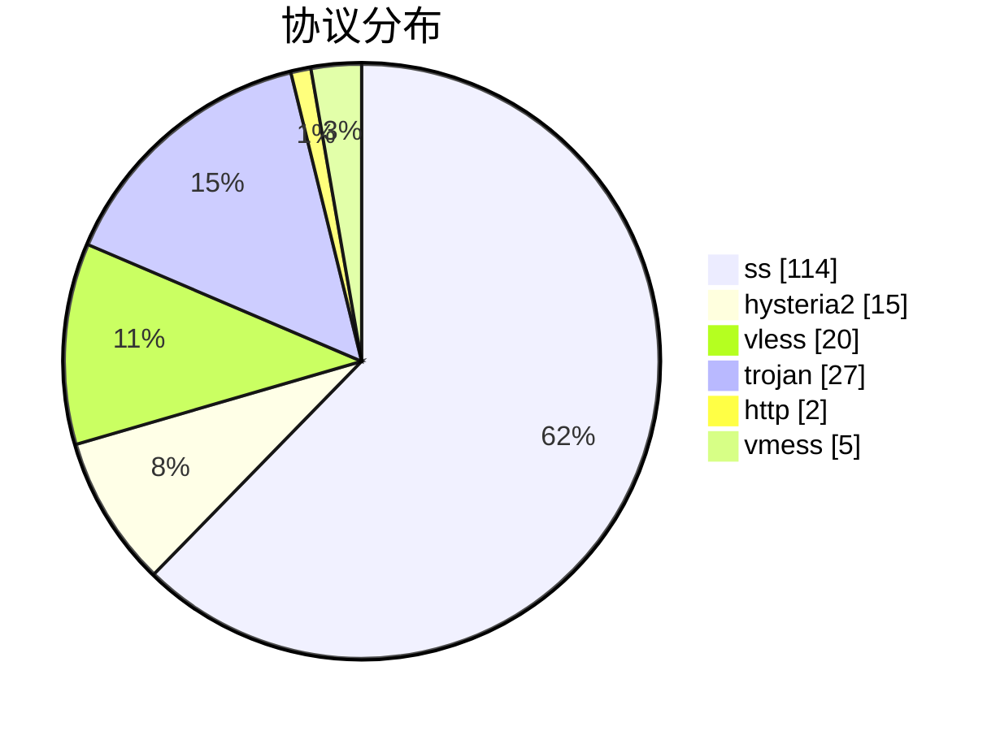

```mermaid
pie showData
title 延迟分布
"114-224ms" : 20
"224-334ms" : 32
"334-444ms" : 33
"444-554ms" : 54
"554-664ms" : 22
"664-774ms" : 20
"774-884ms" : 2
```

```mermaid
pie showData
title 地域分布
"未知" : 60
"日本" : 10
"新加坡" : 9
"香港" : 8
"韩国" : 18
"美国" : 14
"德国" : 4
"法国" : 3
"英国" : 5
"荷兰" : 9
"希腊" : 1
"俄罗斯" : 5
"泰国" : 2
"波兰" : 20
"阿联酋" : 1
"爱尔兰" : 3
"中国" : 2
"瑞典" : 1
"越南" : 1
"土耳其" : 1
"拉脱维亚" : 1
"捷克" : 4
"丹麦" : 1
```

```mermaid
pie showData
title 协议分布
"ss" : 114
"hysteria2" : 15
"vless" : 20
"trojan" : 27
"http" : 2
"vmess" : 5
```