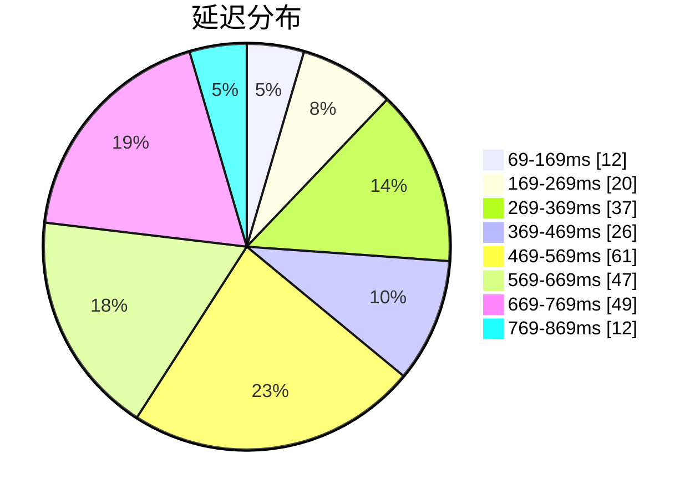
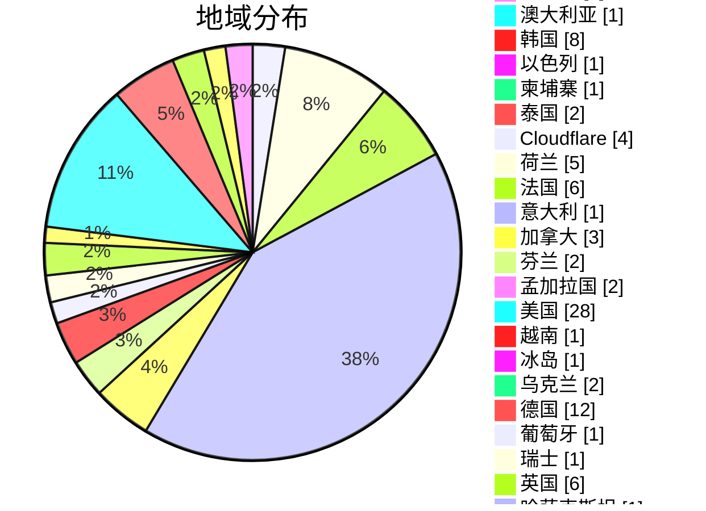
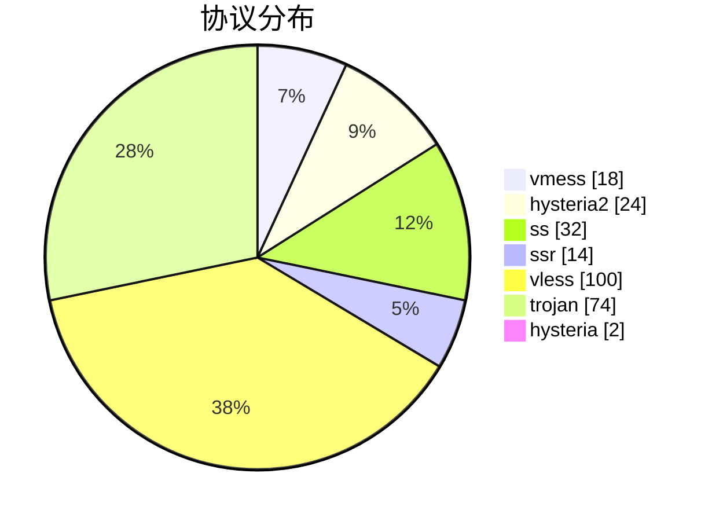

```mermaid
pie showData
title 延迟分布
"69-169ms" : 12
"169-269ms" : 20
"269-369ms" : 37
"369-469ms" : 26
"469-569ms" : 61
"569-669ms" : 47
"669-769ms" : 49
"769-869ms" : 12
```

```mermaid
pie showData
title 地域分布
"中国" : 6
"台湾" : 20
"日本" : 15
"未知" : 99
"香港" : 11
"新加坡" : 7
"俄罗斯" : 2
"澳大利亚" : 1
"韩国" : 8
"以色列" : 1
"柬埔寨" : 1
"泰国" : 2
"Cloudflare" : 4
"荷兰" : 5
"法国" : 6
"意大利" : 1
"加拿大" : 3
"芬兰" : 2
"孟加拉国" : 2
"美国" : 28
"越南" : 1
"冰岛" : 1
"乌克兰" : 2
"德国" : 12
"葡萄牙" : 1
"瑞士" : 1
"英国" : 6
"哈萨克斯坦" : 1
"爱尔兰" : 4
"瑞典" : 2
"波兰" : 5
"捷克" : 1
"斯洛文尼亚" : 1
"印度" : 2
```

```mermaid
pie showData
title 协议分布
"vmess" : 18
"hysteria2" : 24
"ss" : 32
"ssr" : 14
"vless" : 100
"trojan" : 74
"hysteria" : 2
```