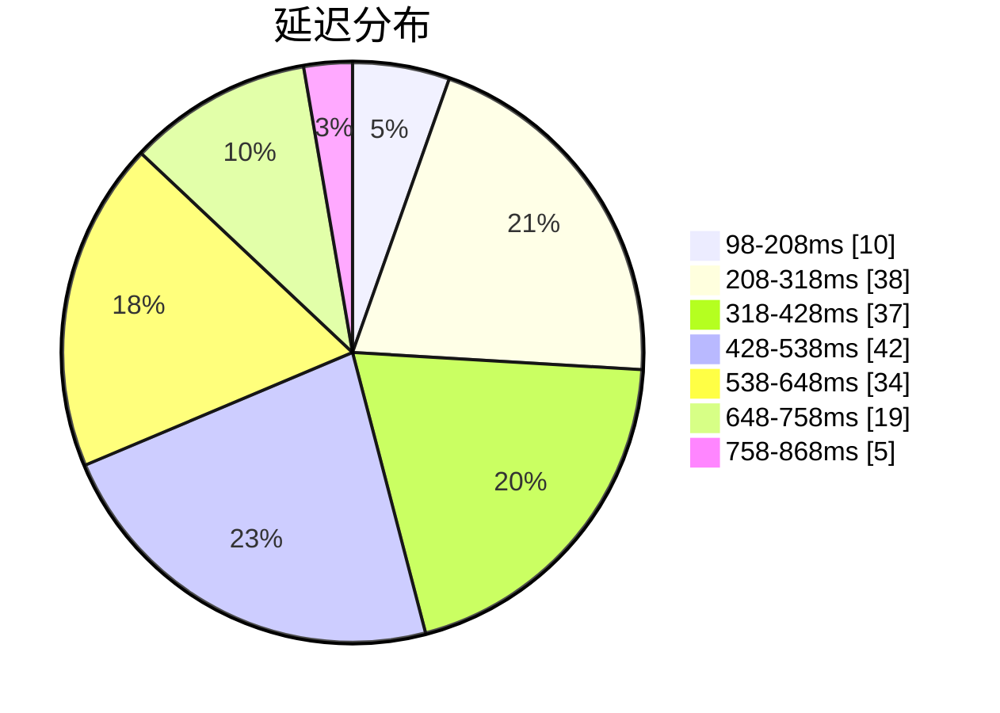
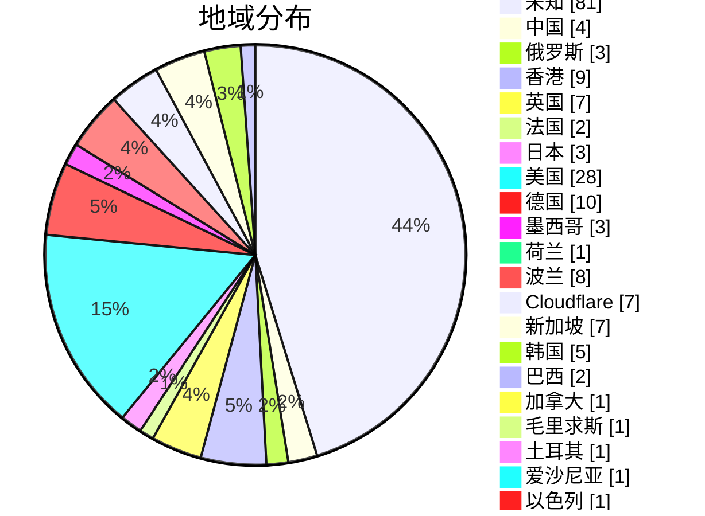
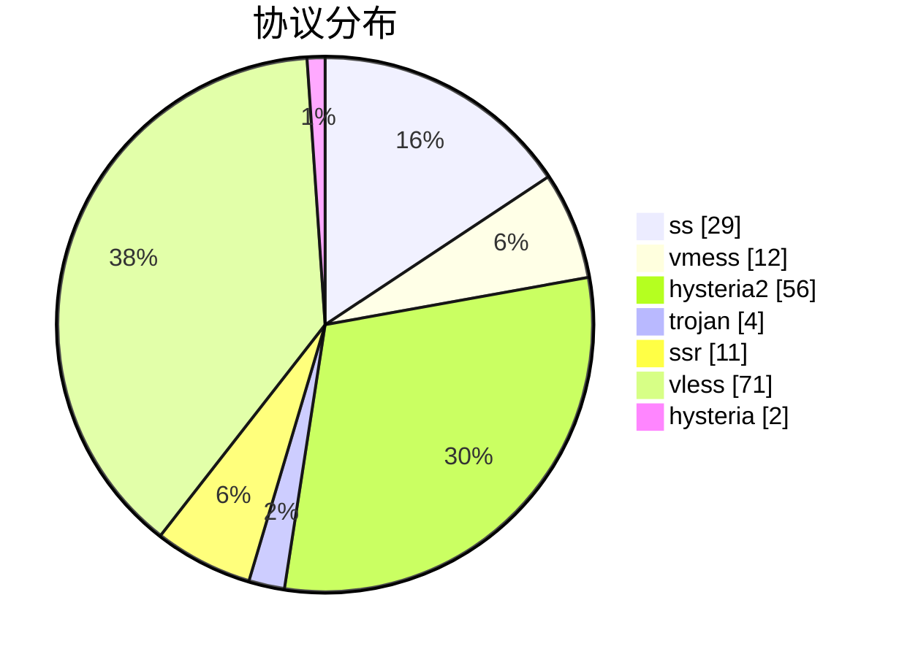

```mermaid
pie showData
title 延迟分布
"98-208ms" : 10
"208-318ms" : 38
"318-428ms" : 37
"428-538ms" : 42
"538-648ms" : 34
"648-758ms" : 19
"758-868ms" : 5
```

```mermaid
pie showData
title 地域分布
"未知" : 81
"中国" : 4
"俄罗斯" : 3
"香港" : 9
"英国" : 7
"法国" : 2
"日本" : 3
"美国" : 28
"德国" : 10
"墨西哥" : 3
"荷兰" : 1
"波兰" : 8
"Cloudflare" : 7
"新加坡" : 7
"韩国" : 5
"巴西" : 2
"加拿大" : 1
"毛里求斯" : 1
"土耳其" : 1
"爱沙尼亚" : 1
"以色列" : 1
```

```mermaid
pie showData
title 协议分布
"ss" : 29
"vmess" : 12
"hysteria2" : 56
"trojan" : 4
"ssr" : 11
"vless" : 71
"hysteria" : 2
```