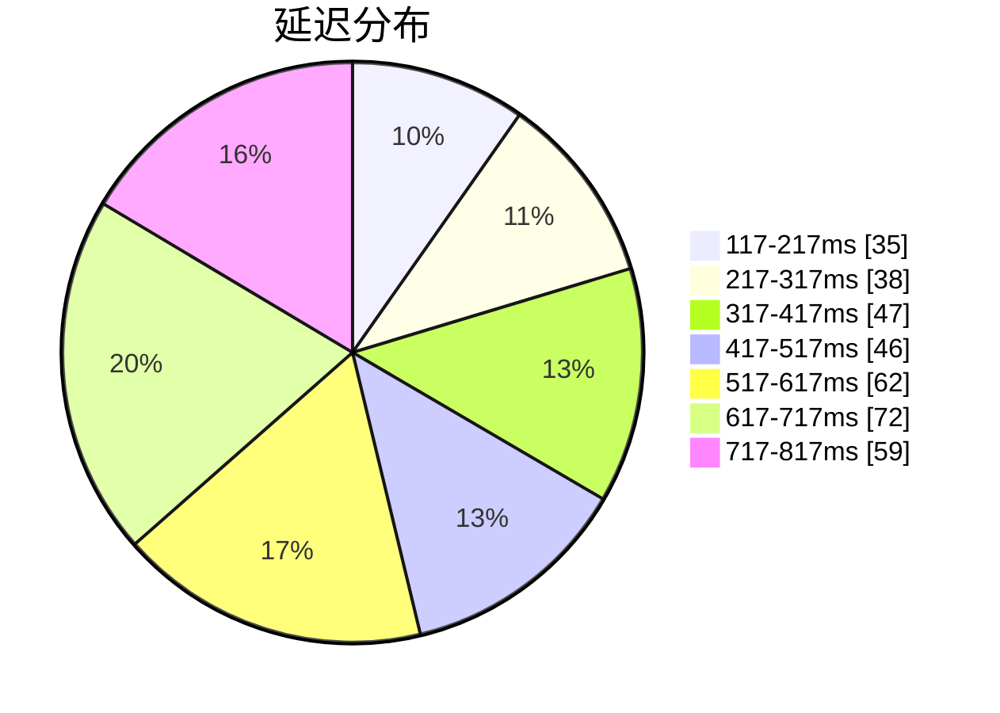
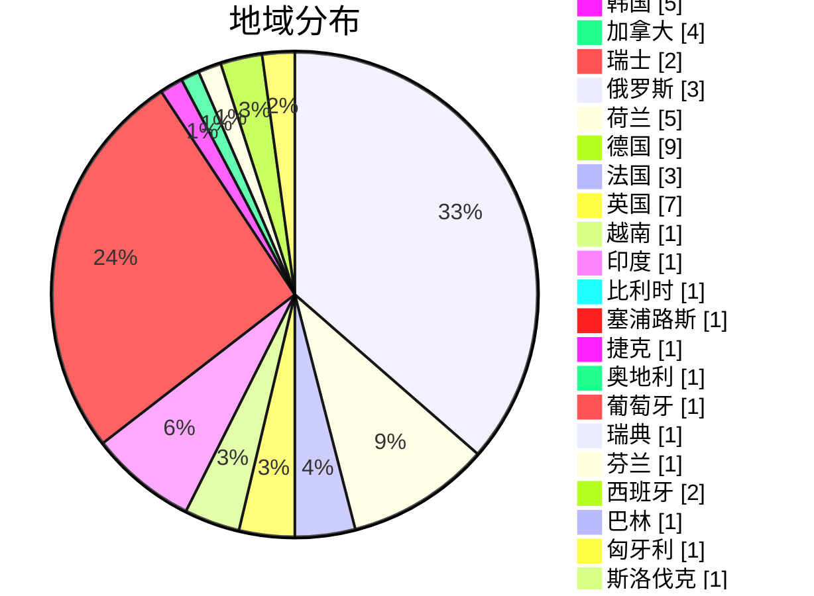
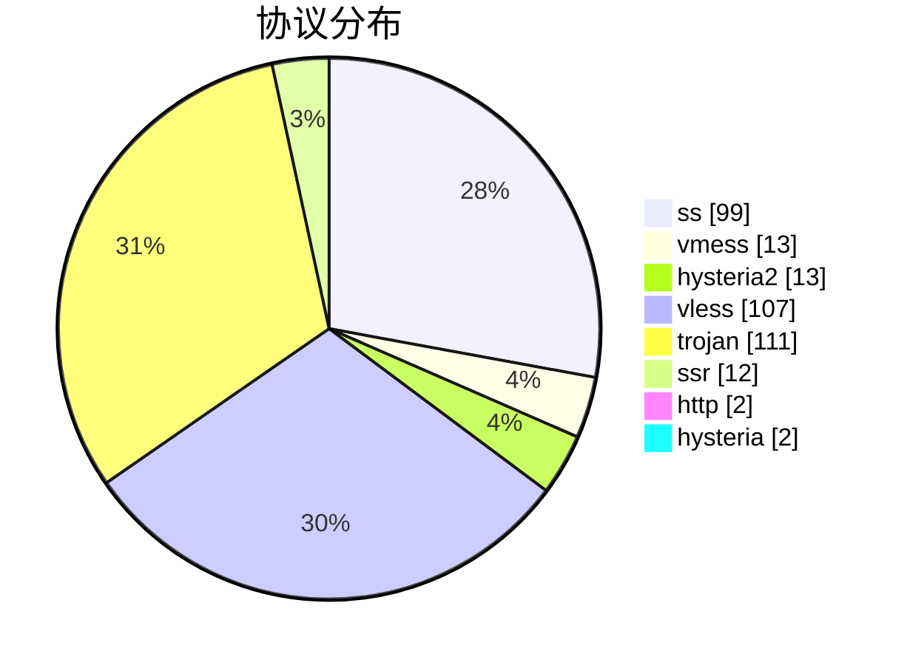

```mermaid
pie showData
title 延迟分布
"117-217ms" : 35
"217-317ms" : 38
"317-417ms" : 47
"417-517ms" : 46
"517-617ms" : 62
"617-717ms" : 72
"717-817ms" : 59
```

```mermaid
pie showData
title 地域分布
"未知" : 118
"美国" : 31
"中国" : 1
"日本" : 13
"香港" : 12
"新加坡" : 12
"波兰" : 23
"Cloudflare" : 3
"台湾" : 85
"韩国" : 5
"加拿大" : 4
"瑞士" : 2
"俄罗斯" : 3
"荷兰" : 5
"德国" : 9
"法国" : 3
"英国" : 7
"越南" : 1
"印度" : 1
"比利时" : 1
"塞浦路斯" : 1
"捷克" : 1
"奥地利" : 1
"葡萄牙" : 1
"瑞典" : 1
"芬兰" : 1
"西班牙" : 2
"巴林" : 1
"匈牙利" : 1
"斯洛伐克" : 1
"罗马尼亚" : 1
"丹麦" : 1
"冰岛" : 1
"摩尔多瓦" : 1
"希腊" : 1
"保加利亚" : 1
"拉脱维亚" : 1
"爱沙尼亚" : 1
"立陶宛" : 1
```

```mermaid
pie showData
title 协议分布
"ss" : 99
"vmess" : 13
"hysteria2" : 13
"vless" : 107
"trojan" : 111
"ssr" : 12
"http" : 2
"hysteria" : 2
```