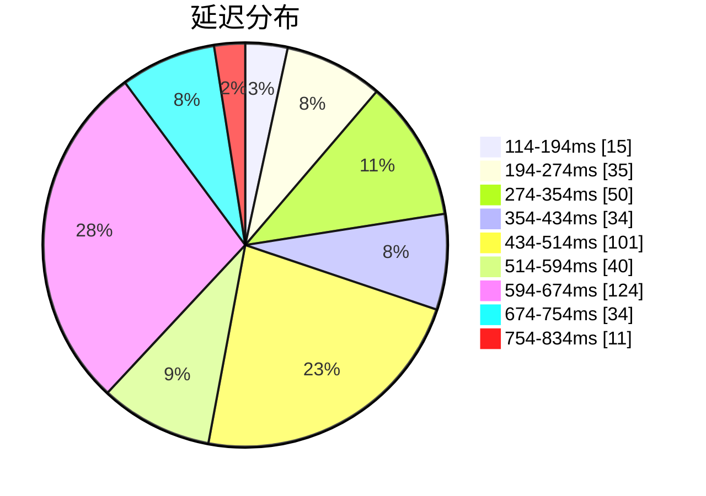
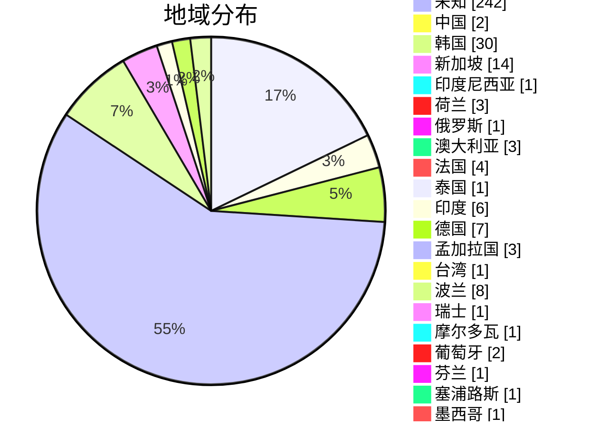
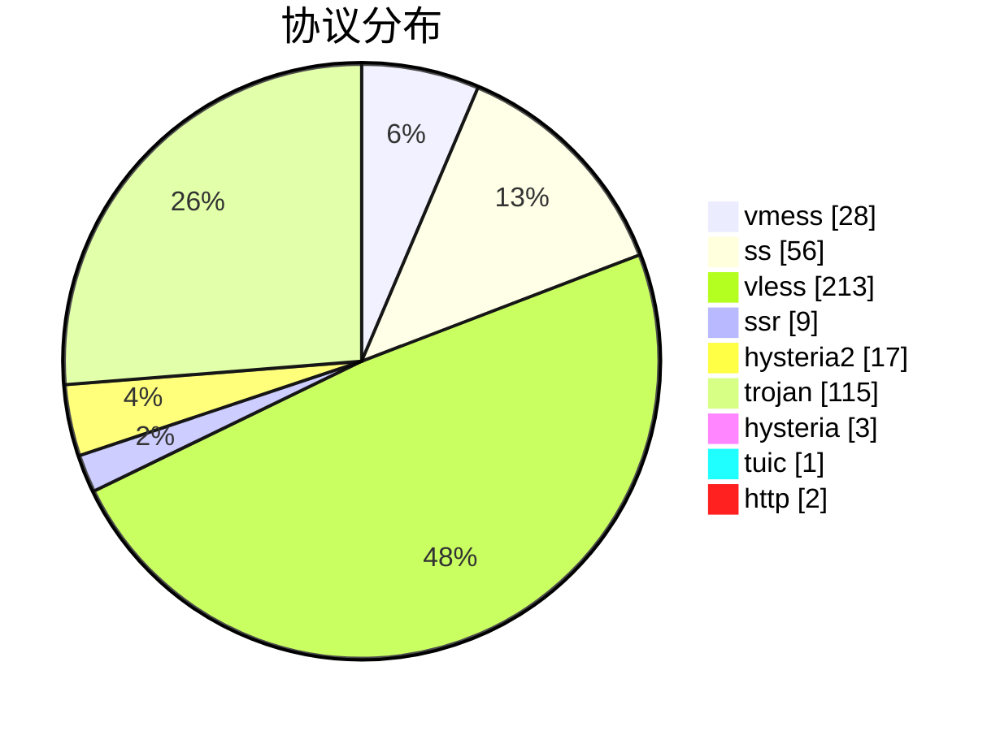

```mermaid
pie showData
title 延迟分布
"114-194ms" : 15
"194-274ms" : 35
"274-354ms" : 50
"354-434ms" : 34
"434-514ms" : 101
"514-594ms" : 40
"594-674ms" : 124
"674-754ms" : 34
"754-834ms" : 11
```

```mermaid
pie showData
title 地域分布
"美国" : 74
"日本" : 13
"香港" : 21
"未知" : 242
"中国" : 2
"韩国" : 30
"新加坡" : 14
"印度尼西亚" : 1
"荷兰" : 3
"俄罗斯" : 1
"澳大利亚" : 3
"法国" : 4
"泰国" : 1
"印度" : 6
"德国" : 7
"孟加拉国" : 3
"台湾" : 1
"波兰" : 8
"瑞士" : 1
"摩尔多瓦" : 1
"葡萄牙" : 2
"芬兰" : 1
"塞浦路斯" : 1
"墨西哥" : 1
"立陶宛" : 1
"Cloudflare" : 1
"加拿大" : 1
```

```mermaid
pie showData
title 协议分布
"vmess" : 28
"ss" : 56
"vless" : 213
"ssr" : 9
"hysteria2" : 17
"trojan" : 115
"hysteria" : 3
"tuic" : 1
"http" : 2
```